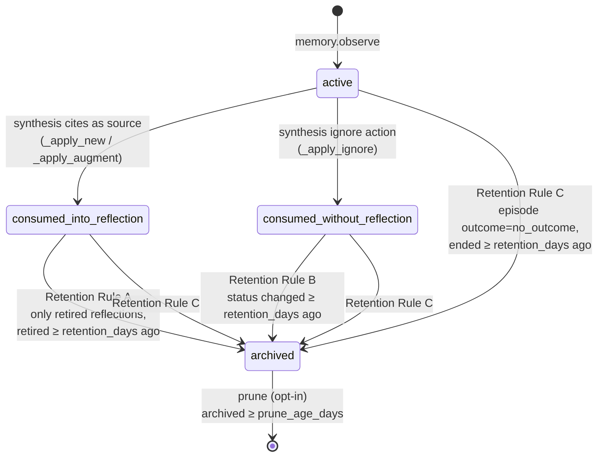

# better-memory

**better-memory gives your AI coding assistant a memory that grows with your project.** It remembers what worked and what didn't, picks up the preferences and conventions you care about, and when you have to point it back to something it should have used, it records that too — so the same lesson surfaces on its own next time. Every lesson is captured the moment a decision is made and distilled into short, relevance-ranked guidance the assistant pulls up on its own. The result: an assistant that *compounds* — getting sharper on your codebase the more you work together.

It's a memory layer for Claude Code that (with the default sqlite backend) runs entirely on your machine. Your observations, distilled lessons, and knowledge base live in a local SQLite database — nothing is sent to a cloud service. Even the work of turning raw notes into durable lessons runs inside your own Claude Code session — no separate cloud LLM, no second subscription, no third party seeing your code. (An optional [AWS-backed backend](website/agentcore-setup.md) exists for teams that want cloud-managed memory.)

## How it works

1. **As it works**, the assistant records what it tried and how it turned out — a fix that worked, an approach that failed, a preference you stated.
2. **Between sessions**, those raw notes are distilled into short, durable lessons — signal kept, noise dropped.
3. **Next session**, lessons surface exactly when they become relevant: your standing rules inject at session start, and everything else arrives as you work — each prompt and the session's first tool call are scored against the memory store (text match + semantic similarity + track record), and only memories with real evidence of relevance inject. No firehose, no guessing.
4. **Every serve gets scored.** At session end the assistant rates each surfaced memory — and any non-trivial rating requires a one-line receipt (what the memory changed, or a quote). Hit rates drive the ranking: memories that keep helping rise, memories that keep getting ignored sink, and brand-new lessons get a reserved trial slot to earn their score.

## What you get

- **Even the failures pay off** — a botched approach is recorded just as carefully as a working fix, so the assistant turns a dead end into a *don't* the next session won't repeat.
- **The right lesson at the right time** — past lessons come back sorted into *do this*, *avoid this*, and *context*, ranked by a Wilson-score hit rate (how often each memory actually helped, out of how often it was shown) fused with text and semantic relevance to what you're doing right now.
- **Ratings with receipts** — when the assistant claims a memory helped, it must say how, in one line; those evidence lines are stored and browsable per-memory in the management UI.
- **Your standards, on hand** — drop your own conventions, language guides, and project docs into a knowledge base the assistant can search.
- **Zero ceremony** — once it's installed, capture is automatic: hooks inside Claude Code snapshot your session for you, with nothing to call or manage mid-task.
- **Nothing happens silently** — every change to memory is an append-only record you can audit.

## Requirements

- **Python 3.12+**
- **[uv](https://docs.astral.sh/uv/getting-started/installation/)** for environment management
- **[Ollama](https://ollama.com/)** — a local model runner (installed separately) with the `nomic-embed-text` embedding model pulled. better-memory uses it *only* to turn text into search vectors; lesson-distilling is done by Claude, and your code never leaves your machine. Ollama is only required when `BETTER_MEMORY_EMBEDDINGS_BACKEND=ollama` (the default). Set it to `sqlite` to use a pure-SQL trigram-FTS5 backend with no model downloads.
- **Claude Code** installed

SQLite ships with Python; `sqlite-vec` is installed as a pip dependency — nothing else to set up.

## Storage backends

better-memory has two storage backends. Pick one:

| Backend | When to pick | Setup |
|---|---|---|
| **`sqlite`** (default) | Single-machine usage; full offline operation; no cloud cost. | None — works out of the box. |
| **`agentcore`** | Multi-machine syncing; managed extraction by AWS; team-shared memory bucket. | Requires an AWS account with Bedrock AgentCore Memory available in your chosen region (`init --region` defaults to `eu-west-2`). See [AgentCore setup](website/agentcore-setup.md). |

Switching to agentcore is done by `better-memory agentcore init`, which provisions the AWS memories and activates the backend by writing `{"storage_backend": "agentcore"}` to `$BETTER_MEMORY_HOME/settings.json`. The MCP server, hooks, and CLI all resolve the backend the same way: `BETTER_MEMORY_STORAGE_BACKEND` env var if set (always wins), else `settings.json`, else `sqlite`. To revert, remove the `storage_backend` key from `settings.json` or set the env var to `sqlite`. To carry existing sqlite memory across, `better-memory agentcore migrate` bulk-copies your distilled reflections and semantic memories into the AgentCore memories (idempotent, re-runnable; `--dry-run` previews the plan). Migration and activation are independent — `migrate` only writes records to AWS and never flips the backend, so use `init` (or set `storage_backend` yourself) to actually switch. See [AgentCore setup](website/agentcore-setup.md).

`agentcore` mode needs the optional dependency group: `pip install 'better-memory[agentcore]'` (or `uv pip install '.[agentcore]'`). Sqlite-only installs skip boto3 entirely.

## Quick start

```bash
./scripts/setup.sh
```

The script:
1. Verifies Python ≥ 3.12 and uv.
2. Runs `uv sync` to build the venv.
3. Checks for Ollama; offers to install via `brew` / `apt` / `winget` if missing.
4. Pulls `nomic-embed-text`.
5. Creates `~/.better-memory/{spool,knowledge-base/...}`.
6. Auto-installs the MCP server registration into `~/.claude.json` and the hooks (`session_bootstrap`, `observer`, `session_close`, and `contextual_inject` on `UserPromptSubmit` + `PreToolUse`) into `~/.claude/settings.json` (idempotent; backups go to `~/.better-memory/install-backups/`).

If you'd rather inspect or hand-edit the config, see [Manual setup](#manual-setup) below.

> **Note:** `./scripts/setup.sh` writes both `~/.claude.json` and `~/.claude/settings.json` for you idempotently. The Manual setup section below is reference material — useful if you need to inspect or hand-edit the config, but not required for a normal install.

## Manual setup

If you'd rather do it by hand:

```bash
uv sync
mkdir -p ~/.better-memory/{spool,knowledge-base/{standards,languages,projects}}
ollama pull nomic-embed-text
```

Then add to `~/.claude.json` (user-scope MCP — create the file if it doesn't exist):

```json
{
  "mcpServers": {
    "better-memory": {
      "type": "stdio",
      "command": "/absolute/path/to/better-memory/.venv/bin/python",
      "args": ["-m", "better_memory.mcp"],
      "env": {
        "BETTER_MEMORY_HOME": "/absolute/path/to/your/home/.better-memory"
      }
    }
  }
}
```

And add hooks to `~/.claude/settings.json`:

Four hooks ship. `session_bootstrap` (SessionStart) opens (or reuses) a background episode for the session and injects the project's curated context — project-scoped and general-scope semantic memories plus distilled reflections (`do` / `dont` / `neutral` buckets) — as `additionalContext` so Claude has prior memory available without needing to call any retrieval tool first. Only the top `BETTER_MEMORY_BOOTSTRAP_TOP_N` project-scoped items (default 5) render in full; the rest collapse into a one-line index plus a retrieve affordance (`BETTER_MEMORY_BOOTSTRAP_TOP_N=0` restores the old full-dump behavior). The hook does its work in-process against `memory.db` (in agentcore mode it routes through the storage backend instead and never opens the local database); if it fails for any reason, a fallback directive is injected instructing Claude to call `mcp__better-memory__memory_session_bootstrap` manually. `contextual_inject` (UserPromptSubmit + PreToolUse) additionally surfaces memories relevant to the current prompt/tool-input mid-session — see [Configuration](website/configuration.md) and [Architecture](website/architecture.md#injection-strategies) for how it scores, floors, and dedups candidates.

```json
{
  "hooks": {
    "SessionStart": [
      {
        "hooks": [
          {
            "type": "command",
            "command": "/absolute/path/to/.venv/bin/python -m better_memory.hooks.session_bootstrap"
          }
        ]
      }
    ],
    "PostToolUse": [
      {
        "matcher": "Write|Edit|Bash",
        "hooks": [
          {
            "type": "command",
            "command": "/absolute/path/to/.venv/bin/python -m better_memory.hooks.observer",
            "async": true
          }
        ]
      }
    ],
    "Stop": [
      {
        "hooks": [
          {
            "type": "command",
            "command": "/absolute/path/to/.venv/bin/python -m better_memory.hooks.session_close",
            "async": true
          }
        ]
      }
    ],
    "UserPromptSubmit": [
      {
        "hooks": [
          {
            "type": "command",
            "command": "/absolute/path/to/.venv/bin/python -m better_memory.hooks.contextual_inject"
          }
        ]
      }
    ],
    "PreToolUse": [
      {
        "matcher": "Skill|Task|Write",
        "hooks": [
          {
            "type": "command",
            "command": "/absolute/path/to/.venv/bin/python -m better_memory.hooks.contextual_inject"
          }
        ]
      }
    ]
  }
}
```

`contextual_inject` is gated at runtime by `BETTER_MEMORY_CONTEXT_INJECT_MODE` (default `both`) — set it to `userprompt`, `pretool`, or `off` to narrow or disable which event actually injects.

On Windows, point hooks at `.venv\Scripts\pythonw.exe` (no console flash) instead of `python.exe`.

Restart Claude Code. MCP servers don't hot-reload.

## Configuration

One env var roots the runtime filesystem layout:

| Variable | Default | Purpose |
|---|---|---|
| `BETTER_MEMORY_HOME` | `~/.better-memory` | Root dir for `memory.db`, `knowledge.db`, `spool/`, `knowledge-base/` |
| `OLLAMA_HOST` | `http://localhost:11434` | Ollama endpoint |
| `EMBED_MODEL` | `nomic-embed-text` | Embedding model (must produce 768-dim vectors) |
| `AUDIT_LOG_RETRIEVED` | `true` | Whether `memory.retrieve` writes per-result audit rows |
| `BETTER_MEMORY_EMBEDDINGS_BACKEND` | `ollama` | `ollama` (default) — local Ollama at `OLLAMA_HOST`; `sqlite` — pure-SQL trigram-FTS5 fusion, no model downloads and no in-memory state. |
| `BETTER_MEMORY_STORAGE_BACKEND` | unset | `sqlite` or `agentcore`. Explicit override of the storage backend; when unset, `$BETTER_MEMORY_HOME/settings.json` (written by `better-memory agentcore init`) decides, falling back to `sqlite`. The env var always wins over settings.json. |
| `BETTER_MEMORY_AUTO_PRUNE` | (unset = `false`) | When set to `1`, the auto-retention runner (which fires on `memory.retrieve`, throttled to once per 24h) ALSO hard-deletes archived observations older than 365 days. **Irreversible.** Default is archive-only (status flip, reversible). Opt in only if you actively want disk space reclaimed. |
| `BETTER_MEMORY_PROJECT` | unset | Force the project name for all calls in this process. Highest-priority project-resolution signal — overrides both the `.better-memory` file and the git-derived name. Designed for subprocess scoping (e.g. ralph's executor sets it per-iteration so subagent observations land in the PBI's target_repo regardless of the worktree's cwd). Empty/whitespace-only values are treated as unset. |
| `BETTER_MEMORY_INJECT_MODE` | `legacy` (config default; `deferred` is the recommended and currently-deployed setting) | `deferred`: SessionStart injects only general-scope standing rules + a one-line index; everything else surfaces via the contextual channel as it becomes relevant. `legacy`: the original full bootstrap dump. Unknown values coerce to `legacy`. |
| `BETTER_MEMORY_CONTEXT_INJECT_MODE` | `both` | Contextual memory-injection hook trigger: `userprompt`, `pretool`, `both` (default), or `off`. PreToolUse fires once per session (any tool), latched. |
| `BETTER_MEMORY_CONTEXT_VEC_FLOOR` | `0.55` | Cosine floor for the contextual channel's vector-evidence leg. A memory injects only with a text match or a cosine ≥ floor; calibrated precision-first (see the deferred-injection spec). |
| `BETTER_MEMORY_BOOTSTRAP_TOP_N` | `5` | Legacy-mode only: project-scoped items the SessionStart bootstrap renders in full; the rest collapse into a one-line index. `0` = full dump. |
| `BETTER_MEMORY_CONTEXT_MIN_HITS` | `2` | **Deprecated, unused** — superseded by the evidence gate (BM25 / vector floor). Kept for back-compat only. |
| `BETTER_MEMORY_CONTEXT_MAX_ITEMS` | `3` | Max memories the contextual-injection hook injects per firing. |
| `BETTER_MEMORY_CONTEXT_REINJECT_TURNS` | `0` | Turns before a contextually-injected memory can be re-injected. `0` = never re-inject. A turn is one firing of the `contextual_inject` hook (each user prompt, plus each matched tool call in mode `both`), not one user prompt-response cycle. |

See [Configuration](website/configuration.md) for the full table and injection-tuning detail.

### Project-name override

Memory is bucketed by project name, resolved in this order (highest priority first):

1. **`BETTER_MEMORY_PROJECT` env var** — if set to a non-empty (after
   stripping) value, it is used verbatim for every call in the process.
   Empty/whitespace-only values fall through. Designed for subprocess
   scoping rather than interactive use.
2. **`.better-memory` override file** — if a `.better-memory` file
   exists in the cwd, its first non-empty stripped line is used
   verbatim. Checked only at the cwd, not at ancestors. Use this only
   for the rare case where the git-derived name isn't right.
3. **Git common dir** — `git rev-parse --git-common-dir` resolves to
   the main repo's `.git` directory even from inside a worktree, so
   all worktrees of the same repo share one project bucket
   automatically. The project name is the parent directory's name.
4. **`general`** — fallback when the cwd isn't inside a git tree (or
   git is unavailable).

If you need an override (renamed repo, multi-repo monolith, etc.):

```bash
echo "my-project" > .better-memory
```

This applies uniformly to knowledge search, observation writes/reads,
episode scoping, and the UI panel filter.

Note: this is a *file* in your repo root, not the data root directory
`~/.better-memory/` (set by `BETTER_MEMORY_HOME`). Different things
despite the shared name.

## MCP tools

The server registers 22 tools, grouped below. Full schemas are in [`website/mcp-tools.md`](website/mcp-tools.md) and live in `better_memory/mcp/tools.py`. (In agentcore mode the two synthesis tools, the four episode tools, and `memory.run_retention` are hidden from the advertised list — 15 tools; the memory-data tools dispatch to AWS instead of SQLite.)

**Episodic memory** — observations the AI writes during a session.

| Tool | Purpose |
|---|---|
| `memory.observe(content, component?, theme?, trigger_type?, outcome?, tech?, scope?)` | Record an observation. Returns `{"id": ...}`. |
| `memory.retrieve(query?, project?, tech?, phase?, polarity?, limit_per_bucket?)` | Distilled reflections in `do` / `dont` / `neutral` buckets, ranked by a Wilson-score hit-rate prior; pass `query` (a plain-language task description) to fuse in BM25 + vector relevance. One shortlist slot per bucket is reserved for an under-rated memory so new lessons earn a score. Drains spool first. |
| `memory.retrieve_observations(query?, component?, theme?, outcome?, episode_id?, project?, limit?)` | Raw-observation drill-down with hybrid FTS5 + vector search. |
| `memory.record_use(id, outcome?)` | Stamp reinforcement outcome on a memory after validation. |

**Semantic memory** — user-stated facts and preferences (current truth, not history).

| Tool | Purpose |
|---|---|
| `memory.semantic_observe(content, scope?)` | Record a user-stated fact. `scope='general'` for cross-project rules. |
| `memory.semantic_retrieve(project?)` | Project-scoped facts merged with all `general` ones. |
| `memory.semantic_update(id, content)` | Edit a semantic memory in place. |
| `memory.semantic_delete(id)` | Remove a semantic memory (idempotent). |

**Episodes** — bounded sessions of work; observations and reflections scope to one.

| Tool | Purpose |
|---|---|
| `memory.start_episode(goal, tech?)` | Open a foreground episode. Returns active episode id and `pending_synthesis` queue depth. |
| `memory.close_episode(outcome, close_reason?, summary?)` | Close the active episode. `outcome` ∈ `success` / `partial` / `abandoned` / `no_outcome`. |
| `memory.list_episodes(project?, outcome?, only_open?)` | List episodes for UI / introspection. |
| `memory.reconcile_episodes()` | List episodes still open from prior sessions. |

**Synthesis** — IDE-driven (Claude itself decides). See [`better-memory-synthesize`](.claude/skills/better-memory-synthesize/SKILL.md) skill.

| Tool | Purpose |
|---|---|
| `memory.synthesize_next_get_context(project?)` | One pending episode's full context for the IDE-LLM to act on. |
| `memory.synthesize_next_apply(episode_id, decision, project?)` | Atomically apply Claude's `new` / `augment` / `merge` / `ignore` decision. |

**Rating** — closed-loop reinforcement on top of `memory.record_use`. Session id is resolved server-side from `CLAUDE_SESSION_ID`; none of these tools take a session id.

| Tool | Purpose |
|---|---|
| `memory.credit(kind, id, class, evidence)` | Opportunistic per-tool-use credit. `class` ∈ `cited` / `shaped` / `misled` / `overlooked` (not `ignored`). `evidence` is required: one line — what the memory changed, or a quote. If you can't write one, the memory was ignored; don't call credit. |
| `memory.list_session_exposures()` | Unrated exposure rows for the current session. Read-only; used by the `rate-session-memories` skill. |
| `memory.apply_session_ratings(ratings)` | Atomic end-of-session batch rating. Each entry: `{kind, id, class, evidence?}` — evidence is required for every non-`ignored` class (write the evidence line first; nothing to point at means the class is `ignored`). Violating batches are rejected whole. |

**Knowledge** — human-authored markdown corpus.

| Tool | Purpose |
|---|---|
| `knowledge.search(query, project?)` | BM25 search against the knowledge base. |
| `knowledge.list(project?)` | List indexed knowledge docs. |

**Operations**

| Tool | Purpose |
|---|---|
| `memory.session_bootstrap(source?, session_id?, cwd?)` | Open or reuse a session episode and inject startup context as `additionalContext` markdown. In `deferred` mode (recommended): general-scope standing rules in full plus a one-line index — everything else arrives contextually. In `legacy` mode: the original render (up to 20 reflections/bucket, Wilson-ranked, top `BETTER_MEMORY_BOOTSTRAP_TOP_N` in full). Mirrors the SessionStart hook; callable manually for recovery, testing, or post-`/clear` re-injection. The hook also runs a CLAUDE.md drift sentinel: if your CLAUDE.md documents tool parameters that don't exist in the live schemas, one warning line is appended. |
| `memory.run_retention(retention_days?, prune?, prune_age_days?, dry_run?)` | Apply spec §9 retention rules; archive or hard-delete. |
| `memory.start_ui()` | Spawn or reuse the management UI; returns `{url, reused}`. |

## Skills

The `better_memory/skills/` directory contains four markdown skills the AI should load at the appropriate moment:

- `memory-retrieve.md` — before starting any task
- `memory-write.md` — at every decision point
- `memory-feedback.md` — when validation evidence arrives
- `session-close.md` — before wrapping up

Plus `CLAUDE.snippet.md` — paste into your project's `CLAUDE.md` to teach the AI about better-memory.

### Claude Code skills

Two skills live in `.claude/skills/` and are auto-symlinked into `~/.claude/skills/` by `./scripts/setup.sh` so Claude triggers them in any repo:

- **`better-memory-synthesize`** — walks Claude through the per-episode reflection synthesis loop (`memory.synthesize_next_get_context` → decide → `memory.synthesize_next_apply`). Fires when `memory.start_episode` reports `pending_synthesis.pending > 0` or when the user asks to consolidate.
- **`rate-session-memories`** — classifies exposed reflections / semantic memories at session end (`cited` / `shaped` / `ignored` / `misled` / `overlooked`) via `memory.list_session_exposures` + `memory.apply_session_ratings`. Triggered by a Stop-block directive from the `session_close` hook when unrated exposures remain.

For the synthesis skill, also add a section to `~/.claude/CLAUDE.md` telling Claude to invoke it when `mcp__better-memory__memory_start_episode` reports `pending_synthesis.pending > 0`. The rating skill fires from the hook directive and doesn't need an instruction line.

If the auto-symlink failed (e.g. Windows without developer mode or admin), symlink manually:

```bash
# Linux / macOS
ln -s "$PWD/.claude/skills/better-memory-synthesize" ~/.claude/skills/better-memory-synthesize
ln -s "$PWD/.claude/skills/rate-session-memories"    ~/.claude/skills/rate-session-memories

# Windows (PowerShell, run from this repo, as Administrator OR with developer mode)
New-Item -ItemType Junction -Path "$env:USERPROFILE\.claude\skills\better-memory-synthesize" -Target "$PWD\.claude\skills\better-memory-synthesize"
New-Item -ItemType Junction -Path "$env:USERPROFILE\.claude\skills\rate-session-memories"    -Target "$PWD\.claude\skills\rate-session-memories"
```

## Development

```bash
uv sync              # install deps
uv run pytest         # full suite (requires Ollama running for integration marker)
uv run pytest -m "not integration"   # unit tests only
uv run ruff check .   # lint
```

Run the MCP server standalone for manual poking:

```bash
uv run python -m better_memory.mcp
```

It speaks JSON-RPC over stdio — pipe `initialize` / `tools/list` / `tools/call` payloads in.

## Troubleshooting

**"Ollama unreachable" on startup.**
Make sure Ollama is running (`ollama serve` on macOS/Linux; the tray app on Windows) and that `nomic-embed-text` is pulled (`ollama pull nomic-embed-text`). The MCP server continues booting and serves `knowledge.*` tools, but `memory.observe` / `memory.retrieve` will error until Ollama is up.

**MCP server not appearing in Claude Code after editing `~/.claude.json`.**
MCP servers don't hot-reload. Restart Claude Code.

**Hooks not firing.**
Open `/hooks` once in Claude Code to reload the hook config — the settings watcher only watches directories that had a settings file when the session started. If that fails, restart.

**Spool files piling up.**
The spool drains on every `memory.retrieve` call. If you haven't retrieved in a long time, files accumulate — they're tiny JSON, not a concern. Bad files are moved to `spool/.quarantine/` so one corrupt file never blocks the drain.

**Windows console flashes on every tool call.**
Your hook command is using `python.exe`; switch to `.venv\Scripts\pythonw.exe`. The no-console variant still reads stdin pipes fine and won't flash a window.

## Architecture

See `docs/superpowers/specs/2026-04-06-better-memory-design.md` for the original design spec — four-layer epistemic hierarchy, hybrid search via FTS5 + sqlite-vec + RRF, reinforcement-weighted ranking, and the consolidation pipeline.

### The retrieval-quality layer (July 2026)

Three shipped upgrades sit on top of that foundation (specs: `2026-07-23-retrieval-quality-design.md`, `2026-07-23-deferred-injection-design.md`):

- **Wilson-score ranking.** Reflections and semantic memories rank by the lower bound of their observed hit rate — `(useful + overlooked) / (useful + overlooked + ignored)` — so a memory that helps 3 times out of 4 serves outranks one that helped 67 times out of 192. No raw-count rich-get-richer. One shortlist slot per bucket is reserved for memories with fewer than 3 ratings (the **exploration slot**), so new lessons get served, rated, and scored instead of starving; those serves are tagged (`via_exploration`) and excluded from headline usefulness metrics.
- **Deferred, evidence-gated injection.** SessionStart injects only your standing rules; each prompt (and the session's first tool call) is then scored against the store with three legs — BM25 text match, vector cosine (reflections and semantic memories are embedded at write time, self-healed on retrieve, backfillable via `python -m better_memory.cli.backfill_embeddings`), and the Wilson prior for ranking only. A memory injects solely on positive relevance evidence; popularity can never force an irrelevant injection. Ollama outages cost at most one bounded stall per minute (file-persisted circuit breaker shared across hook processes).
- **Evidence-anchored ratings.** Non-`ignored` ratings require a one-line receipt, enforced server-side and stored on the exposure row; the management UI shows each memory's rating-evidence history. Ratings are the fuel for everything above, so their variance is the system's noise floor — the receipts anchor them to observable events.

## Observation lifecycle

Observations don't live forever. They flow through four states (`active` → `consumed_*` → `archived` → deleted) driven by two pipelines: **synthesis** (LLM-driven, runs from the UI button or automatically by `memory.start_episode`) and **retention** (manual; spec §13 explicitly defers auto-scheduling).



**Synthesis transitions** (no deletion, just status flips, atomic per run):

| Outcome | New status | Notes |
|---|---|---|
| Cited as a source for a NEW reflection | `consumed_into_reflection` | Linked into `reflection_sources`. |
| Cited as a NEW source for an EXISTING reflection (`augment`) | `consumed_into_reflection` | Linked into `reflection_sources`. |
| LLM marks as not reflection-worthy (`ignore`) | `consumed_without_reflection` | No link, just marked done. |
| Untouched by this run | (unchanged — usually `active`) | Picked up by the next synthesis run. |

`merge` does not change observation status: source reflection's `reflection_sources` rows move to the target, and the source's rating counters (`useful_count`, `times_misled`, `times_overlooked`) are summed onto the target with `last_*_at` timestamps taking the later of the two. Source is marked `superseded`.

**Retention** (`better_memory.services.retention.RetentionService.run`, default `retention_days=90`):

| Rule | Archives observations where … |
|---|---|
| **A** | linked only to *retired* reflections, oldest retirement ≥ retention_days old |
| **B** | `status='consumed_without_reflection'` and the status change was ≥ retention_days ago |
| **C** | belongs to an episode whose `outcome='no_outcome'` and ended ≥ retention_days ago |

**Prune** (opt-in, `RetentionService.run(..., prune=True, prune_age_days=N)`): hard-deletes `archived` rows older than `prune_age_days`. `dry_run=True` previews the count without deleting. Reflections are **never** auto-deleted.

Retention is invoked manually — there's no scheduler. Triggers today:
- `memory.run_retention` MCP tool, or
- Direct call from a script / cron / CI step.

## License

See [LICENSE](LICENSE).

## Management UI

Call the `memory.start_ui` MCP tool. It returns `{"url": ..., "reused": ...}`:
the URL is the loopback address the UI bound to; `reused` is `true` when an
existing live UI was returned and `false` when a fresh one was spawned. Open
the URL in a browser. Stdout and stderr from the UI subprocess are written
to `$BETTER_MEMORY_HOME/ui.log`.

The UI exits after 30 minutes of inactivity or when you click **Close UI**
in the header.

To launch it manually for debugging, the entry point is unchanged:

```bash
BETTER_MEMORY_HOME=~/.better-memory uv run python -m better_memory.ui
```
