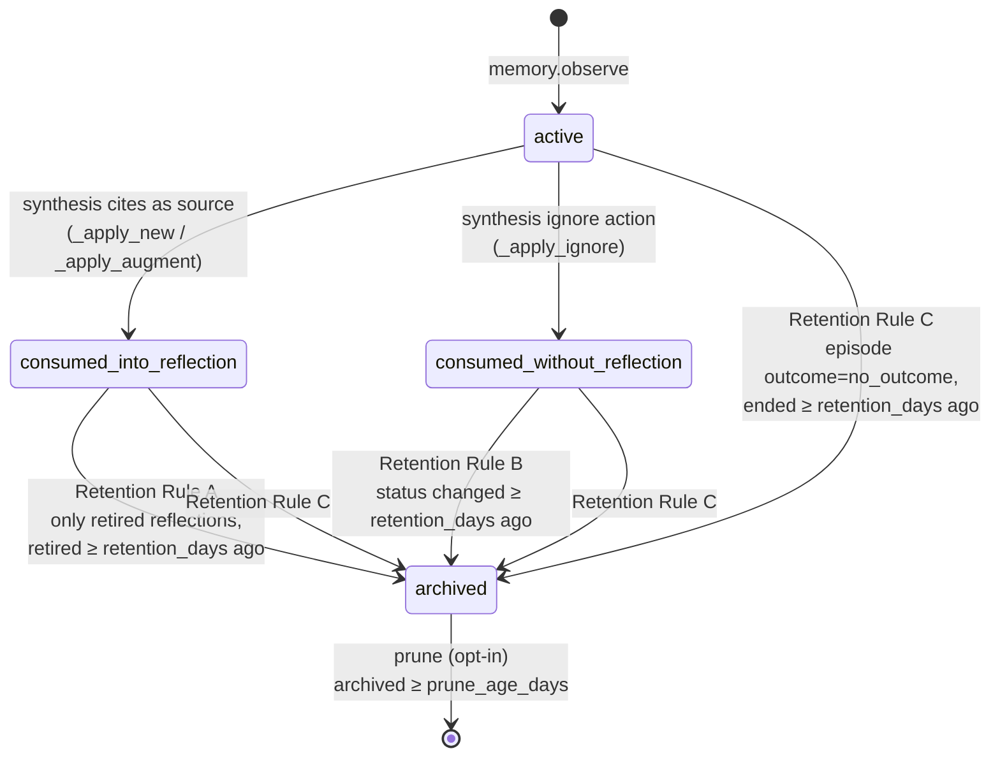

# better-memory

A local-first semantic + episodic memory manager for Claude Code. All state lives on your machine — SQLite databases for observations and the knowledge base, and a local Ollama instance for embeddings. Synthesis (turning observations into distilled reflections) runs inside your Claude Code session via an MCP-driven skill — no separate cloud LLM.

## What it gives you

- **Observations** the AI writes at decision points (`memory.observe`), tagged with an `outcome` of `success` / `failure` / `neutral`.
- **Retrieval in three buckets** (`memory.retrieve`): `do` (prior successes), `dont` (approaches to avoid), `neutral` (context). Reinforcement-weighted.
- **Knowledge base** (`~/.better-memory/knowledge-base/`) — human-authored markdown indexed via FTS5. Standards, language conventions, per-project docs.
- **Fire-and-forget hooks** that snapshot Claude Code's tool calls into a spool, drained lazily on the next retrieve.
- **Full audit trail** in `audit_log` — every state change is an immutable append.

## Prerequisites

- **Python 3.12+**
- **[uv](https://docs.astral.sh/uv/getting-started/installation/)** for environment management
- **[Ollama](https://ollama.com/)** running locally with the `nomic-embed-text` model pulled (embeddings only — synthesis is Claude-driven)
- **Claude Code** installed

SQLite ships with Python; `sqlite-vec` is installed as a pip dependency.

## Quick start

```bash
./scripts/setup.sh
```

The script:
1. Verifies Python ≥ 3.12 and uv.
2. Runs `uv sync` to build the venv.
3. Checks for Ollama; offers to install via `brew` / `apt` / `winget` if missing.
4. Pulls `nomic-embed-text`.
5. Creates `~/.better-memory/{spool,knowledge-base/...}`.
6. Prints the JSON snippets you paste into `~/.claude.json` and `~/.claude/settings.json`.

It does **not** auto-edit your Claude config — too high-blast-radius for a setup script. Review and paste the snippets yourself.

> **Note:** `./scripts/setup.sh` writes both `~/.claude.json` and `~/.claude/settings.json` for you idempotently. The Manual setup section below is reference material — useful if you need to inspect or hand-edit the config, but not required for a normal install.

## Manual setup

If you'd rather do it by hand:

```bash
uv sync
mkdir -p ~/.better-memory/{spool,knowledge-base/{standards,languages,projects}}
ollama pull nomic-embed-text
```

Then add to `~/.claude.json` (user-scope MCP — create the file if it doesn't exist):

```json
{
  "mcpServers": {
    "better-memory": {
      "type": "stdio",
      "command": "/absolute/path/to/better-memory/.venv/bin/python",
      "args": ["-m", "better_memory.mcp"],
      "env": {
        "BETTER_MEMORY_HOME": "/absolute/path/to/your/home/.better-memory"
      }
    }
  }
}
```

And add hooks to `~/.claude/settings.json`:

Two SessionStart hooks ship: `session_start` writes a spool marker so the MCP server can lazy-open a background episode for the session, and `session_retrieve` queries `memory.db` and injects the project's reflections (`do` / `dont` / `neutral` buckets) as `additionalContext` so Claude has prior memory available without needing to call `memory_retrieve` first. Both should be registered — Claude Code concatenates `additionalContext` across hooks.

```json
{
  "hooks": {
    "SessionStart": [
      {
        "hooks": [
          {
            "type": "command",
            "command": "/absolute/path/to/.venv/bin/python -m better_memory.hooks.session_start"
          },
          {
            "type": "command",
            "command": "/absolute/path/to/.venv/bin/python -m better_memory.hooks.session_retrieve"
          }
        ]
      }
    ],
    "PostToolUse": [
      {
        "matcher": "Write|Edit|Bash",
        "hooks": [
          {
            "type": "command",
            "command": "/absolute/path/to/.venv/bin/python -m better_memory.hooks.observer",
            "async": true
          }
        ]
      }
    ],
    "Stop": [
      {
        "hooks": [
          {
            "type": "command",
            "command": "/absolute/path/to/.venv/bin/python -m better_memory.hooks.session_close",
            "async": true
          }
        ]
      }
    ]
  }
}
```

On Windows, point hooks at `.venv\Scripts\pythonw.exe` (no console flash) instead of `python.exe`.

Restart Claude Code. MCP servers don't hot-reload.

## Configuration

One env var roots the runtime filesystem layout:

| Variable | Default | Purpose |
|---|---|---|
| `BETTER_MEMORY_HOME` | `~/.better-memory` | Root dir for `memory.db`, `knowledge.db`, `spool/`, `knowledge-base/` |
| `OLLAMA_HOST` | `http://localhost:11434` | Ollama endpoint |
| `EMBED_MODEL` | `nomic-embed-text` | Embedding model (must produce 768-dim vectors) |
| `AUDIT_LOG_RETRIEVED` | `true` | Whether `memory.retrieve` writes per-result audit rows |
| `BETTER_MEMORY_AUTO_PRUNE` | (unset = `false`) | When set to `1`, the auto-retention runner (which fires on `memory.retrieve`, throttled to once per 24h) ALSO hard-deletes archived observations older than 365 days. **Irreversible.** Default is archive-only (status flip, reversible). Opt in only if you actively want disk space reclaimed. |

### Project-name override

Memory is bucketed by project name, derived from the cwd's leaf
directory name (`Path.cwd().name`). For situations where the leaf name
isn't right — multiple worktrees of the same logical project, or a
deeply-nested cwd — drop a `.better-memory` file at the project root
with a single line containing the desired project name:

```bash
echo "my-project" > .better-memory
```

This applies uniformly to knowledge search, observation writes/reads,
episode scoping, and the UI panel filter.

Note: this is a *file* in your repo root, not the data root directory
`~/.better-memory/` (set by `BETTER_MEMORY_HOME`). Different things
despite the shared name.

## MCP tools

The server registers 18 tools, grouped below. Full schemas are in [`website/mcp-tools.md`](website/mcp-tools.md) and live in `better_memory/mcp/server.py`.

**Episodic memory** — observations the AI writes during a session.

| Tool | Purpose |
|---|---|
| `memory.observe(content, component?, theme?, trigger_type?, outcome?, tech?, scope?)` | Record an observation. Returns `{"id": ...}`. |
| `memory.retrieve(project?, tech?, phase?, polarity?, limit_per_bucket?)` | Distilled reflections in `do` / `dont` / `neutral` buckets. Drains spool first. |
| `memory.retrieve_observations(query?, component?, theme?, outcome?, episode_id?, project?, limit?)` | Raw-observation drill-down with hybrid FTS5 + vector search. |
| `memory.record_use(id, outcome?)` | Stamp reinforcement outcome on a memory after validation. |

**Semantic memory** — user-stated facts and preferences (current truth, not history).

| Tool | Purpose |
|---|---|
| `memory.semantic_observe(content, scope?)` | Record a user-stated fact. `scope='general'` for cross-project rules. |
| `memory.semantic_retrieve(project?)` | Project-scoped facts merged with all `general` ones. |
| `memory.semantic_update(id, content)` | Edit a semantic memory in place. |
| `memory.semantic_delete(id)` | Remove a semantic memory (idempotent). |

**Episodes** — bounded sessions of work; observations and reflections scope to one.

| Tool | Purpose |
|---|---|
| `memory.start_episode(goal, tech?)` | Open a foreground episode. Returns active episode id and `pending_synthesis` queue depth. |
| `memory.close_episode(outcome, close_reason?, summary?)` | Close the active episode. `outcome` ∈ `success` / `partial` / `abandoned` / `no_outcome`. |
| `memory.list_episodes(project?, outcome?, only_open?)` | List episodes for UI / introspection. |
| `memory.reconcile_episodes()` | List episodes still open from prior sessions. |

**Synthesis** — IDE-driven (Claude itself decides). See [`better-memory-synthesize`](.claude/skills/better-memory-synthesize/SKILL.md) skill.

| Tool | Purpose |
|---|---|
| `memory.synthesize_next_get_context(project?)` | One pending episode's full context for the IDE-LLM to act on. |
| `memory.synthesize_next_apply(episode_id, decision, project?)` | Atomically apply Claude's `new` / `augment` / `merge` / `ignore` decision. |

**Knowledge** — human-authored markdown corpus.

| Tool | Purpose |
|---|---|
| `knowledge.search(query, project?)` | BM25 search against the knowledge base. |
| `knowledge.list(project?)` | List indexed knowledge docs. |

**Operations**

| Tool | Purpose |
|---|---|
| `memory.run_retention(retention_days?, prune?, prune_age_days?, dry_run?)` | Apply spec §9 retention rules; archive or hard-delete. |
| `memory.start_ui()` | Spawn or reuse the management UI; returns `{url, reused}`. |

## Skills

The `better_memory/skills/` directory contains four markdown skills the AI should load at the appropriate moment:

- `memory-retrieve.md` — before starting any task
- `memory-write.md` — at every decision point
- `memory-feedback.md` — when validation evidence arrives
- `session-close.md` — before wrapping up

Plus `CLAUDE.snippet.md` — paste into your project's `CLAUDE.md` to teach the AI about better-memory.

### Synthesis skill (Claude Code)

Reflection synthesis is driven by Claude — episode by episode — via two MCP tools (`memory.synthesize_next_get_context` / `_apply`). The walkthrough lives at `.claude/skills/better-memory-synthesize/SKILL.md`.

For cross-project availability (so Claude triggers it in any repo where better-memory is configured, not just this one), mirror the skill into your user-level `~/.claude/skills/`. Symlink keeps the repo as the source of truth:

```bash
# Linux / macOS
ln -s "$PWD/.claude/skills/better-memory-synthesize" ~/.claude/skills/better-memory-synthesize

# Windows (PowerShell, run from this repo)
New-Item -ItemType Junction -Path "$env:USERPROFILE\.claude\skills\better-memory-synthesize" -Target "$PWD\.claude\skills\better-memory-synthesize"
```

Then add a section to `~/.claude/CLAUDE.md` telling Claude to invoke the skill when `mcp__better-memory__memory_start_episode` reports `pending_synthesis.pending > 0`.

## Development

```bash
uv sync              # install deps
uv run pytest         # full suite (requires Ollama running for integration marker)
uv run pytest -m "not integration"   # unit tests only
uv run ruff check .   # lint
```

Run the MCP server standalone for manual poking:

```bash
uv run python -m better_memory.mcp
```

It speaks JSON-RPC over stdio — pipe `initialize` / `tools/list` / `tools/call` payloads in.

## Troubleshooting

**"Ollama unreachable" on startup.**
Make sure Ollama is running (`ollama serve` on macOS/Linux; the tray app on Windows) and that `nomic-embed-text` is pulled (`ollama pull nomic-embed-text`). The MCP server continues booting and serves `knowledge.*` tools, but `memory.observe` / `memory.retrieve` will error until Ollama is up.

**MCP server not appearing in Claude Code after editing `~/.claude.json`.**
MCP servers don't hot-reload. Restart Claude Code.

**Hooks not firing.**
Open `/hooks` once in Claude Code to reload the hook config — the settings watcher only watches directories that had a settings file when the session started. If that fails, restart.

**Spool files piling up.**
The spool drains on every `memory.retrieve` call. If you haven't retrieved in a long time, files accumulate — they're tiny JSON, not a concern. Bad files are moved to `spool/.quarantine/` so one corrupt file never blocks the drain.

**Windows console flashes on every tool call.**
Your hook command is using `python.exe`; switch to `.venv\Scripts\pythonw.exe`. The no-console variant still reads stdin pipes fine and won't flash a window.

## Architecture

See `docs/superpowers/specs/2026-04-06-better-memory-design.md` for the full design spec — four-layer epistemic hierarchy, hybrid search via FTS5 + sqlite-vec + RRF, reinforcement-weighted ranking, and the consolidation pipeline that lives in Plan 2.

## Observation lifecycle

Observations don't live forever. They flow through four states (`active` → `consumed_*` → `archived` → deleted) driven by two pipelines: **synthesis** (LLM-driven, runs from the UI button or automatically by `memory.start_episode`) and **retention** (manual; spec §13 explicitly defers auto-scheduling).



**Synthesis transitions** (no deletion, just status flips, atomic per run):

| Outcome | New status | Notes |
|---|---|---|
| Cited as a source for a NEW reflection | `consumed_into_reflection` | Linked into `reflection_sources`. |
| Cited as a NEW source for an EXISTING reflection (`augment`) | `consumed_into_reflection` | Linked into `reflection_sources`. |
| LLM marks as not reflection-worthy (`ignore`) | `consumed_without_reflection` | No link, just marked done. |
| Untouched by this run | (unchanged — usually `active`) | Picked up by the next synthesis run. |

`merge` is link-only: source reflection's `reflection_sources` rows move to the target; observation status doesn't change.

**Retention** (`better_memory.services.retention.RetentionService.run`, default `retention_days=90`):

| Rule | Archives observations where … |
|---|---|
| **A** | linked only to *retired* reflections, oldest retirement ≥ retention_days old |
| **B** | `status='consumed_without_reflection'` and the status change was ≥ retention_days ago |
| **C** | belongs to an episode whose `outcome='no_outcome'` and ended ≥ retention_days ago |

**Prune** (opt-in, `RetentionService.run(..., prune=True, prune_age_days=N)`): hard-deletes `archived` rows older than `prune_age_days`. `dry_run=True` previews the count without deleting. Reflections are **never** auto-deleted.

Retention is invoked manually — there's no scheduler. Triggers today:
- `memory.run_retention` MCP tool, or
- Direct call from a script / cron / CI step.

## License

See [LICENSE](LICENSE).

## Management UI

Call the `memory.start_ui` MCP tool. It returns `{"url": ..., "reused": ...}`:
the URL is the loopback address the UI bound to; `reused` is `true` when an
existing live UI was returned and `false` when a fresh one was spawned. Open
the URL in a browser. Stdout and stderr from the UI subprocess are written
to `$BETTER_MEMORY_HOME/ui.log`.

The UI exits after 30 minutes of inactivity or when you click **Close UI**
in the header.

To launch it manually for debugging, the entry point is unchanged:

```bash
BETTER_MEMORY_HOME=~/.better-memory uv run python -m better_memory.ui
```
