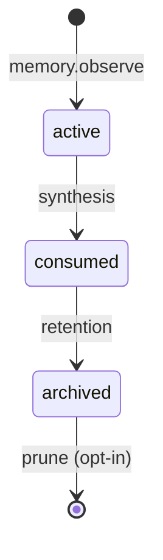
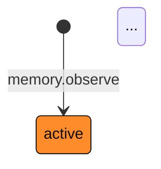

# Website brutalist redesign — implementation plan

> **For agentic workers:** REQUIRED SUB-SKILL: Use superpowers:subagent-driven-development (recommended) or superpowers:executing-plans to implement this plan task-by-task. Steps use checkbox (`- [ ]`) syntax for tracking.

**Goal:** Replace the generic MkDocs Material default look on https://emp3thy.github.io/better-memory/ with a distinctive brutalist visual identity (Inter ExtraBold display + JetBrains Mono body, paper/ink/amber palette) — landing page rebuilt from scratch, five docs pages restyled cohesively, MkDocs Material engine kept.

**Architecture:** All changes ship as Material customizations. Custom theme templates in `website/overrides/`, custom CSS + self-hosted fonts in `website/assets/`, vanilla JS only for the install-tabs widget. No new build dependencies. The existing `.github/workflows/docs.yml` deploy is untouched.

**Tech Stack:** MkDocs Material (already installed via `[dependency-groups.docs]`), vanilla CSS, vanilla JS, self-hosted `.woff2` fonts, GitHub Pages deploy.

**Spec:** `docs/superpowers/specs/2026-05-03-website-brutalist-redesign-design.md`

---

## Context for the engineer

You're redesigning a documentation site. The site is built by MkDocs Material from Markdown sources in `website/`, output to `site/`, and served at https://emp3thy.github.io/better-memory/. There are 6 pages: `index.md` (landing), `configuration.md`, `architecture.md`, `mcp-tools.md`, `observation-lifecycle.md`, `contributing.md`.

**Local preview workflow** (you'll use this constantly):

```bash
cd .worktrees/website-brutalist
uv sync --group docs            # one time
uv run mkdocs serve             # long-running; hot-reloads on save
```

Then open `http://127.0.0.1:8000/`. Hit `Ctrl+C` to stop.

**Build assertion** (your "test"):

```bash
uv run mkdocs build --strict
```

This must always pass. `--strict` fails the build on broken links, missing files, or any warning.

**File layout you'll be creating:**

```
website/
├── index.md                               # rewrite — hero + sections via md_in_html
├── overrides/
│   ├── home.html                          # NEW — landing page template (no chrome)
│   └── main.html                          # NEW — extends Material main, restyles docs pages
├── assets/
│   ├── css/
│   │   ├── brutalist.css                  # NEW — variables, typography, components
│   │   └── pygments-brutalist.css         # NEW — syntax highlighting palette
│   ├── js/
│   │   └── install-tabs.js                # NEW — OS tabs in install section
│   └── fonts/
│       ├── Inter-ExtraBold.woff2          # NEW — binary asset
│       ├── JetBrainsMono-Regular.woff2    # NEW — binary asset
│       ├── JetBrainsMono-Medium.woff2     # NEW — binary asset
│       └── JetBrainsMono-Bold.woff2       # NEW — binary asset
mkdocs.yml                                 # MODIFY — add custom_dir, fonts, extra_css/js, palette
```

---

### Task 1: Scaffold theme overrides and asset directories

**Files:**
- Modify: `mkdocs.yml`
- Create: `website/overrides/main.html`
- Create: `website/assets/css/brutalist.css` (empty)
- Create: `website/assets/css/pygments-brutalist.css` (empty)
- Create: `website/assets/js/install-tabs.js` (empty)
- Create: `website/assets/fonts/.gitkeep`

- [ ] **Step 1: Update mkdocs.yml**

Replace the `theme:` block in `mkdocs.yml` and add `extra_css` / `extra_javascript`:

```yaml
theme:
  name: material
  custom_dir: overrides
  font: false
  palette:
    scheme: default
    primary: custom
    accent: custom
  features:
    - navigation.instant
    - navigation.tracking
    - navigation.sections
    - navigation.top
    - toc.follow
    - search.suggest
    - search.highlight
    - content.code.copy
    - content.action.edit

markdown_extensions:
  # ... keep existing markdown_extensions block unchanged ...

nav:
  # ... keep existing nav block unchanged ...

extra_css:
  - assets/css/brutalist.css
  - assets/css/pygments-brutalist.css

extra_javascript:
  - assets/js/install-tabs.js
```

Note: `custom_dir: overrides` is relative to the *project root*, not `docs_dir`. Since `docs_dir: website`, the overrides path becomes `website/overrides/` automatically — Material resolves it relative to `mkdocs.yml`. Keep `docs_dir: website` and `site_dir: site` unchanged.

- [ ] **Step 2: Create overrides directory and a no-op main.html**

```bash
mkdir -p website/overrides website/assets/css website/assets/js website/assets/fonts
```

Create `website/overrides/main.html` with:

```html

```

That single line extends Material's base template without overriding anything yet. We'll add overrides in later tasks.

- [ ] **Step 3: Create empty asset placeholders**

Create three empty files so `mkdocs build` can resolve the `extra_css` / `extra_javascript` paths:

```bash
touch website/assets/css/brutalist.css
touch website/assets/css/pygments-brutalist.css
touch website/assets/js/install-tabs.js
touch website/assets/fonts/.gitkeep
```

- [ ] **Step 4: Verify the build still passes**

Run:

```bash
uv run mkdocs build --strict
```

Expected: build succeeds with no warnings. The site will look mostly unchanged (just no Material-loaded fonts since `font: false`) — that's fine.

- [ ] **Step 5: Sanity-check in browser**

Run `uv run mkdocs serve`, open `http://127.0.0.1:8000/`. Pages should still render. Material's tabs/sidebar/search should still function. The system fallback fonts will look slightly different from before (no Inter loaded). That's expected.

- [ ] **Step 6: Commit**

```bash
git add mkdocs.yml website/overrides/main.html website/assets/
git commit -m "chore(site): scaffold custom theme overrides + asset dirs"
```

---

### Task 2: Self-host Inter and JetBrains Mono as woff2

**Files:**
- Add: `website/assets/fonts/Inter-ExtraBold.woff2` (binary)
- Add: `website/assets/fonts/JetBrainsMono-Regular.woff2` (binary)
- Add: `website/assets/fonts/JetBrainsMono-Medium.woff2` (binary)
- Add: `website/assets/fonts/JetBrainsMono-Bold.woff2` (binary)
- Modify: `website/assets/css/brutalist.css`

- [ ] **Step 1: Download Inter from rsms/inter releases**

```bash
cd /tmp
curl -L -o inter.zip https://github.com/rsms/inter/releases/download/v4.0/Inter-4.0.zip
unzip -j inter.zip "Inter Web/Inter-ExtraBold.woff2" -d /tmp/inter-extracted/
```

If that exact tag is gone, browse https://github.com/rsms/inter/releases and pick the latest. The file is always at `Inter Web/Inter-ExtraBold.woff2` inside the zip.

Copy to the worktree:

```bash
cp /tmp/inter-extracted/Inter-ExtraBold.woff2 website/assets/fonts/
```

- [ ] **Step 2: Download JetBrains Mono from JetBrains/JetBrainsMono releases**

```bash
cd /tmp
curl -L -o jbmono.zip https://github.com/JetBrains/JetBrainsMono/releases/download/v2.304/JetBrainsMono-2.304.zip
unzip -j jbmono.zip "fonts/webfonts/JetBrainsMono-Regular.woff2" "fonts/webfonts/JetBrainsMono-Medium.woff2" "fonts/webfonts/JetBrainsMono-Bold.woff2" -d /tmp/jbmono-extracted/
cp /tmp/jbmono-extracted/JetBrainsMono-{Regular,Medium,Bold}.woff2 website/assets/fonts/
```

If v2.304 is gone, browse https://github.com/JetBrains/JetBrainsMono/releases for the latest tag. Path inside the zip is always `fonts/webfonts/`.

- [ ] **Step 3: Verify file sizes**

```bash
ls -la website/assets/fonts/
```

Expected sizes (approximate):
- `Inter-ExtraBold.woff2`: ~110 KB
- `JetBrainsMono-Regular.woff2`: ~50 KB
- `JetBrainsMono-Medium.woff2`: ~50 KB
- `JetBrainsMono-Bold.woff2`: ~50 KB

Total: ~260 KB. This is over the 80 KB budget noted in the spec — that's acceptable for v1. Step 5 of Task 15 covers subsetting if we want to reduce.

- [ ] **Step 4: Add @font-face declarations to brutalist.css**

Replace the empty `website/assets/css/brutalist.css` with:

```css
/* ============================================================
   Fonts (self-hosted)
   ============================================================ */

@font-face {
  font-family: "Inter";
  font-style: normal;
  font-weight: 800;
  font-display: swap;
  src: url("../fonts/Inter-ExtraBold.woff2") format("woff2");
}

@font-face {
  font-family: "JetBrains Mono";
  font-style: normal;
  font-weight: 400;
  font-display: swap;
  src: url("../fonts/JetBrainsMono-Regular.woff2") format("woff2");
}

@font-face {
  font-family: "JetBrains Mono";
  font-style: normal;
  font-weight: 500;
  font-display: swap;
  src: url("../fonts/JetBrainsMono-Medium.woff2") format("woff2");
}

@font-face {
  font-family: "JetBrains Mono";
  font-style: normal;
  font-weight: 700;
  font-display: swap;
  src: url("../fonts/JetBrainsMono-Bold.woff2") format("woff2");
}
```

- [ ] **Step 5: Verify in browser**

Run `uv run mkdocs serve` (if not already running). Open `http://127.0.0.1:8000/` and DevTools → Network tab. Refresh. Confirm all four `.woff2` files load with status 200. Switch to DevTools → Elements → Computed and verify `font-family` resolves to `JetBrains Mono` somewhere on the page (it won't yet — that's Task 3 — but the files should at least be served).

- [ ] **Step 6: Commit**

```bash
git add website/assets/fonts/ website/assets/css/brutalist.css
git commit -m "style(site): self-host Inter ExtraBold + JetBrains Mono webfonts"
```

---

### Task 3: CSS variables and base typography

**Files:**
- Modify: `website/assets/css/brutalist.css`

- [ ] **Step 1: Add :root variables and reset**

Append to `website/assets/css/brutalist.css`:

```css
/* ============================================================
   Design tokens
   ============================================================ */

:root,
[data-md-color-scheme="default"] {
  /* Color */
  --brut-ink: #0d0d0d;
  --brut-paper: #f5f3ee;
  --brut-paper-shade: #ebe8e1;
  --brut-amber: #ff8c2b;
  --brut-amber-ink: #0d0d0d;
  --brut-muted: #6b6862;
  --brut-rule: #d8d4cb;

  /* Type */
  --brut-display: "Inter", "Helvetica Neue", Arial, sans-serif;
  --brut-mono: "JetBrains Mono", "SFMono-Regular", "Menlo", "Monaco", "Consolas", monospace;

  /* Layout */
  --brut-content-w: 880px;
  --brut-hero-w: 1100px;
  --brut-section-y: 96px;
  --brut-section-y-docs: 56px;

  /* Override Material's primary/accent so anywhere it leaks through, we're consistent */
  --md-primary-fg-color: var(--brut-ink);
  --md-primary-fg-color--light: var(--brut-ink);
  --md-primary-fg-color--dark: var(--brut-ink);
  --md-accent-fg-color: var(--brut-amber);
  --md-default-bg-color: var(--brut-paper);
  --md-default-fg-color: var(--brut-ink);
  --md-typeset-color: var(--brut-ink);
  --md-typeset-a-color: var(--brut-ink);
}
```

- [ ] **Step 2: Add base typography rules**

Append:

```css
/* ============================================================
   Base typography
   ============================================================ */

html, body, .md-typeset {
  font-family: var(--brut-mono);
  font-size: 15px;
  line-height: 1.65;
  color: var(--brut-ink);
  background: var(--brut-paper);
}

.md-typeset h1,
.md-typeset h2,
.md-typeset h3,
.md-typeset h4,
.md-typeset h5,
.md-typeset h6 {
  font-family: var(--brut-display);
  font-weight: 800;
  letter-spacing: -0.04em;
  text-transform: lowercase;
  color: var(--brut-ink);
}

.md-typeset h1 { font-size: 3.25rem; line-height: 0.96; margin: 0 0 1.25rem; }
.md-typeset h2 { font-size: 2.25rem; line-height: 1.0;  margin: 2rem 0 0.75rem; }
.md-typeset h3 { font-size: 1.5rem;  line-height: 1.1;  margin: 1.5rem 0 0.5rem; }
.md-typeset h4 { font-size: 1.15rem; line-height: 1.2;  margin: 1.25rem 0 0.5rem; }

.md-typeset p { margin: 0 0 1rem; }

.md-typeset a {
  color: var(--brut-ink);
  text-decoration: none;
  border-bottom: 2px solid var(--brut-amber);
  padding-bottom: 1px;
  transition: background 120ms ease;
}
.md-typeset a:hover { background: var(--brut-amber); color: var(--brut-amber-ink); }

.md-typeset code {
  font-family: var(--brut-mono);
  background: var(--brut-paper-shade);
  border-radius: 0;
  padding: 1px 5px;
  font-size: 0.92em;
  color: var(--brut-ink);
}

.md-typeset pre,
.md-typeset .highlight,
.md-typeset .highlight pre {
  border-radius: 0;
  background: var(--brut-paper-shade);
  border: none;
}

.md-typeset table:not([class]) {
  font-family: var(--brut-mono);
  font-size: 0.9rem;
  border: none;
}

.md-typeset table:not([class]) th {
  background: transparent;
  border-bottom: 2px solid var(--brut-ink);
  text-transform: uppercase;
  letter-spacing: 0.12em;
  font-size: 0.7rem;
  font-weight: 700;
  color: var(--brut-ink);
}

.md-typeset table:not([class]) td {
  border-bottom: 1px solid var(--brut-rule);
}
```

- [ ] **Step 3: Verify visually**

`uv run mkdocs serve` → `http://127.0.0.1:8000/`. Browse all 6 pages. Expect: paper background, mono body text, lowercase Inter ExtraBold headings, amber-underlined links, paper-shade code blocks. Layout is still Material's default (sidebar/TOC/header all present and unstyled-by-us) — that's fine, we restyle them in Task 12.

- [ ] **Step 4: Build check**

```bash
uv run mkdocs build --strict
```

Expected: pass.

- [ ] **Step 5: Commit**

```bash
git add website/assets/css/brutalist.css
git commit -m "style(site): brutalist design tokens + base typography"
```

---

### Task 4: Custom landing page template (home.html)

**Files:**
- Create: `website/overrides/home.html`
- Modify: `website/index.md` (front-matter only, content stays for now)
- Modify: `website/assets/css/brutalist.css` (landing-page styles)

- [ ] **Step 1: Create home.html**

Create `website/overrides/home.html`:

```html


{# Hide Material chrome on landing #}



  <main class="brut-landing">
    {{ page.content | safe }}
  </main>




  {{ super() }}
  <meta name="description" content="A local-first semantic + episodic memory manager for Claude Code.">

```

The `` empties the left sidebar. `` hides the top tabs. We render `page.content` directly inside `<main class="brut-landing">` so all our landing-page styles can scope to `.brut-landing`.

- [ ] **Step 2: Add front-matter to index.md**

Edit `website/index.md`. Add at the very top (before any existing content):

```yaml
---
template: home.html
title: better-memory
description: Memory that sticks between sessions.
hide:
  - navigation
  - toc
---
```

Keep all existing `# better-memory` and below content unchanged for now. The hero rewrite happens in Task 5.

- [ ] **Step 3: Add landing-page scope CSS**

Append to `website/assets/css/brutalist.css`:

```css
/* ============================================================
   Landing page scope
   ============================================================ */

.brut-landing {
  width: 100%;
  max-width: none;
  padding: 0;
  margin: 0;
}

.brut-landing > * {
  /* Sections will set their own backgrounds */
}

.brut-section {
  padding: var(--brut-section-y) 32px;
  background: var(--brut-paper);
}

.brut-section.brut-shade {
  background: var(--brut-paper-shade);
}

.brut-container {
  max-width: var(--brut-content-w);
  margin: 0 auto;
}

.brut-container.brut-wide {
  max-width: var(--brut-hero-w);
}
```

- [ ] **Step 4: Verify chrome is gone**

`uv run mkdocs serve` → `http://127.0.0.1:8000/`. The landing page should render with no top tabs, no left sidebar, no right TOC, no Material footer. The existing markdown content is visible inside `<main class="brut-landing">`. The other 5 pages should still have full Material chrome — verify by clicking into any of them via browser URL.

- [ ] **Step 5: Build check**

```bash
uv run mkdocs build --strict
```

Expected: pass.

- [ ] **Step 6: Commit**

```bash
git add website/overrides/home.html website/index.md website/assets/css/brutalist.css
git commit -m "feat(site): custom landing page template (no chrome)"
```

---

### Task 5: Hero section + landing top nav

**Files:**
- Modify: `website/index.md` (replace content with raw HTML hero block)
- Modify: `website/assets/css/brutalist.css` (hero + nav styles)

- [ ] **Step 1: Rewrite index.md content**

Replace everything BELOW the front-matter in `website/index.md` with:

```html
<nav class="brut-nav">
  <div class="brut-nav-brand">
    <span class="brut-bracket">[</span> better-memory <span class="brut-bracket">]</span>
  </div>
  <div class="brut-nav-links">
    <a href="#install">install</a>
    <a href="configuration/">docs</a>
    <a href="https://github.com/emp3thy/better-memory">github</a>
  </div>
</nav>

<section class="brut-section brut-hero-section">
  <div class="brut-container brut-wide">
    <div class="brut-eyebrow">// LOCAL-FIRST · MCP · CLAUDE-CODE</div>
    <h1 class="brut-display">memory that<br><span class="brut-hl">sticks</span> between sessions.</h1>
    <p class="brut-lede">A semantic + episodic memory manager for Claude Code. SQLite, local Ollama, no cloud.</p>
    <div class="brut-ctas">
      <a class="brut-cta brut-cta-primary" href="#install">install →</a>
      <a class="brut-cta brut-cta-secondary" href="architecture/">read the spec →</a>
    </div>
  </div>
</section>
```

Note: `{: ...}` attr_list syntax could replace the raw HTML, but the spec opted for `md_in_html` since hero markup is non-trivial. Keep raw HTML.

- [ ] **Step 2: Add nav + hero CSS**

Append to `website/assets/css/brutalist.css`:

```css
/* ============================================================
   Landing — top nav
   ============================================================ */

.brut-nav {
  display: flex;
  justify-content: space-between;
  align-items: center;
  padding: 18px 32px;
  border-bottom: 1px solid var(--brut-rule);
  background: var(--brut-paper);
  font-family: var(--brut-mono);
  font-size: 14px;
}

.brut-nav-brand { font-weight: 700; }
.brut-nav-brand .brut-bracket { color: var(--brut-muted); margin: 0 2px; }

.brut-nav-links { display: flex; gap: 24px; }
.brut-nav-links a {
  color: var(--brut-ink);
  text-decoration: none;
  border-bottom: none;
  padding-bottom: 0;
}
.brut-nav-links a:hover {
  background: transparent;
  color: var(--brut-amber);
}

/* ============================================================
   Landing — hero section (01)
   ============================================================ */

.brut-hero-section {
  padding-top: 100px;
  padding-bottom: 110px;
}

.brut-eyebrow {
  font-family: var(--brut-mono);
  font-size: 12px;
  letter-spacing: 0.2em;
  text-transform: uppercase;
  color: var(--brut-muted);
  margin-bottom: 18px;
}

.brut-display {
  font-family: var(--brut-display);
  font-weight: 800;
  font-size: clamp(48px, 8vw, 104px);
  line-height: 0.94;
  letter-spacing: -0.045em;
  text-transform: lowercase;
  margin: 0 0 28px;
  color: var(--brut-ink);
}

.brut-display .brut-hl {
  background: var(--brut-amber);
  color: var(--brut-amber-ink);
  padding: 0 8px;
}

.brut-lede {
  font-family: var(--brut-mono);
  font-size: 18px;
  line-height: 1.55;
  color: var(--brut-ink);
  max-width: 60ch;
  margin: 0 0 32px;
}

.brut-ctas { display: flex; gap: 0; }

.brut-cta {
  font-family: var(--brut-mono);
  font-size: 14px;
  padding: 14px 24px;
  border-bottom: none;
  cursor: pointer;
  text-decoration: none;
  display: inline-block;
  transition: background 120ms ease, color 120ms ease;
}
.brut-cta-primary {
  background: var(--brut-ink);
  color: var(--brut-paper);
  border: 2px solid var(--brut-ink);
}
.brut-cta-primary:hover {
  background: var(--brut-amber);
  color: var(--brut-amber-ink);
  border-color: var(--brut-ink);
}
.brut-cta-secondary {
  background: var(--brut-paper);
  color: var(--brut-ink);
  border: 2px solid var(--brut-ink);
  border-left: none;
}
.brut-cta-secondary:hover {
  background: var(--brut-ink);
  color: var(--brut-paper);
}

/* Responsive */
@media (max-width: 720px) {
  .brut-nav { padding: 14px 20px; }
  .brut-nav-links { gap: 16px; }
  .brut-hero-section { padding-top: 56px; padding-bottom: 64px; }
}
```

- [ ] **Step 3: Verify hero renders correctly**

`uv run mkdocs serve` → `http://127.0.0.1:8000/`. Expect:
- Top nav: `[ better-memory ]` left, `install · docs · github` right
- Eyebrow line `// LOCAL-FIRST · MCP · CLAUDE-CODE` in muted small caps
- Massive lowercase Inter ExtraBold display: "memory that ⟨amber-block⟩sticks⟨/⟩ between sessions."
- 1-line lede in mono
- Two CTAs: filled "install →" and outlined "read the spec →"

Test at three browser widths via DevTools responsive mode:
- 1280px: hero is wide, lede is on one line
- 768px: still readable, display shrinks
- 375px: nav stacks if needed (doesn't have to — `flex` with `gap` handles it), display shrinks via `clamp()`

- [ ] **Step 4: Build check**

```bash
uv run mkdocs build --strict
```

Expected: pass. (The rest of the README content is still in `index.md` after the hero — that's fine, it'll get replaced section-by-section in Tasks 6-10.)

- [ ] **Step 5: Commit**

```bash
git add website/index.md website/assets/css/brutalist.css
git commit -m "feat(site): landing page hero + top nav"
```

---

### Task 6: Specimen section (02) and Three buckets section (03)

**Files:**
- Modify: `website/index.md`
- Modify: `website/assets/css/brutalist.css`

- [ ] **Step 1: Append section 02 + 03 HTML to index.md**

Add immediately after the closing `</section>` of the hero (and before any of the existing README-derived content — that gets removed in Task 10):

````html
<section class="brut-section brut-shade">
  <div class="brut-container">
    <div class="brut-num">02 — SPECIMEN</div>
    <h2 class="brut-section-h">what an observation looks like</h2>
    <p class="brut-lede brut-muted">A real <code>memory.observe()</code> call, and what comes back from <code>memory.retrieve()</code> next session.</p>

```python
memory.observe(
    content="Growatt Timespan.day inflated; switched to Timespan.hour",
    component="growatt_client",
    outcome="failure",
    trigger_type="debugging",
)
# → returns {"id": "6aa6bf51..."}

# next session, retrieved as:
memory.retrieve(query="growatt") → do bucket
  ↳ "switched to Timespan.hour" — confidence 1.0
```

  </div>
</section>

<section class="brut-section">
  <div class="brut-container">
    <div class="brut-num">03 — RETRIEVAL</div>
    <h2 class="brut-section-h">retrieval, sorted by outcome</h2>
    <p class="brut-lede brut-muted">Three buckets, surfaced separately. The AI sees what worked, what to avoid, and what's just context.</p>
    <div class="brut-buckets">
      <div class="brut-bucket brut-bucket-do">
        <div class="brut-bucket-name">do</div>
        <div class="brut-bucket-role">prior wins</div>
        <div class="brut-bucket-ex">"Calculator uses _estimate_generation_hourly + morning_floor; charge = max(gap_pct, morning_floor_pct)."</div>
      </div>
      <div class="brut-bucket">
        <div class="brut-bucket-name">dont</div>
        <div class="brut-bucket-role">approaches to avoid</div>
        <div class="brut-bucket-ex">"Growatt Timespan.day returned inflated consumption — use Timespan.hour."</div>
      </div>
      <div class="brut-bucket">
        <div class="brut-bucket-name">neutral</div>
        <div class="brut-bucket-role">context</div>
        <div class="brut-bucket-ex">"Python ZoneInfo unavailable on Windows without tzdata package."</div>
      </div>
    </div>
    <p class="brut-bucket-sub">reinforcement-weighted — memory.record_use promotes signal, demotes noise.</p>
  </div>
</section>
````

The triple-backtick `python` block inside the `<section>` works because `md_in_html` is enabled. The block needs the surrounding blank lines exactly as shown — markdown-inside-html requires them.

- [ ] **Step 2: Add section CSS**

Append to `website/assets/css/brutalist.css`:

```css
/* ============================================================
   Landing — common section primitives
   ============================================================ */

.brut-num {
  font-family: var(--brut-mono);
  font-size: 12px;
  letter-spacing: 0.2em;
  color: var(--brut-muted);
  margin-bottom: 8px;
}

.brut-section-h {
  font-family: var(--brut-display);
  font-weight: 800;
  font-size: clamp(36px, 5vw, 56px);
  line-height: 1.0;
  letter-spacing: -0.04em;
  text-transform: lowercase;
  margin: 0 0 16px;
  color: var(--brut-ink);
}

.brut-lede.brut-muted { color: var(--brut-muted); }

.brut-section .highlight,
.brut-section pre {
  margin-top: 16px;
  background: var(--brut-paper-shade);
  border: none;
  padding: 18px 20px;
  font-size: 13px;
  line-height: 1.65;
}

.brut-shade .highlight,
.brut-shade pre {
  background: var(--brut-paper);
}

/* ============================================================
   Landing — three buckets (03)
   ============================================================ */

.brut-buckets {
  display: grid;
  grid-template-columns: repeat(3, 1fr);
  border: 1px solid var(--brut-ink);
  margin-top: 28px;
}

.brut-bucket {
  padding: 24px 22px;
  border-right: 1px solid var(--brut-ink);
}
.brut-bucket:last-child { border-right: none; }

.brut-bucket-do {
  border-left: 4px solid var(--brut-amber);
  margin-left: -1px;
}

.brut-bucket-name {
  font-family: var(--brut-display);
  font-weight: 800;
  font-size: 36px;
  letter-spacing: -0.04em;
  text-transform: lowercase;
  line-height: 1.0;
  color: var(--brut-ink);
}

.brut-bucket-role {
  font-family: var(--brut-mono);
  font-size: 11px;
  letter-spacing: 0.12em;
  text-transform: uppercase;
  color: var(--brut-muted);
  margin-top: 6px;
}

.brut-bucket-ex {
  font-family: var(--brut-mono);
  font-size: 13px;
  line-height: 1.55;
  margin-top: 16px;
  color: var(--brut-ink);
}

.brut-bucket-sub {
  font-family: var(--brut-mono);
  font-size: 14px;
  color: var(--brut-muted);
  margin-top: 18px;
}

@media (max-width: 720px) {
  .brut-buckets { grid-template-columns: 1fr; }
  .brut-bucket { border-right: none; border-bottom: 1px solid var(--brut-ink); }
  .brut-bucket:last-child { border-bottom: none; }
}
```

- [ ] **Step 3: Verify both sections render**

`uv run mkdocs serve` → `http://127.0.0.1:8000/`. After the hero you should see:
- Section 02 on `paper-shade` background, with a real Python code block (syntax highlighting via Pygments default — we restyle in Task 13).
- Section 03 on `paper` background, three-column bucket grid bordered in ink, the `do` column with a 4px amber left bar.

Mobile (375px): buckets should stack vertically.

- [ ] **Step 4: Build check**

```bash
uv run mkdocs build --strict
```

Expected: pass.

- [ ] **Step 5: Commit**

```bash
git add website/index.md website/assets/css/brutalist.css
git commit -m "feat(site): landing sections — specimen + three buckets"
```

---

### Task 7: Lifecycle section (04) with Mermaid

**Files:**
- Modify: `website/index.md`
- Modify: `website/assets/css/brutalist.css`

- [ ] **Step 1: Append lifecycle section to index.md**

Add immediately after the closing `</section>` of section 03:

````html
<section class="brut-section brut-shade">
  <div class="brut-container">
    <div class="brut-num">04 — LIFECYCLE</div>
    <h2 class="brut-section-h">observations have a lifecycle</h2>
    <p class="brut-lede brut-muted">Synthesis consolidates. Retention archives. Prune is opt-in.</p>



  </div>
</section>
````

This is a simplified version of the full diagram in `observation-lifecycle.md`. The full diagram is dense; for the landing page we want quick scannability.

- [ ] **Step 2: Confirm Mermaid still renders**

Mermaid is already configured via `pymdownx.superfences` custom_fences in `mkdocs.yml`. No code changes needed — just verify it renders. Run `uv run mkdocs serve` and check that the diagram shows up in section 04 of the landing page.

If it doesn't render, check that the `mermaid` block syntax in the code-fence above matches the existing `observation-lifecycle.md` syntax exactly (same custom_fences config).

- [ ] **Step 3: Add minimal lifecycle section CSS**

Append to `website/assets/css/brutalist.css`:

```css
/* ============================================================
   Landing — lifecycle (04)
   ============================================================ */

.brut-section .mermaid {
  margin-top: 24px;
  padding: 32px 20px;
  background: var(--brut-paper);
  border: 1px solid var(--brut-ink);
  text-align: center;
}

.brut-shade .mermaid { background: var(--brut-paper-shade); }
```

(Detailed Mermaid theming — making the diagram itself ink-and-amber instead of Material's default — happens in Task 14. For now we just style the wrapper.)

- [ ] **Step 4: Verify**

`uv run mkdocs serve` → check section 04 renders with the Mermaid diagram inside an ink-bordered box on `paper-shade` background. The diagram itself will still be Material's default colors — we fix that in Task 14.

- [ ] **Step 5: Build check**

```bash
uv run mkdocs build --strict
```

Expected: pass.

- [ ] **Step 6: Commit**

```bash
git add website/index.md website/assets/css/brutalist.css
git commit -m "feat(site): landing lifecycle section with mermaid"
```

---

### Task 8: Install section (05) with OS tabs

**Files:**
- Modify: `website/index.md`
- Modify: `website/assets/css/brutalist.css`
- Modify: `website/assets/js/install-tabs.js`

- [ ] **Step 1: Append install section to index.md**

Add immediately after the closing `</section>` of section 04:

````html
<section class="brut-section" id="install">
  <div class="brut-container">
    <div class="brut-num">05 — INSTALL</div>
    <h2 class="brut-section-h">three commands, one paste</h2>
    <p class="brut-lede brut-muted">Clone, run setup, paste the printed JSON snippets into your Claude Code config.</p>

```bash
git clone https://github.com/emp3thy/better-memory
cd better-memory
./scripts/setup.sh
```

    <div class="brut-tabs" data-brut-tabs>
      <button class="brut-tab brut-tab-active" data-os="macos">macos</button>
      <button class="brut-tab" data-os="linux">linux</button>
      <button class="brut-tab" data-os="windows">windows</button>
    </div>

    <div class="brut-tab-pane brut-tab-pane-active" data-os-pane="macos">
```json
{
  "mcpServers": {
    "better-memory": {
      "type": "stdio",
      "command": "/absolute/path/to/.venv/bin/python",
      "args": ["-m", "better_memory.mcp"]
    }
  }
}
```
    </div>

    <div class="brut-tab-pane" data-os-pane="linux">
```json
{
  "mcpServers": {
    "better-memory": {
      "type": "stdio",
      "command": "/absolute/path/to/.venv/bin/python",
      "args": ["-m", "better_memory.mcp"]
    }
  }
}
```
    </div>

    <div class="brut-tab-pane" data-os-pane="windows">
```json
{
  "mcpServers": {
    "better-memory": {
      "type": "stdio",
      "command": "C:/absolute/path/to/.venv/Scripts/pythonw.exe",
      "args": ["-m", "better_memory.mcp"]
    }
  }
}
```
    </div>

    <p style="margin-top:18px"><a href="configuration/">full setup guide →</a></p>
  </div>
</section>
````

The macos and linux blocks are identical — that's accurate to the project's setup; only Windows uses `pythonw.exe`. We still keep three tabs for visual symmetry and for future divergence.

- [ ] **Step 2: Add tabs CSS**

Append to `website/assets/css/brutalist.css`:

```css
/* ============================================================
   Landing — install tabs (05)
   ============================================================ */

.brut-tabs {
  display: flex;
  gap: 0;
  margin-top: 24px;
  border-bottom: 2px solid var(--brut-ink);
}

.brut-tab {
  font-family: var(--brut-mono);
  font-size: 13px;
  text-transform: lowercase;
  padding: 8px 18px;
  background: var(--brut-paper-shade);
  color: var(--brut-ink);
  border: 2px solid var(--brut-ink);
  border-bottom: none;
  margin-right: -2px;
  cursor: pointer;
  transition: background 120ms ease, color 120ms ease;
}

.brut-tab:hover { background: var(--brut-paper); }

.brut-tab-active,
.brut-tab-active:hover {
  background: var(--brut-ink);
  color: var(--brut-paper);
}

.brut-tab-pane { display: none; }
.brut-tab-pane-active { display: block; }

.brut-tab-pane > .highlight,
.brut-tab-pane > pre {
  margin-top: 0;
  border: 2px solid var(--brut-ink);
  border-top: none;
}
```

- [ ] **Step 3: Implement tab-switching JS**

Replace the empty `website/assets/js/install-tabs.js` with:

```javascript
(function () {
  function initBrutTabs(root) {
    const buttons = root.querySelectorAll('.brut-tab');
    const section = root.closest('.brut-section') || document;
    const panes = section.querySelectorAll('.brut-tab-pane');

    buttons.forEach((btn) => {
      btn.addEventListener('click', (e) => {
        e.preventDefault();
        const os = btn.dataset.os;
        buttons.forEach((b) => b.classList.toggle('brut-tab-active', b === btn));
        panes.forEach((p) => p.classList.toggle('brut-tab-pane-active', p.dataset.osPane === os));
      });
    });
  }

  function init() {
    document.querySelectorAll('[data-brut-tabs]').forEach(initBrutTabs);
  }

  if (document.readyState === 'loading') {
    document.addEventListener('DOMContentLoaded', init);
  } else {
    init();
  }

  // Material's instant-load nav swaps the page without a full reload.
  // Re-init on each navigation event.
  if (typeof document$ !== 'undefined' && document$.subscribe) {
    document$.subscribe(init);
  }
})();
```

The `document$` subscription handles Material's `navigation.instant` feature, which swaps page contents without a hard reload.

- [ ] **Step 4: Verify tabs work**

`uv run mkdocs serve`. Click each of the three OS tabs. Confirm:
- Active tab gets ink background + paper text
- The visible JSON pane swaps to match
- The Windows pane shows `pythonw.exe`, others show `python`
- Clicking from anchor link `#install` (e.g., from the hero CTA) scrolls smoothly to the install section

- [ ] **Step 5: Build check**

```bash
uv run mkdocs build --strict
```

Expected: pass.

- [ ] **Step 6: Commit**

```bash
git add website/index.md website/assets/css/brutalist.css website/assets/js/install-tabs.js
git commit -m "feat(site): landing install section with OS tabs"
```

---

### Task 9: MCP tools section (06)

**Files:**
- Modify: `website/index.md`
- Modify: `website/assets/css/brutalist.css`

- [ ] **Step 1: Append section 06 to index.md**

Add immediately after the closing `</section>` of section 05:

```html
<section class="brut-section brut-shade">
  <div class="brut-container">
    <div class="brut-num">06 — TOOLS</div>
    <h2 class="brut-section-h">the surface area</h2>

    <table class="brut-tools">
      <thead>
        <tr><th>tool</th><th>purpose</th></tr>
      </thead>
      <tbody>
        <tr><td><a href="mcp-tools/#memoryobserve">memory.observe</a></td><td>Create a new observation. Returns {"id": ...}.</td></tr>
        <tr><td><a href="mcp-tools/#memoryretrieve">memory.retrieve</a></td><td>Three outcome buckets + insights + knowledge. Drains spool first.</td></tr>
        <tr><td><a href="mcp-tools/#memoryrecord_use">memory.record_use</a></td><td>Stamp reinforcement outcome on a memory after validation.</td></tr>
        <tr><td><a href="mcp-tools/#knowledgesearch">knowledge.search</a></td><td>BM25 search against the knowledge base.</td></tr>
        <tr><td><a href="mcp-tools/#knowledgelist">knowledge.list</a></td><td>List indexed knowledge docs.</td></tr>
        <tr><td><a href="mcp-tools/#memorystart_ui">memory.start_ui</a></td><td>Spawn or reuse the management UI; returns {url, reused}.</td></tr>
      </tbody>
    </table>
  </div>
</section>
```

The anchor IDs (`#memoryobserve`, `#memoryretrieve`, etc.) are mkdocs/Material's auto-generated heading anchors — verify they exist in `mcp-tools.md` after building. If they don't match, update the hrefs to match what mkdocs actually generates (it strips dots and lowercases).

- [ ] **Step 2: Add tools table CSS**

Append to `website/assets/css/brutalist.css`:

```css
/* ============================================================
   Landing — tools table (06)
   ============================================================ */

.brut-tools {
  width: 100%;
  border-collapse: collapse;
  margin-top: 28px;
  font-family: var(--brut-mono);
  font-size: 14px;
}

.brut-tools th {
  text-align: left;
  padding: 12px 16px;
  border-bottom: 2px solid var(--brut-ink);
  text-transform: uppercase;
  letter-spacing: 0.12em;
  font-size: 11px;
  font-weight: 700;
  color: var(--brut-ink);
}

.brut-tools td {
  padding: 12px 16px;
  border-bottom: 1px solid var(--brut-rule);
  vertical-align: top;
  color: var(--brut-ink);
}

.brut-tools td:first-child {
  font-weight: 700;
  white-space: nowrap;
}

.brut-tools td a {
  color: var(--brut-ink);
  text-decoration: none;
  border-bottom: 2px solid var(--brut-amber);
  padding-bottom: 1px;
}
.brut-tools td a:hover {
  background: var(--brut-amber);
  color: var(--brut-amber-ink);
}
```

- [ ] **Step 3: Verify table + anchors**

`uv run mkdocs serve`. Section 06 renders with the table on `paper-shade` background. Click each tool name link — confirm it navigates to the corresponding tool's section in `/mcp-tools/`. If any link 404s or scrolls to nothing, fix the anchor in step 1.

- [ ] **Step 4: Build check**

```bash
uv run mkdocs build --strict
```

Expected: pass. (Anchor mismatches don't fail `--strict` — only missing-page links do — so manually verify in browser.)

- [ ] **Step 5: Commit**

```bash
git add website/index.md website/assets/css/brutalist.css
git commit -m "feat(site): landing MCP tools surface-area table"
```

---

### Task 10: Go deeper cards (07) + Footer (08), and remove leftover README content

**Files:**
- Modify: `website/index.md`
- Modify: `website/assets/css/brutalist.css`

- [ ] **Step 1: Append sections 07 + 08, remove old content**

Edit `website/index.md`. Append immediately after the closing `</section>` of section 06:

```html
<section class="brut-section">
  <div class="brut-container">
    <div class="brut-num">07 — GO DEEPER</div>
    <h2 class="brut-section-h">documentation</h2>
    <div class="brut-docs-grid">
      <a href="architecture/" class="brut-doc-card">
        <div class="brut-doc-title">architecture</div>
        <div class="brut-doc-desc">Four-layer epistemic hierarchy, hybrid search, reinforcement-weighted ranking.</div>
        <div class="brut-doc-arrow">→</div>
      </a>
      <a href="configuration/" class="brut-doc-card">
        <div class="brut-doc-title">configuration</div>
        <div class="brut-doc-desc">Env vars, project-name overrides, MCP wiring.</div>
        <div class="brut-doc-arrow">→</div>
      </a>
      <a href="observation-lifecycle/" class="brut-doc-card">
        <div class="brut-doc-title">observation lifecycle</div>
        <div class="brut-doc-desc">Active → consumed → archived. Synthesis, retention, prune.</div>
        <div class="brut-doc-arrow">→</div>
      </a>
      <a href="contributing/" class="brut-doc-card">
        <div class="brut-doc-title">contributing</div>
        <div class="brut-doc-desc">Setup, testing, conventions.</div>
        <div class="brut-doc-arrow">→</div>
      </a>
    </div>
  </div>
</section>

<footer class="brut-footer">
  <div class="brut-footer-left">better-memory · v0.1.0 · MIT</div>
  <div class="brut-footer-right">
    <a href="https://github.com/emp3thy/better-memory">github</a>
    <span class="brut-footer-sep">·</span>
    <span>built with <a href="https://docs.astral.sh/uv/">uv</a> · <a href="https://www.sqlite.org/">sqlite</a> · <a href="https://ollama.com/">ollama</a></span>
  </div>
</footer>
```

Now scroll down in `index.md` and **delete** all README-derived content that follows the closing `</footer>` (the old `# better-memory`, "Quick start", "Manual setup", "Skills", "Troubleshooting" sections). The landing is fully replaced — only the front-matter + the eight sections + footer remain.

- [ ] **Step 2: Add doc cards + footer CSS**

Append to `website/assets/css/brutalist.css`:

```css
/* ============================================================
   Landing — doc cards (07)
   ============================================================ */

.brut-docs-grid {
  display: grid;
  grid-template-columns: 1fr 1fr;
  border-top: 1px solid var(--brut-rule);
  margin-top: 28px;
}

.brut-doc-card {
  display: block;
  padding: 26px 24px;
  border-bottom: 1px solid var(--brut-rule);
  border-right: 1px solid var(--brut-rule);
  text-decoration: none;
  color: var(--brut-ink);
  transition: background 120ms ease;
}
.brut-doc-card:nth-child(2n) { border-right: none; }
.brut-doc-card:hover {
  background: var(--brut-paper-shade);
  border-bottom: 1px solid var(--brut-rule);
}

.brut-doc-title {
  font-family: var(--brut-display);
  font-weight: 800;
  font-size: 32px;
  letter-spacing: -0.04em;
  text-transform: lowercase;
  margin-bottom: 6px;
  color: var(--brut-ink);
}

.brut-doc-desc {
  font-family: var(--brut-mono);
  font-size: 13px;
  line-height: 1.55;
  color: var(--brut-muted);
}

.brut-doc-arrow {
  font-family: var(--brut-mono);
  font-size: 14px;
  font-weight: 700;
  color: var(--brut-amber);
  margin-top: 14px;
}

@media (max-width: 720px) {
  .brut-docs-grid { grid-template-columns: 1fr; }
  .brut-doc-card { border-right: none; }
}

/* ============================================================
   Landing — footer (08)
   ============================================================ */

.brut-footer {
  background: var(--brut-paper);
  border-top: 2px solid var(--brut-ink);
  padding: 28px 32px;
  display: flex;
  justify-content: space-between;
  flex-wrap: wrap;
  gap: 16px;
  font-family: var(--brut-mono);
  font-size: 12px;
  color: var(--brut-muted);
}

.brut-footer a {
  color: var(--brut-muted);
  text-decoration: none;
  border-bottom: 1px solid var(--brut-rule);
  padding-bottom: 1px;
  transition: color 120ms ease, background 120ms ease, border-color 120ms ease;
}
.brut-footer a:hover {
  background: var(--brut-amber);
  color: var(--brut-amber-ink);
  border-bottom-color: var(--brut-ink);
}

.brut-footer-sep { margin: 0 8px; }
```

- [ ] **Step 3: Verify all 8 sections render in order**

`uv run mkdocs serve`. Scroll the landing page top-to-bottom and confirm:
1. Top nav
2. Hero (paper)
3. Specimen (paper-shade)
4. Buckets (paper)
5. Lifecycle (paper-shade)
6. Install (paper)
7. Tools (paper-shade)
8. Go deeper (paper)
9. Footer

Click each doc card — they should navigate to their respective docs pages.

- [ ] **Step 4: Build check**

```bash
uv run mkdocs build --strict
```

Expected: pass.

- [ ] **Step 5: Commit**

```bash
git add website/index.md website/assets/css/brutalist.css
git commit -m "feat(site): landing go-deeper cards + footer; drop README leftovers"
```

---

### Task 11: Docs page header + sidebar restyle

**Files:**
- Modify: `website/overrides/main.html`
- Modify: `website/assets/css/brutalist.css`

- [ ] **Step 1: Override Material header brand in main.html**

Replace `website/overrides/main.html` with:

```html



  {{ super() }}



  {{ super() }}
  <meta name="theme-color" content="#f5f3ee">




{# Replace the Material logo + site name with a brutalist wordmark #}

<header class="md-header brut-docs-header" data-md-component="header">
  <nav class="md-header__inner md-grid" aria-label="Header">
    <a href="{{ config.site_url | d(nav.homepage.url, true) | url }}" class="brut-docs-brand">
      <span class="brut-bracket">[</span>&nbsp;{{ config.site_name }}&nbsp;<span class="brut-bracket">]</span>
    </a>
    <div class="brut-docs-header-links">
      <a href="{{ '/#install' | url }}">install</a>
      <a href="{{ 'configuration/' | url }}">docs</a>
      <a href="{{ config.repo_url }}">github</a>
    </div>
    
      <label class="md-header__button md-icon" for="__search">
        
      </label>
      <div class="md-search" data-md-component="search" role="dialog">
        
      </div>
    
  </nav>
</header>

```

This replaces the Material logo + nav with a wordmark and three top-level links, while preserving the search drawer.

- [ ] **Step 2: Add docs-page-scope CSS**

Append to `website/assets/css/brutalist.css`:

```css
/* ============================================================
   Docs page — header
   ============================================================ */

.brut-docs-header.md-header {
  background: var(--brut-paper);
  color: var(--brut-ink);
  box-shadow: none;
  border-bottom: 1px solid var(--brut-rule);
}

.brut-docs-brand {
  font-family: var(--brut-mono);
  font-size: 15px;
  font-weight: 700;
  color: var(--brut-ink);
  text-decoration: none;
  display: flex;
  align-items: center;
  padding: 14px 0;
}
.brut-docs-brand .brut-bracket { color: var(--brut-muted); }

.brut-docs-header-links {
  display: flex;
  gap: 24px;
  margin-left: auto;
  margin-right: 24px;
  font-family: var(--brut-mono);
  font-size: 14px;
}

.brut-docs-header-links a {
  color: var(--brut-ink);
  text-decoration: none;
  border-bottom: none;
  padding: 14px 0;
  transition: color 120ms ease;
}
.brut-docs-header-links a:hover { color: var(--brut-amber); background: transparent; }

/* Material search button + drawer adjustments */
.md-header .md-search__form {
  background: var(--brut-paper-shade);
  border-radius: 0;
}
.md-header .md-search__input::placeholder { color: var(--brut-muted); }
.md-header .md-search__input { color: var(--brut-ink); }
.md-header .md-icon svg { fill: var(--brut-ink); }

/* ============================================================
   Docs page — sidebar (left nav)
   ============================================================ */

.md-sidebar--primary {
  background: var(--brut-paper);
}

.md-nav__title {
  font-family: var(--brut-mono);
  text-transform: uppercase;
  letter-spacing: 0.12em;
  font-size: 11px;
  color: var(--brut-muted);
  background: transparent;
  box-shadow: none;
  padding: 16px 16px 8px;
}

.md-nav__list {
  border-top: 1px solid var(--brut-rule);
}

.md-nav__item {
  border-bottom: 1px solid var(--brut-rule);
}

.md-nav__link {
  font-family: var(--brut-mono);
  font-size: 13px;
  color: var(--brut-ink);
  padding: 12px 16px;
  border-bottom: none;
  border-left: 2px solid transparent;
  transition: background 120ms ease, border-color 120ms ease, color 120ms ease;
}

.md-nav__link:hover {
  background: var(--brut-paper-shade);
  color: var(--brut-ink);
}

.md-nav__link--active {
  border-left-color: var(--brut-amber);
  color: var(--brut-ink);
  font-weight: 700;
}

/* ============================================================
   Docs page — TOC (right)
   ============================================================ */

.md-sidebar--secondary .md-nav__title {
  border-bottom: 1px solid var(--brut-rule);
}

.md-sidebar--secondary .md-nav__link {
  font-size: 12px;
  border-left: 2px solid transparent;
  border-bottom: none;
  padding: 6px 12px;
}
.md-sidebar--secondary .md-nav__link--active {
  border-left-color: var(--brut-amber);
}

/* ============================================================
   Docs page — content
   ============================================================ */

.md-content__inner {
  padding-top: 32px;
  padding-bottom: 64px;
}

.md-typeset h1 {
  font-family: var(--brut-display);
  font-weight: 800;
  font-size: clamp(40px, 5vw, 64px);
  line-height: 0.96;
  letter-spacing: -0.04em;
  text-transform: lowercase;
  color: var(--brut-ink);
  margin: 0 0 1.5rem;
}

.md-typeset h2 {
  border-top: 1px solid var(--brut-rule);
  padding-top: 1.5rem;
  margin-top: 2.5rem;
}
```

- [ ] **Step 3: Verify docs pages**

Visit each of: `/configuration/`, `/architecture/`, `/mcp-tools/`, `/observation-lifecycle/`, `/contributing/`. Each should now show:
- Brutalist header with `[ better-memory ]` wordmark left, `install · docs · github` right
- Left sidebar with mono nav items, active page has amber left bar
- Right TOC similarly styled
- Page h1 in Inter ExtraBold lowercase
- Body text in JetBrains Mono
- Section h2s with thin top rule
- Search button still works (click magnifier icon, type something, results appear)

Test instant-load: click between pages and confirm the page swap is smooth (Material's `navigation.instant` feature). The header shouldn't flicker.

Mobile (< 720px): the sidebar collapses to a hamburger drawer (Material's built-in responsive behavior). Confirm it still opens cleanly.

- [ ] **Step 4: Build check**

```bash
uv run mkdocs build --strict
```

Expected: pass.

- [ ] **Step 5: Commit**

```bash
git add website/overrides/main.html website/assets/css/brutalist.css
git commit -m "feat(site): brutalist restyle for docs pages (header, sidebar, TOC)"
```

---

### Task 12: Admonitions + table restyle on docs pages

**Files:**
- Modify: `website/assets/css/brutalist.css`

- [ ] **Step 1: Add admonition + table styles**

Append to `website/assets/css/brutalist.css`:

```css
/* ============================================================
   Docs page — admonitions
   ============================================================ */

.md-typeset .admonition,
.md-typeset details {
  border: 1px solid var(--brut-ink);
  border-left: 4px solid var(--brut-ink);
  border-radius: 0;
  background: var(--brut-paper);
  box-shadow: none;
  margin: 1.5rem 0;
  font-family: var(--brut-mono);
  font-size: 14px;
}

.md-typeset .admonition-title,
.md-typeset summary {
  background: transparent;
  font-family: var(--brut-mono);
  font-weight: 700;
  text-transform: uppercase;
  letter-spacing: 0.12em;
  font-size: 11px;
  color: var(--brut-ink);
  padding: 12px 16px 8px;
}
.md-typeset .admonition-title::before,
.md-typeset summary::before { display: none; }
.md-typeset .admonition > p,
.md-typeset details > p { padding: 0 16px 12px; }

.md-typeset .admonition.warning,
.md-typeset details.warning { border-left-color: var(--brut-amber); }

.md-typeset .admonition.note,
.md-typeset details.note { border-left-color: var(--brut-ink); }

.md-typeset .admonition.tip,
.md-typeset details.tip { border-left-color: var(--brut-amber); }

.md-typeset .admonition.danger,
.md-typeset details.danger { border-left-color: var(--brut-amber); }

/* ============================================================
   Docs page — tables
   ============================================================ */

.md-typeset table:not([class]) {
  font-family: var(--brut-mono);
  font-size: 13px;
  border: none;
  border-radius: 0;
  background: transparent;
  margin: 1.5rem 0;
}

.md-typeset table:not([class]) th {
  background: transparent;
  border-bottom: 2px solid var(--brut-ink);
  text-transform: uppercase;
  letter-spacing: 0.12em;
  font-size: 11px;
  font-weight: 700;
  color: var(--brut-ink);
  padding: 12px 14px;
}

.md-typeset table:not([class]) td {
  background: transparent;
  border-bottom: 1px solid var(--brut-rule);
  padding: 12px 14px;
  vertical-align: top;
}

/* Inline code inside tables */
.md-typeset table:not([class]) code {
  background: var(--brut-paper-shade);
  padding: 1px 5px;
}
```

- [ ] **Step 2: Verify on relevant pages**

Visit `/configuration/` and `/architecture/`. Both have tables and admonitions:
- Tables: hairline rules between rows, caps headers with letter-spacing.
- `!!! warning` blocks (in `/index.md`'s old troubleshooting section if any survived — they shouldn't have; check `/configuration/` and `/observation-lifecycle/` for remaining admonitions): ink-bordered with amber left bar, uppercase mono label.

- [ ] **Step 3: Build check**

```bash
uv run mkdocs build --strict
```

Expected: pass.

- [ ] **Step 4: Commit**

```bash
git add website/assets/css/brutalist.css
git commit -m "style(site): brutalist admonitions + table treatment"
```

---

### Task 13: Pygments syntax-highlighting theme

**Files:**
- Modify: `website/assets/css/pygments-brutalist.css`

- [ ] **Step 1: Inspect current Pygments classes**

Run `uv run mkdocs serve` and view source on a page with code blocks (e.g., the landing page specimen section). You'll see classes like `.k` (keyword), `.s1` (single-quoted string), `.nb` (built-in name), `.nf` (function name), `.c1` (single-line comment), `.mi` (integer literal). Material wraps them in `.highlight` or `.codehilite`.

- [ ] **Step 2: Write the brutalist Pygments theme**

Replace the empty `website/assets/css/pygments-brutalist.css` with:

```css
/* ============================================================
   Pygments — brutalist theme
   amber for keywords, muted for strings/comments, ink for everything else
   ============================================================ */

.highlight,
.codehilite,
.md-typeset pre,
.md-typeset code {
  color: var(--brut-ink);
  background-color: var(--brut-paper-shade);
}

/* Keywords (def, class, if, return, etc.) */
.highlight .k,
.highlight .kc,
.highlight .kd,
.highlight .kn,
.highlight .kp,
.highlight .kr,
.highlight .kt {
  color: var(--brut-amber);
  font-weight: 700;
}

/* Strings */
.highlight .s,
.highlight .s1,
.highlight .s2,
.highlight .sb,
.highlight .sc,
.highlight .sd,
.highlight .se,
.highlight .sh,
.highlight .si,
.highlight .sx,
.highlight .sr,
.highlight .ss {
  color: var(--brut-muted);
}

/* Comments */
.highlight .c,
.highlight .c1,
.highlight .cm,
.highlight .cp,
.highlight .cs {
  color: var(--brut-muted);
  font-style: normal;
}

/* Numeric literals */
.highlight .m,
.highlight .mb,
.highlight .mf,
.highlight .mh,
.highlight .mi,
.highlight .mo {
  color: var(--brut-ink);
  font-weight: 700;
}

/* Function and class names */
.highlight .nf,
.highlight .nc {
  color: var(--brut-ink);
  font-weight: 700;
}

/* Built-ins (print, range, len) */
.highlight .nb { color: var(--brut-ink); }

/* Operators */
.highlight .o,
.highlight .ow {
  color: var(--brut-ink);
}

/* Punctuation */
.highlight .p { color: var(--brut-ink); }

/* Variable names — default ink */
.highlight .n,
.highlight .nv,
.highlight .nx { color: var(--brut-ink); }

/* JSON / config — keys */
.highlight .nt { color: var(--brut-ink); font-weight: 700; }

/* Emphasized error text */
.highlight .err { color: var(--brut-amber); border: none; background: transparent; }

/* Diff blocks */
.highlight .gi { color: var(--brut-ink); background: rgba(255, 140, 43, 0.12); }
.highlight .gd { color: var(--brut-muted); }

/* Code-block line numbers (if used) */
.highlight .linenos { color: var(--brut-muted); border-right: 1px solid var(--brut-rule); padding-right: 12px; }

/* Inline code (already styled in brutalist.css but reinforce here) */
.md-typeset code {
  background: var(--brut-paper-shade);
  border-radius: 0;
  padding: 1px 5px;
}
```

- [ ] **Step 3: Verify code blocks across the site**

Visit pages with code:
- Landing `/` — Python observe block, JSON config blocks, bash setup line
- `/configuration/` — env var table, JSON snippets
- `/architecture/` — fenced code samples
- `/mcp-tools/` — function signatures

All should show:
- Amber bold keywords (`def`, `import`, `return`, JSON keys-as-keywords for some lexers)
- Muted strings and comments
- Ink for everything else
- Paper-shade block backgrounds with no border

The Material default purple-on-cream syntax theme should be entirely replaced.

- [ ] **Step 4: Build check**

```bash
uv run mkdocs build --strict
```

Expected: pass.

- [ ] **Step 5: Commit**

```bash
git add website/assets/css/pygments-brutalist.css
git commit -m "style(site): pygments brutalist syntax theme (amber/muted/ink)"
```

---

### Task 14: Mermaid theming

**Files:**
- Create: `website/assets/js/mermaid-init.js`
- Modify: `mkdocs.yml` (add the new JS to `extra_javascript`)
- Possibly modify: `website/observation-lifecycle.md` (add `classDef` for amber active state if missing)

Material 9.x loads Mermaid via its superfences integration. Material exposes `document$` (an Observable) that fires on every page swap (including instant-nav). The right hook is to subscribe to `document$`, then re-initialize mermaid with our theme config and re-run it on the rendered diagram nodes.

- [ ] **Step 1: Create the mermaid init script**

Create `website/assets/js/mermaid-init.js`:

```javascript
// Re-theme Material's bundled mermaid with the brutalist palette.
// Subscribes to Material's document$ observable so it survives instant-nav.

(function () {
  const themeConfig = {
    startOnLoad: false,
    theme: 'base',
    themeVariables: {
      fontFamily: '"JetBrains Mono", monospace',
      fontSize: '14px',
      primaryColor: '#f5f3ee',
      primaryTextColor: '#0d0d0d',
      primaryBorderColor: '#0d0d0d',
      lineColor: '#0d0d0d',
      secondaryColor: '#ff8c2b',
      tertiaryColor: '#ebe8e1',
      background: '#f5f3ee',
      edgeLabelBackground: '#f5f3ee',
      textColor: '#0d0d0d',
      // State-diagram specific
      stateBkg: '#f5f3ee',
      stateBorder: '#0d0d0d',
      labelColor: '#0d0d0d',
      altBackground: '#ebe8e1',
      cScale0: '#ff8c2b',
      cScale1: '#ebe8e1',
      cScale2: '#f5f3ee'
    }
  };

  function applyTheme() {
    if (!window.mermaid) return;
    try {
      window.mermaid.initialize(themeConfig);
      // Re-render any already-rendered diagrams
      const blocks = document.querySelectorAll('.mermaid');
      if (blocks.length && typeof window.mermaid.run === 'function') {
        // Reset processed flag so mermaid will re-render
        blocks.forEach((b) => b.removeAttribute('data-processed'));
        window.mermaid.run({ nodes: blocks });
      }
    } catch (e) {
      console.warn('Brutalist mermaid theme: re-init failed', e);
    }
  }

  // Material exposes document$ (rxjs-style) for page swaps.
  if (typeof document$ !== 'undefined' && document$.subscribe) {
    document$.subscribe(() => setTimeout(applyTheme, 50));
  } else if (document.readyState === 'loading') {
    document.addEventListener('DOMContentLoaded', () => setTimeout(applyTheme, 50));
  } else {
    setTimeout(applyTheme, 50);
  }
})();
```

The `setTimeout(..., 50)` gives Material's own mermaid bootstrap a tick to register the global before we call `initialize()`. The 50ms is conservative — adjust if you see flicker or unthemed first-paint.

- [ ] **Step 2: Wire the new JS in mkdocs.yml**

Edit `mkdocs.yml` and append to the `extra_javascript` block:

```yaml
extra_javascript:
  - assets/js/install-tabs.js
  - assets/js/mermaid-init.js
```

- [ ] **Step 3: Verify both Mermaid diagrams**

Restart `mkdocs serve` (so the new JS path is picked up). Visit:
1. Landing page section 04 (simplified lifecycle)
2. `/observation-lifecycle/` (full state diagram)

Confirm:
- Background is paper, not Material's default light-grey
- Boxes have ink borders, labels in JetBrains Mono
- Edges are ink-colored

If state-machine diagrams have multiple coloured states and you want amber highlighting on `active`, the source markdown may need a `classDef`. Check `website/observation-lifecycle.md` — if there's no classDef for active states, add one to the mermaid block:



Only add the classDef if the spec called for an active-state highlight that isn't appearing. Don't restructure the diagram.

- [ ] **Step 4: Test instant-nav**

Click between pages (e.g., from the landing to `/observation-lifecycle/` and back). The diagram should re-theme correctly each time without sticking on Material's defaults. If it sticks, increase the `setTimeout` to 100-150ms.

- [ ] **Step 5: Build check**

```bash
uv run mkdocs build --strict
```

Expected: pass.

- [ ] **Step 6: Commit**

```bash
git add website/assets/js/mermaid-init.js mkdocs.yml website/observation-lifecycle.md
git commit -m "style(site): brutalist mermaid theme (ink + amber via runtime init)"
```

(If you didn't modify `observation-lifecycle.md`, drop it from the `git add`.)

---

### Task 15: Cross-browser smoke + Lighthouse + final QA

**Files:**
- Possibly modify: `website/assets/css/brutalist.css` (regression fixes)

- [ ] **Step 1: Capture baseline Lighthouse scores**

In a separate terminal, check out `main` to get the pre-redesign baseline:

```bash
git -C C:/Users/gethi/source/better-memory worktree add /tmp/baseline main
cd /tmp/baseline && uv sync --group docs && uv run mkdocs serve -a 127.0.0.1:8001
```

(Use `-a` to bind a different port so it doesn't clash with `mkdocs serve` on 8000.)

Run Lighthouse against `http://127.0.0.1:8001/` (Chrome DevTools → Lighthouse → Mobile, run). Note the four scores: Performance, Accessibility, Best Practices, SEO.

Stop the baseline server when done. Cleanup:

```bash
git -C C:/Users/gethi/source/better-memory worktree remove /tmp/baseline
```

- [ ] **Step 2: Run Lighthouse on the new site**

In your worktree, ensure `mkdocs serve` is running on `http://127.0.0.1:8000/`. Run Lighthouse against it (Chrome DevTools → Lighthouse → Mobile, run). Compare to the baseline.

Acceptable: each score within 5 points of baseline. If Performance drops more than that, suspect the self-hosted fonts (check Network tab — should see all 4 woff2s on first load, cached on subsequent loads).

If Accessibility drops, the most likely cause is amber-on-paper contrast for body text. Body text should never be amber — only links, accents, and highlight backgrounds. Verify and fix.

- [ ] **Step 3: Cross-browser check**

Open `http://127.0.0.1:8000/` in Firefox (in addition to whatever Chromium-based browser you've been using). Browse each of:
- Landing
- `/configuration/`
- `/architecture/`
- `/mcp-tools/`
- `/observation-lifecycle/`
- `/contributing/`

Look for: font rendering differences, layout breaks, broken interactivity (especially the install tabs).

- [ ] **Step 4: Mobile smoke**

Use Chrome DevTools → Device toolbar. Test at:
- 375px (iPhone SE)
- 768px (iPad portrait)

For each viewport, scroll the landing page and visit one docs page. Confirm:
- No horizontal scroll
- Hero is readable
- Install tabs still work
- Sidebar collapses to drawer on mobile (Material's built-in behavior)
- Mermaid diagrams scale or scroll without breaking layout

- [ ] **Step 5: Verify CSS + font budgets**

```bash
ls -la website/assets/css/ website/assets/fonts/
```

- Total CSS: target < 30 KB. Likely you're well under.
- Total fonts: target < 80 KB. You're probably over (~260 KB with all four woff2s). Acceptable for v1; if you want to reduce, use `pyftsubset` or `glyphhanger` to subset to Latin only:

```bash
# Optional — install fonttools and subset
uv pip install fonttools brotli
pyftsubset website/assets/fonts/Inter-ExtraBold.woff2 \
  --output-file=website/assets/fonts/Inter-ExtraBold.subset.woff2 \
  --flavor=woff2 --layout-features='*' --unicodes='U+0020-007F,U+00A0-00FF,U+2010-2027'
# repeat per font, swap in the CSS @font-face src URLs
```

Skip this step if budget isn't a concern for v1 — it's flagged in the spec as deferred.

- [ ] **Step 6: Run mkdocs build --strict one final time**

```bash
uv run mkdocs build --strict
```

Expected: pass with no warnings.

- [ ] **Step 7: Commit any regression fixes**

If steps 1-6 surfaced bugs and you fixed them:

```bash
git add website/assets/css/brutalist.css   # or wherever fixes landed
git commit -m "fix(site): cross-browser + a11y polish from QA"
```

If no fixes were needed, skip this step.

- [ ] **Step 8: Final commit (or none if no fixes)**

The implementation is complete. Hand back to the parent skill (`finishing-a-development-branch`) for merge/PR/cleanup decisions.

---

## Self-review summary

**Spec coverage check:**

| Spec section | Implemented in |
|---|---|
| Technical approach (custom_dir + extra_css) | Task 1 |
| Self-hosted fonts | Task 2 |
| CSS variables / color tokens | Task 3 |
| Base typography (h1-h6, p, a, code, table) | Task 3 |
| Custom landing template (no chrome) | Task 4 |
| Hero + top nav | Task 5 |
| Specimen section | Task 6 |
| Three buckets section | Task 6 |
| Lifecycle section + mermaid | Tasks 7 + 14 |
| Install section + OS tabs JS | Task 8 |
| MCP tools table | Task 9 |
| Go deeper cards | Task 10 |
| Footer | Task 10 |
| Docs page header restyle | Task 11 |
| Docs sidebar / TOC restyle | Task 11 |
| Docs body restyle (h1, h2, body, code) | Task 11 |
| Admonitions restyle | Task 12 |
| Tables restyle | Task 12 |
| Pygments syntax theme | Task 13 |
| Mermaid theming | Task 14 |
| Cross-browser + Lighthouse + budget | Task 15 |
| Build pipeline (`mkdocs build --strict`) | Asserted in every task |

**Risks (from spec):**

| Spec risk | Plan handling |
|---|---|
| Inter feels too generic at full size | Task 5 — verify at hero scale, swap CSS variable if needed (no plan rework). |
| All-mono body fatigues readers | Task 11 — verify on docs pages, swap CSS variable if needed (no plan rework). |
| Material updates break overrides | Material version not pinned; out of scope for this plan. Flag in PR description. |
| Self-hosted fonts add weight | Task 15 step 5 — optional subset with fonttools, deferred from v1. |
| Mermaid restyle is incomplete | Task 14 step 2 — accept "monochrome with amber active states." Bigger overhauls deferred. |
