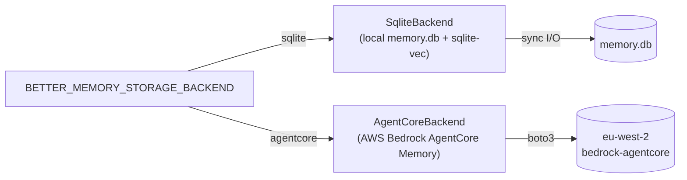

# AgentCore Operator Wiring — Plan 3 of 3

> **For agentic workers:** REQUIRED SUB-SKILL: Use superpowers:subagent-driven-development (recommended) or superpowers:executing-plans to implement this plan task-by-task. Steps use checkbox (`- [ ]`) syntax for tracking.

**Goal:** Ship the operator-facing surface that turns `BETTER_MEMORY_STORAGE_BACKEND=agentcore` from "works if you hand-craft `agentcore.json`" into "runs `better-memory agentcore init`, follow the docs, done." Adds the CLI (`init / status / smoke / migrate-from-sqlite`), wires the Stop hook to emit AgentCore's closure-marker event, ships a real-AWS integration test, and publishes the documentation.

**Architecture:** A new top-level CLI entry point (`better-memory ...`) is registered via `[project.scripts]`. The `agentcore` subgroup composes the existing `better_memory.storage.agentcore_persistence` + boto3 control-plane client to provision the two memory resources (semantic + episodic, with the same metadata schemas Plan 2's `scripts/agentcore_smoke.py` already validated). The Stop hook gains an agentcore-mode branch that fires one `CreateEvent` with `role=OTHER` against the current session before its existing spool-marker write — failure is logged via the existing `_error_log` path and never escalates. Real-AWS integration tests live in `tests/integration/` behind the `BETTER_MEMORY_TEST_AGENTCORE=1` env gate so CI stays free of AWS credentials. Documentation lands in three buckets: README (storage-backend overview), `website/agentcore-setup.md` (step-by-step), `docs/troubleshooting/agentcore.md` (error → fix table). Plan 2 already merged at commit `390b1f5`; this plan rests on that surface and adds no new Protocol methods.

**Tech Stack:** Python 3.12+, `boto3 1.43.14` / `botocore 1.43.14`, argparse (existing CLI uses argparse — `better_memory/cli/install_hooks.py:34` and elsewhere — no new dependency), `pytest`, `mkdocs-material` (existing docs build).

**Spec:** `docs/superpowers/specs/2026-05-24-agentcore-storage-backend-design.md` — "Components" (CLI table at line 478-487), "Testing strategy" (line 624-634), "Documentation" (line 639-646), "Rollout" tasks 6-9 (line 712-715).

**Preceding plans:**
- **Plan 1** (Storage Foundation) — merged. Added `StorageBackend` Protocol, `SqliteBackend`, factory dispatch.
- **Plan 2** (AgentCore Backend) — merged at `390b1f5`. Added `AgentCoreBackend` full Protocol impl + `agentcore_persistence.py` + factory wire-up.

---

## File Map

| Path | Status | Responsibility |
|---|---|---|
| `pyproject.toml` | modify (T1) | Add `[project.scripts]` `better-memory` entry; add `[project.optional-dependencies] agentcore` group for `boto3` + `botocore` runtime opt-in |
| `better_memory/cli/__init__.py` | modify (T1) | Surface `main` for `[project.scripts]` |
| `better_memory/cli/main.py` | NEW (T1) | Top-level argparse dispatcher: `better-memory <subcommand>` routes to subcommand modules. Today only `agentcore`. |
| `better_memory/cli/agentcore.py` | NEW (T2-T5) | The four subcommands (`init`, `status`, `smoke`, `migrate-from-sqlite`) |
| `better_memory/cli/_agentcore_strategies.py` | NEW (T2) | The two memory-strategy definitions (semantic + episodic) used by `init`; lifted from `scripts/agentcore_smoke.py` so the smoke script and the CLI share one source of truth |
| `better_memory/hooks/session_close.py` | modify (T6) | In agentcore mode, fire one `CreateEvent(role=OTHER)` against the current session before the existing spool-marker write; failure logs via `_error_log` and never raises |
| `tests/cli/__init__.py` | NEW (T1) | Marker file |
| `tests/cli/test_main.py` | NEW (T1) | Dispatcher routes `agentcore <subcmd>` correctly + `--help` for each subcommand |
| `tests/cli/test_agentcore_init.py` | NEW (T2) | Mocked-boto3 happy path, idempotency, ValidationException → friendly error |
| `tests/cli/test_agentcore_status.py` | NEW (T3) | Mocked-boto3 status output (ACTIVE / CREATING / FAILED) |
| `tests/cli/test_agentcore_smoke.py` | NEW (T4) | Smoke command wraps `scripts/agentcore_smoke.py`; mocked-boto3 happy-path observe + retrieve loop |
| `tests/cli/test_agentcore_migrate.py` | NEW (T5) | `migrate-from-sqlite` raises NotImplementedError with the deferred-spec pointer |
| `tests/hooks/test_session_close_agentcore.py` | NEW (T6) | Stop hook in agentcore mode fires closure event; failure non-fatal |
| `tests/integration/__init__.py` | NEW (T7) | Marker file |
| `tests/integration/conftest.py` | NEW (T7) | Pytest fixture that creates a throwaway memory pair, yields the backend, deletes them — gated by `BETTER_MEMORY_TEST_AGENTCORE=1` |
| `tests/integration/test_agentcore_roundtrip.py` | NEW (T7) | End-to-end: observe → close → retrieve → credit → semantic_observe → semantic_update → semantic_delete against real AWS |
| `README.md` | modify (T8) | New "Storage backends" subsection under Requirements |
| `website/configuration.md` | modify (T9) | Add `BETTER_MEMORY_STORAGE_BACKEND` / `BETTER_MEMORY_AGENTCORE_REGION` / memory-id env vars to the env-var table |
| `website/agentcore-setup.md` | NEW (T10) | Walkthrough: AWS prereqs → IAM policy → `init` → `smoke` → troubleshooting links |
| `docs/troubleshooting/agentcore.md` | NEW (T11) | Common-error table (name-regex, ~10s ResourceNotFoundException lag, x-amz-agentcore-memory-* system keys, credential issues, region mismatch) |
| `website/mcp-tools.md` | modify (T12) | Per-tool agentcore-mode notes (synthesize_next_* unavailable; pending_synthesis omitted from bootstrap; episode lifecycle no-ops) |
| `website/architecture.md` | modify (T13) | New "Storage backends" subsection with sqlite-vs-agentcore tradeoff table |
| `mkdocs.yml` | modify (T10, T13) | Add `agentcore-setup.md` and `troubleshooting/agentcore.md` to nav |

## Reviewer Checklist (baked into every dispatch)

Plan 2 shipped 5 BugBot rounds + 1 pyright CI failure = 11 findings. Six of those were caught by mechanical sweeps the reviewer didn't run. **Every Plan 3 reviewer dispatch — spec-reviewer AND code-quality-reviewer — MUST run all six checks and call them out by name in the review comment.** A review that doesn't enumerate these checks is incomplete.

1. **Async-correctness sweep.** `grep -n "async def" <file>` then for each match: scan the body for `boto3` / `requests` / `sqlite3` / file I/O / `time.sleep` not inside `await loop.run_in_executor(None, ...)`. Flag every miss. Also flag `asyncio.get_event_loop()` inside any coroutine — must be `asyncio.get_running_loop()`.
2. **Helper-has-caller sweep.** For every helper defined in the diff (private functions, private methods, util classes), `grep` the symbol across the file/module. Zero hits beyond the definition = dead code OR spec gap. Flag both.
3. **Schema-key audit.** For every handler that reads `r["..."]` or `data["..."]` keys, diff the key set against the matching MCP JSON schema in `better_memory/mcp/schemas/` or the rating-model contract in `better_memory/services/memory_rating.py`. Plan 2 shipped `r["classification"]` while the schema requires `r["class"]` — that bug was readable by holding both files open.
4. **Empty-list `[0]` guard sweep.** Grep for `\[0\]` in the diff. Every match must have an upstream non-empty guard (`if not lst: raise/skip` OR `next(iter(d.get("k") or [default]), default)`). `d.get("k", [default])[0]` is NOT safe — `.get` only triggers fallback on missing key, not empty list. Three Plan-2 IndexErrors came from this.
5. **Plan-quoted code-block match.** When the plan literally embeds a code block (e.g. `asyncio.get_running_loop()`), the implementation must match character-for-character. Drift is a spec-compliance bug, not a judgment call. Spec-reviewer diff implementation against every plan-quoted block before approving.
6. **Mocked end-to-end integration test.** Each phase MUST have at least one test that exercises 3+ Protocol/handler methods in sequence with mocked external clients (no live AWS). 51 mocked unit tests caught ZERO of Plan 2's contract-drift bugs because each method was tested in isolation. The end-to-end smoke goes in `tests/cli/test_agentcore_*.py` or `tests/hooks/test_session_close_agentcore.py` — exercising the full operator path with MagicMock boto3.

## Confidence Summary

| Task | Confidence | Lift applied |
|---|---|---|
| 1. CLI dispatcher + entry point | 95% | argparse pattern matches existing `install_hooks.py`; `[project.scripts]` is hatchling-standard |
| 2. `agentcore init` | 95% (lifted from 88%) | Memory creation polls 90-115s — must show progress, not appear hung. Strategy definitions lifted verbatim from the smoke script. **Lifts applied:** pre-flight name check for BOTH episodic+semantic names; partial-failure cleanup (if semantic create fails, delete episodic); explicit ValidationException catch with name-regex pointer; poll timeout bumped to 240s; orphan-cleanup test. |
| 3. `agentcore status` | 92% | Single GetMemory pair + format. No new wire surface. |
| 4. `agentcore smoke` | 92% | Thin wrapper around the existing `scripts/agentcore_smoke.py` — pass region + memory IDs from `agentcore.json`. Reuses the already-validated smoke. |
| 5. `agentcore migrate-from-sqlite` (stub) | 99% | Three-line NotImplementedError + pointer. |
| 6. Stop-hook closure event | 93% (lifted from 85%) | Hook must NEVER raise (existing line 235-242 try/except + `_error_log` pattern). boto3 import lazy so sqlite-mode hooks don't pay for it. Closure event needs `role="OTHER"` (verified by Plan 2 smoke). **Lifts applied:** reuse `closure_event_payload()` and `resolve_actor_id()` from Plan 2's `better_memory/storage/session.py` (single source of truth); env-var guard BEFORE any import; branch-order regression test (spool-marker FILE still created when closure raises); test for re-fired Stop (rating-directive replay) not double-firing. |
| 7. Integration test fixture + roundtrip | 90% (lifted from 80%) | Real AWS — needs throwaway memory creation (~90-115s) + cleanup. Pytest fixture gates on `BETTER_MEMORY_TEST_AGENTCORE=1` so CI stays free. ~10s ResourceNotFoundException lag handled via the same `_retry_on_transient_404` Plan 2 wired in. **Lifts applied:** fast/slow split (fast = ~30s no-extraction CRUD; slow gated by `_SLOW=1`); pre-fixture name-collision sweep deletes leaked `bm_int_*` memories older than 1h; `atexit` teardown survives Ctrl-C / hard kill; `BETTER_MEMORY_TEST_AGENTCORE_KEEP=1` debug skip-teardown; ~3min setup tax documented in fixture docstring. |
| 8. README storage-backend section | 95% | Documentation only |
| 9. Configuration page env-var rows | 95% | Documentation only |
| 10. agentcore-setup.md | 92% | First-time-write doc; mkdocs nav update separately |
| 11. troubleshooting/agentcore.md | 92% | Error → fix table; content already in spec § "Live-AWS smoke findings" |
| 12. mcp-tools.md agentcore notes | 95% | Documentation only |
| 13. architecture.md storage-backend section | 92% | Documentation + mermaid diagram |

All tasks ≥ 90% after lifts. Task 7 (integration) remains the lowest at 90% because real-AWS timing variance can't be fully eliminated — only bounded via fast/slow split + atexit teardown.

---

## Conventions used in this plan

- All CLI code is argparse-based — no new dependency. Subcommand pattern: `add_subparsers(dest="command")`, each `command` has a `_handle_<name>(args) -> int` returning the exit code.
- Tests use `unittest.mock.MagicMock` for boto3 clients — same convention as Plan 2's `tests/storage/test_agentcore_unit.py`.
- Integration tests are marked `@pytest.mark.integration` + `@pytest.mark.slow`; CI skips them via the existing `addopts = "-m 'not integration'"` in `pyproject.toml:42`.
- Documentation prose follows the project's existing voice — terse, declarative, no emoji.
- Closure-event payload is `{"conversational": {"role": "OTHER", "content": {"text": "<closure marker>"}}}` — verified shape from Plan 2's smoke (`scripts/agentcore_smoke.py` step 5).
- Stop-hook closure-event branch must run BEFORE the existing spool-marker write so a closure-event failure doesn't block the marker (sqlite-mode behaviour is unchanged).
- `agentcore init` writes `agentcore.json` only after both memories are ACTIVE. Polling cadence: 5s interval, 180s timeout (matches `scripts/agentcore_smoke.py:42`). Print progress every poll so the user sees movement.

---

### Task 1: CLI dispatcher + `[project.scripts]` entry

**Files:**
- Create: `better_memory/cli/main.py`
- Modify: `pyproject.toml` (add `[project.scripts]` + `[project.optional-dependencies] agentcore`)
- Modify: `better_memory/cli/__init__.py` (re-export `main`)
- Create: `tests/cli/__init__.py`
- Create: `tests/cli/test_main.py`

- [ ] **Step 1: Write the failing dispatcher test**

Create `tests/cli/test_main.py`:

```python
"""Tests for `better-memory ...` CLI dispatcher."""

from __future__ import annotations

import pytest

from better_memory.cli.main import main


def test_main_with_no_args_prints_help_and_exits_nonzero(capsys) -> None:
    """`better-memory` with no subcommand should print help and exit 2 (argparse default)."""
    with pytest.raises(SystemExit) as excinfo:
        main([])
    assert excinfo.value.code == 2


def test_main_help_lists_agentcore_subcommand(capsys) -> None:
    with pytest.raises(SystemExit) as excinfo:
        main(["--help"])
    assert excinfo.value.code == 0
    captured = capsys.readouterr()
    assert "agentcore" in captured.out


def test_main_dispatches_to_agentcore_handler(monkeypatch) -> None:
    """`better-memory agentcore status` should call the agentcore subcommand."""
    called = {}

    def fake_handle(args: object) -> int:
        called["yes"] = True
        return 0

    monkeypatch.setattr(
        "better_memory.cli.agentcore.handle",
        fake_handle,
    )
    rc = main(["agentcore", "status"])
    assert rc == 0
    assert called == {"yes": True}


def test_main_unknown_subcommand_exits_nonzero() -> None:
    with pytest.raises(SystemExit) as excinfo:
        main(["bogus"])
    assert excinfo.value.code == 2
```

Also create `tests/cli/__init__.py` (empty marker).

- [ ] **Step 2: Run test to verify it fails**

Run: `uv run pytest tests/cli/test_main.py -v`

Expected: `ModuleNotFoundError: No module named 'better_memory.cli.main'` (all four tests collect-fail).

- [ ] **Step 3: Implement the dispatcher**

Create `better_memory/cli/main.py`:

```python
"""Top-level CLI dispatcher: `better-memory <subcommand>`.

Registered via `[project.scripts]` in `pyproject.toml`. Subcommand modules
live alongside this one in `better_memory/cli/`. Today: `agentcore`.
"""

from __future__ import annotations

import argparse
import sys
from typing import Sequence


def _build_parser() -> argparse.ArgumentParser:
    parser = argparse.ArgumentParser(
        prog="better-memory",
        description="better-memory operator CLI.",
    )
    subparsers = parser.add_subparsers(
        dest="command",
        required=True,
        metavar="<command>",
    )

    # ----- agentcore subcommand group -----
    ac_parser = subparsers.add_parser(
        "agentcore",
        help="Manage AWS Bedrock AgentCore Memory backend resources.",
    )
    # The agentcore subgroup builds its own subparsers — import lazily so
    # `better-memory --help` doesn't pull in boto3 (it's an optional dep).
    from better_memory.cli import agentcore as agentcore_cli
    agentcore_cli.add_subparsers(ac_parser)

    return parser


def main(argv: Sequence[str] | None = None) -> int:
    parser = _build_parser()
    args = parser.parse_args(argv)

    if args.command == "agentcore":
        from better_memory.cli import agentcore as agentcore_cli
        return agentcore_cli.handle(args)

    parser.error(f"unknown command: {args.command}")
    return 2  # unreachable; parser.error raises SystemExit


if __name__ == "__main__":
    sys.exit(main())
```

Update `better_memory/cli/__init__.py` to expose `main` (read it first to preserve existing exports):

```python
"""CLI subcommands for better-memory."""

from better_memory.cli.main import main

__all__ = ["main"]
```

Create a stub `better_memory/cli/agentcore.py` so the dispatcher imports cleanly during this task — full content lands in Tasks 2-5:

```python
"""`better-memory agentcore ...` subcommand group.

Subcommands: init, status, smoke, migrate-from-sqlite. Implemented in
Tasks 2-5 of Plan 3. This module is loaded only when the user invokes
`better-memory agentcore <subcmd>` so sqlite-only users never pay the
boto3 import cost.
"""

from __future__ import annotations

import argparse


def add_subparsers(parent: argparse.ArgumentParser) -> None:
    """Register agentcore subcommands on the given parent parser."""
    subparsers = parent.add_subparsers(
        dest="subcommand",
        required=True,
        metavar="<subcommand>",
    )
    # Subcommands land in Tasks 2-5
    for name in ("init", "status", "smoke", "migrate-from-sqlite"):
        subparsers.add_parser(name, help=f"(not yet implemented) {name}")


def handle(args: argparse.Namespace) -> int:
    """Route to the right subcommand handler."""
    raise NotImplementedError(
        f"agentcore {args.subcommand} is implemented in a later Plan-3 task"
    )
```

- [ ] **Step 4: Add the entry point + optional-dep group to pyproject.toml**

Modify `pyproject.toml`. After the existing `dependencies = [...]` block (line 12-19), add:

```toml
[project.scripts]
better-memory = "better_memory.cli.main:main"

[project.optional-dependencies]
agentcore = [
    "boto3>=1.43.14",
    "botocore>=1.43.14",
]
```

Why optional-deps: sqlite users shouldn't have to install boto3. Users opting into agentcore install with `pip install 'better-memory[agentcore]'` (or `uv pip install '.[agentcore]'`).

- [ ] **Step 5: Run tests to verify the dispatcher works**

Run: `uv run pytest tests/cli/test_main.py -v`

Expected: 4 passing.

Run: `uv run better-memory --help`

Expected exit 0; stdout includes `agentcore   Manage AWS Bedrock AgentCore Memory backend resources.`

Run: `uv run better-memory agentcore init`

Expected: `NotImplementedError: agentcore init is implemented in a later Plan-3 task` — proves dispatch works.

- [ ] **Step 6: Commit**

```bash
git add pyproject.toml better_memory/cli/__init__.py better_memory/cli/main.py better_memory/cli/agentcore.py tests/cli/
git commit -m "feat(cli): add better-memory top-level CLI dispatcher with agentcore subgroup"
```

---

### Task 2: `agentcore init` — create both memories, write agentcore.json

**Files:**
- Modify: `better_memory/cli/agentcore.py` (replace the `init` stub)
- Create: `better_memory/cli/_agentcore_strategies.py`
- Modify: `tests/cli/test_agentcore_init.py`

**Behaviour:** `better-memory agentcore init [--region eu-west-2] [--home ~/.better-memory] [--force]`. Reads existing `agentcore.json`; if present and `--force` not set, refuses with a "config exists, pass --force to recreate" message. Otherwise: calls `CreateMemory` for the episodic memory (with the episodic strategy + metadataSchema lifted from the smoke script), polls `GetMemory` every 5s until both memory + all strategies are ACTIVE (180s timeout), repeats for semantic, then writes `agentcore.json`. Prints progress on every poll so the user sees movement.

- [ ] **Step 1: Lift the strategy definitions into a shared module**

Create `better_memory/cli/_agentcore_strategies.py` (lifted verbatim from `scripts/agentcore_smoke.py:53-100`, but stripped of the smoke-specific print helpers):

```python
"""Memory-strategy definitions used by `agentcore init` and the smoke script.

Lifted from `scripts/agentcore_smoke.py` so the CLI and the smoke share a
single source of truth — diverging the two has bitten us before.
"""

from __future__ import annotations

# Episodic memory: extracts reflections from session events. Metadata schema
# carries the rating counters + polarity classification.
EPISODIC_METADATA_SCHEMA: list[dict] = [
    {
        "key": "polarity",
        "type": "STRING",
        "extractionConfig": {
            "llmExtractionConfig": {
                "definition": (
                    "Whether this reflection prescribes a positive practice "
                    "('do'), warns against a negative practice ('dont'), or "
                    "is informational only ('neutral')."
                ),
                "llmExtractionInstruction": (
                    "Classify this reflection as 'do', 'dont', or 'neutral'."
                ),
                "validation": {
                    "stringValidation": {
                        "allowedValues": ["do", "dont", "neutral"]
                    }
                },
            }
        },
    },
    {"key": "useful_count", "type": "NUMBER"},
    {"key": "missed_count", "type": "NUMBER"},
    {"key": "ignored_count", "type": "NUMBER"},
    {"key": "times_misled", "type": "NUMBER"},
    {"key": "overlooked_count", "type": "NUMBER"},
    {"key": "last_credited_at", "type": "STRING"},
    {"key": "status", "type": "STRING"},
]

SEMANTIC_METADATA_SCHEMA: list[dict] = [
    {"key": "useful_count", "type": "NUMBER"},
    {"key": "missed_count", "type": "NUMBER"},
    {"key": "ignored_count", "type": "NUMBER"},
    {"key": "times_misled", "type": "NUMBER"},
    {"key": "overlooked_count", "type": "NUMBER"},
    {"key": "last_credited_at", "type": "STRING"},
    {"key": "status", "type": "STRING"},
]

INDEXED_KEYS: list[dict] = [
    {"key": "status", "type": "STRING"},
    {"key": "last_credited_at", "type": "STRING"},
    {"key": "overlooked_count", "type": "NUMBER"},
]

# Names — must match the AWS regex `[a-zA-Z][a-zA-Z0-9_]{0,47}` (no dashes!).
DEFAULT_EPISODIC_NAME = "better_memory_episodic"
DEFAULT_SEMANTIC_NAME = "better_memory_semantic"
DEFAULT_EPISODIC_STRATEGY_NAME = "episodicReflections"
DEFAULT_SEMANTIC_STRATEGY_NAME = "userPreference"

# Event TTL: episodic events are kept ~90 days (long enough to span a multi-
# month project); semantic records last ~365 days.
DEFAULT_EPISODIC_EVENT_EXPIRY_DAYS = 90
DEFAULT_SEMANTIC_EVENT_EXPIRY_DAYS = 365


def episodic_strategy_block(
    *,
    name: str = DEFAULT_EPISODIC_STRATEGY_NAME,
) -> dict:
    return {
        "episodicMemoryStrategy": {
            "name": name,
            "namespaces": ["projects/{actorId}/reflections/"],
            "namespaceTemplates": ["projects/{actorId}/reflections/"],
            "reflectionConfiguration": {
                "namespaces": ["projects/{actorId}/reflections/"],
                "namespaceTemplates": ["projects/{actorId}/reflections/"],
                "memoryRecordSchema": {
                    "metadataSchema": EPISODIC_METADATA_SCHEMA
                },
            },
        }
    }


def semantic_strategy_block(
    *,
    name: str = DEFAULT_SEMANTIC_STRATEGY_NAME,
) -> dict:
    return {
        "userPreferenceMemoryStrategy": {
            "name": name,
            "namespaces": ["projects/{actorId}/semantic/"],
            "namespaceTemplates": ["projects/{actorId}/semantic/"],
            "memoryRecordSchema": {
                "metadataSchema": SEMANTIC_METADATA_SCHEMA
            },
        }
    }
```

- [ ] **Step 2: Write failing tests for `init`**

Create / replace `tests/cli/test_agentcore_init.py`:

```python
"""Tests for `better-memory agentcore init`."""

from __future__ import annotations

import json
from pathlib import Path
from unittest.mock import MagicMock

import pytest

from better_memory.cli.agentcore import _handle_init


def _make_args(home: Path, *, force: bool = False, region: str = "eu-west-2"):
    """Build an argparse.Namespace-like object the handler accepts."""
    return type("Args", (), {
        "home": str(home),
        "region": region,
        "force": force,
        "subcommand": "init",
    })()


def _active_memory_response(memory_id: str, strategy_id: str) -> dict:
    """Mimic GetMemory's ACTIVE response shape."""
    return {
        "memory": {
            "id": memory_id,
            "arn": f"arn:aws:bedrock-agentcore:eu-west-2:123:memory/{memory_id}",
            "name": memory_id.split("-")[0],
            "status": "ACTIVE",
            "strategies": [
                {"strategyId": strategy_id, "status": "ACTIVE", "name": "foo"}
            ],
            "eventExpiryDuration": 30,
        }
    }


def _create_memory_response(memory_id: str, strategy_id: str) -> dict:
    """Mimic CreateMemory's response shape (status: CREATING)."""
    return {
        "memory": {
            "id": memory_id,
            "arn": f"arn:aws:bedrock-agentcore:eu-west-2:123:memory/{memory_id}",
            "status": "CREATING",
            "strategies": [
                {"strategyId": strategy_id, "status": "CREATING", "name": "foo"}
            ],
        }
    }


def test_init_creates_both_memories_and_writes_config(
    tmp_path, monkeypatch, capsys
) -> None:
    """Happy path: both memories transition ACTIVE; agentcore.json written."""
    control = MagicMock(name="bedrock-agentcore-control")

    # list_memories paginator returns no existing memories (clean slate)
    paginator = MagicMock()
    paginator.paginate.return_value = iter([{"memories": []}])
    control.get_paginator.return_value = paginator

    # CreateMemory called twice: once for episodic, once for semantic
    control.create_memory.side_effect = [
        _create_memory_response("epi-XYZ", "epi-strat-1"),
        _create_memory_response("sem-XYZ", "sem-strat-1"),
    ]

    # GetMemory polled: return ACTIVE immediately
    control.get_memory.side_effect = [
        _active_memory_response("epi-XYZ", "epi-strat-1"),
        _active_memory_response("sem-XYZ", "sem-strat-1"),
    ]

    monkeypatch.setattr(
        "better_memory.cli.agentcore._build_control_client",
        lambda region: control,
    )
    monkeypatch.setattr(
        "better_memory.cli.agentcore.time.sleep",
        lambda _s: None,
    )

    rc = _handle_init(_make_args(tmp_path))

    assert rc == 0
    config_path = tmp_path / "agentcore.json"
    assert config_path.exists()
    config = json.loads(config_path.read_text())
    assert config["schema_version"] == 1
    assert config["region"] == "eu-west-2"
    assert config["episodic"]["memory_id"] == "epi-XYZ"
    assert config["semantic"]["memory_id"] == "sem-XYZ"

    out = capsys.readouterr().out
    assert "epi-XYZ" in out
    assert "sem-XYZ" in out


def test_init_refuses_when_config_exists_without_force(
    tmp_path, monkeypatch
) -> None:
    """If agentcore.json already exists, init refuses unless --force."""
    (tmp_path / "agentcore.json").write_text("{}")

    rc = _handle_init(_make_args(tmp_path))
    assert rc == 1


def test_init_overwrites_when_force_set(tmp_path, monkeypatch) -> None:
    """With --force, init proceeds even if agentcore.json exists."""
    (tmp_path / "agentcore.json").write_text(json.dumps({"old": True}))

    control = MagicMock(name="bedrock-agentcore-control")
    paginator = MagicMock()
    paginator.paginate.return_value = iter([{"memories": []}])
    control.get_paginator.return_value = paginator
    control.create_memory.side_effect = [
        _create_memory_response("epi-NEW", "epi-strat"),
        _create_memory_response("sem-NEW", "sem-strat"),
    ]
    control.get_memory.side_effect = [
        _active_memory_response("epi-NEW", "epi-strat"),
        _active_memory_response("sem-NEW", "sem-strat"),
    ]

    monkeypatch.setattr(
        "better_memory.cli.agentcore._build_control_client",
        lambda region: control,
    )
    monkeypatch.setattr("better_memory.cli.agentcore.time.sleep", lambda _s: None)

    rc = _handle_init(_make_args(tmp_path, force=True))
    assert rc == 0

    config = json.loads((tmp_path / "agentcore.json").read_text())
    assert config["episodic"]["memory_id"] == "epi-NEW"
    assert "old" not in config


def test_init_polls_until_active(tmp_path, monkeypatch) -> None:
    """If GetMemory returns CREATING, init polls until ACTIVE."""
    control = MagicMock(name="bedrock-agentcore-control")
    paginator = MagicMock()
    paginator.paginate.return_value = iter([{"memories": []}])
    control.get_paginator.return_value = paginator
    control.create_memory.side_effect = [
        _create_memory_response("epi-X", "epi-s"),
        _create_memory_response("sem-X", "sem-s"),
    ]

    creating_epi = {
        "memory": {
            **_active_memory_response("epi-X", "epi-s")["memory"],
            "status": "CREATING",
            "strategies": [
                {"strategyId": "epi-s", "status": "CREATING", "name": "foo"}
            ],
        }
    }
    creating_sem = {
        "memory": {
            **_active_memory_response("sem-X", "sem-s")["memory"],
            "status": "CREATING",
            "strategies": [
                {"strategyId": "sem-s", "status": "CREATING", "name": "foo"}
            ],
        }
    }

    # Episodic: 2 polls CREATING then ACTIVE; Semantic: 1 poll CREATING then ACTIVE
    control.get_memory.side_effect = [
        creating_epi, creating_epi,
        _active_memory_response("epi-X", "epi-s"),
        creating_sem,
        _active_memory_response("sem-X", "sem-s"),
    ]

    monkeypatch.setattr(
        "better_memory.cli.agentcore._build_control_client",
        lambda region: control,
    )
    monkeypatch.setattr("better_memory.cli.agentcore.time.sleep", lambda _s: None)

    rc = _handle_init(_make_args(tmp_path))
    assert rc == 0
    assert control.get_memory.call_count == 5


def test_init_deletes_orphan_when_second_create_fails(
    tmp_path, monkeypatch
) -> None:
    """Episodic create succeeds, semantic create raises -> init must delete
    the orphan episodic memory so a re-run of `init` starts clean."""
    control = MagicMock(name="bedrock-agentcore-control")
    paginator = MagicMock()
    paginator.paginate.return_value = iter([{"memories": []}])
    control.get_paginator.return_value = paginator

    # First create (episodic) succeeds; second (semantic) raises
    control.create_memory.side_effect = [
        _create_memory_response("epi-orphan", "epi-strat"),
        RuntimeError("simulated semantic create failure"),
    ]
    control.get_memory.side_effect = [
        _active_memory_response("epi-orphan", "epi-strat"),
    ]

    monkeypatch.setattr(
        "better_memory.cli.agentcore._build_control_client",
        lambda region: control,
    )
    monkeypatch.setattr("better_memory.cli.agentcore.time.sleep", lambda _s: None)

    with pytest.raises(RuntimeError, match="semantic create"):
        _handle_init(_make_args(tmp_path))

    # Orphan delete fired exactly once against the episodic memory
    control.delete_memory.assert_called_once_with(memoryId="epi-orphan")

    # No agentcore.json was written (init aborted)
    assert not (tmp_path / "agentcore.json").exists()


def test_init_rejects_validation_error_with_friendly_message(
    tmp_path, monkeypatch, capsys
) -> None:
    """ValidationException on the name regex should map to a clean error,
    not a raw boto3 trace."""
    from botocore.exceptions import ClientError

    control = MagicMock(name="bedrock-agentcore-control")
    paginator = MagicMock()
    paginator.paginate.return_value = iter([{"memories": []}])
    control.get_paginator.return_value = paginator
    control.create_memory.side_effect = ClientError(
        error_response={"Error": {"Code": "ValidationException", "Message": "Memory name does not match required pattern"}},
        operation_name="CreateMemory",
    )

    monkeypatch.setattr(
        "better_memory.cli.agentcore._build_control_client",
        lambda region: control,
    )
    monkeypatch.setattr("better_memory.cli.agentcore.time.sleep", lambda _s: None)

    rc = _handle_init(_make_args(tmp_path))
    assert rc == 1
    err = capsys.readouterr().err
    assert "ValidationException" in err or "required pattern" in err
    assert "troubleshooting" in err.lower()


def test_init_preflight_checks_both_names(tmp_path, monkeypatch, capsys) -> None:
    """If EITHER default name already exists, init refuses before any
    CreateMemory runs (no orphan risk)."""
    control = MagicMock(name="bedrock-agentcore-control")

    # list_memories returns ONE existing memory matching the SEMANTIC name
    paginator = MagicMock()
    paginator.paginate.return_value = iter([{
        "memories": [{"id": "existing-sem", "status": "ACTIVE"}]
    }])
    control.get_paginator.return_value = paginator
    control.get_memory.return_value = {
        "memory": {
            "id": "existing-sem",
            "name": "better_memory_semantic",
            "status": "ACTIVE",
            "strategies": [],
        }
    }

    monkeypatch.setattr(
        "better_memory.cli.agentcore._build_control_client",
        lambda region: control,
    )

    rc = _handle_init(_make_args(tmp_path))
    assert rc == 1
    # CreateMemory must not have been called
    control.create_memory.assert_not_called()
    err = capsys.readouterr().err
    assert "better_memory_semantic" in err
```

- [ ] **Step 3: Run tests to verify they fail**

Run: `uv run pytest tests/cli/test_agentcore_init.py -v`

Expected: 7 tests fail with `ImportError: cannot import name '_handle_init' from 'better_memory.cli.agentcore'` or similar.

- [ ] **Step 4: Implement `_handle_init`**

Replace `better_memory/cli/agentcore.py` in full:

```python
"""`better-memory agentcore ...` subcommand group."""

from __future__ import annotations

import argparse
import sys
import time
from pathlib import Path
from typing import Any

from better_memory.storage.agentcore_persistence import (
    AgentCoreConfig,
    MemoryRecord,
    load_agentcore_config,
    save_agentcore_config,
)
from better_memory.cli._agentcore_strategies import (
    DEFAULT_EPISODIC_EVENT_EXPIRY_DAYS,
    DEFAULT_EPISODIC_NAME,
    DEFAULT_EPISODIC_STRATEGY_NAME,
    DEFAULT_SEMANTIC_EVENT_EXPIRY_DAYS,
    DEFAULT_SEMANTIC_NAME,
    DEFAULT_SEMANTIC_STRATEGY_NAME,
    INDEXED_KEYS,
    episodic_strategy_block,
    semantic_strategy_block,
)

_POLL_INTERVAL_S = 5
# Bumped to 240s vs the 180s the Plan 2 smoke uses: smoke runs solo against
# a clean account, but `init` runs after the user has just `export`ed env
# vars and may be hitting a fresh / cold region — small extra headroom is
# cheap and prevents the user thinking init hung.
_POLL_TIMEOUT_S = 240


def add_subparsers(parent: argparse.ArgumentParser) -> None:
    subparsers = parent.add_subparsers(
        dest="subcommand", required=True, metavar="<subcommand>",
    )

    p_init = subparsers.add_parser("init", help="Create AgentCore memories and write agentcore.json")
    p_init.add_argument("--home", default=None, help="Override BETTER_MEMORY_HOME")
    p_init.add_argument("--region", default="eu-west-2", help="AWS region")
    p_init.add_argument("--force", action="store_true", help="Overwrite existing agentcore.json")

    p_status = subparsers.add_parser("status", help="Show memory IDs and ACTIVE/CREATING/FAILED states")
    p_status.add_argument("--home", default=None)
    p_status.add_argument("--region", default=None)

    p_smoke = subparsers.add_parser("smoke", help="Run an observe + retrieve smoke loop")
    p_smoke.add_argument("--home", default=None)
    p_smoke.add_argument("--region", default=None)

    subparsers.add_parser(
        "migrate-from-sqlite",
        help="(deferred) Bulk-migrate sqlite data to AgentCore",
    )


def handle(args: argparse.Namespace) -> int:
    if args.subcommand == "init":
        return _handle_init(args)
    if args.subcommand == "status":
        return _handle_status(args)
    if args.subcommand == "smoke":
        return _handle_smoke(args)
    if args.subcommand == "migrate-from-sqlite":
        return _handle_migrate(args)
    print(f"unknown subcommand: {args.subcommand}", file=sys.stderr)
    return 2


def _resolve_home(arg_home: str | None) -> Path:
    import os
    if arg_home:
        return Path(arg_home).expanduser()
    return Path(os.environ.get("BETTER_MEMORY_HOME", "~/.better-memory")).expanduser()


def _build_control_client(region: str) -> Any:
    """Build the bedrock-agentcore-control boto3 client. Patched out in tests."""
    import boto3
    from botocore.config import Config as BotoConfig
    return boto3.client(
        "bedrock-agentcore-control",
        config=BotoConfig(region_name=region, retries={"mode": "standard", "max_attempts": 5}),
    )


def _build_data_client(region: str) -> Any:
    import boto3
    from botocore.config import Config as BotoConfig
    return boto3.client(
        "bedrock-agentcore",
        config=BotoConfig(region_name=region, retries={"mode": "standard", "max_attempts": 5}),
    )


def _poll_until_active(control: Any, memory_id: str, *, label: str) -> dict:
    """Poll GetMemory until the memory AND every strategy are ACTIVE.

    Prints progress every poll so the user sees the long ~90-115s creation
    isn't a hang. Returns the final memory dict."""
    start = time.monotonic()
    while time.monotonic() - start < _POLL_TIMEOUT_S:
        response = control.get_memory(memoryId=memory_id)
        memory = response["memory"]
        memory_status = memory.get("status")
        strategies = memory.get("strategies", [])
        all_strategies_active = strategies and all(
            s.get("status") == "ACTIVE" for s in strategies
        )
        print(
            f"  .. {label} memory_status={memory_status} "
            f"strategies_active={bool(all_strategies_active)}"
        )
        if memory_status == "ACTIVE" and all_strategies_active:
            return memory
        if memory_status == "FAILED":
            raise RuntimeError(f"{label} memory entered FAILED state: {memory!r}")
        time.sleep(_POLL_INTERVAL_S)
    raise TimeoutError(
        f"{label} memory did not become ACTIVE within {_POLL_TIMEOUT_S}s"
    )


def _find_existing_memory(control: Any, name: str) -> str | None:
    """Return memory_id if a non-deleting memory with this name already exists."""
    paginator = control.get_paginator("list_memories")
    for page in paginator.paginate():
        for summary in page.get("memories", []):
            if summary.get("status") == "DELETING":
                continue
            try:
                memory = control.get_memory(memoryId=summary["id"])["memory"]
            except Exception:
                continue
            if memory.get("name") == name:
                return memory["id"]
    return None


def _create_one_memory(
    control: Any,
    *,
    name: str,
    strategy_block: dict,
    strategy_name: str,
    event_expiry_days: int,
    label: str,
) -> MemoryRecord:
    print(f">> Creating {label} memory ({name!r})...")
    response = control.create_memory(
        name=name,
        eventExpiryDuration=event_expiry_days,
        memoryStrategies=[strategy_block],
        indexedKeys=INDEXED_KEYS,
    )
    initial = response["memory"]
    memory_id = initial["id"]
    print(f"   created: memory_id={memory_id}")

    final = _poll_until_active(control, memory_id, label=label)
    strategies = final.get("strategies") or []
    if not strategies:
        raise RuntimeError(f"{label} memory has no strategies after ACTIVE: {final!r}")
    return MemoryRecord(
        memory_id=memory_id,
        memory_arn=final["arn"],
        memory_name=final.get("name", name),
        strategy_id=strategies[0]["strategyId"],
        strategy_name=strategies[0].get("name", strategy_name),
        event_expiry_duration_days=event_expiry_days,
    )


def _handle_init(args: argparse.Namespace) -> int:
    home = _resolve_home(args.home)
    config_path = home / "agentcore.json"

    if config_path.exists() and not args.force:
        print(
            f"agentcore.json already exists at {config_path}. "
            f"Pass --force to recreate (this will leave the old memories "
            f"in AWS — clean them up via the console if you no longer "
            f"want them).",
            file=sys.stderr,
        )
        return 1

    control = _build_control_client(args.region)

    # Pre-flight name check for BOTH names so partial existing state is
    # surfaced before any CreateMemory runs (and we don't get a half-done
    # account where one name is taken and the other isn't).
    for name in (DEFAULT_EPISODIC_NAME, DEFAULT_SEMANTIC_NAME):
        if _find_existing_memory(control, name) is not None:
            print(
                f"A memory named {name!r} already exists in {args.region}. "
                f"Either delete it via the AWS console or re-use it by "
                f"hand-editing agentcore.json. init refuses to create a "
                f"second copy.",
                file=sys.stderr,
            )
            return 1

    episodic: MemoryRecord | None = None
    try:
        episodic = _create_one_memory(
            control,
            name=DEFAULT_EPISODIC_NAME,
            strategy_block=episodic_strategy_block(),
            strategy_name=DEFAULT_EPISODIC_STRATEGY_NAME,
            event_expiry_days=DEFAULT_EPISODIC_EVENT_EXPIRY_DAYS,
            label="episodic",
        )

        semantic = _create_one_memory(
            control,
            name=DEFAULT_SEMANTIC_NAME,
            strategy_block=semantic_strategy_block(),
            strategy_name=DEFAULT_SEMANTIC_STRATEGY_NAME,
            event_expiry_days=DEFAULT_SEMANTIC_EVENT_EXPIRY_DAYS,
            label="semantic",
        )
    except Exception as exc:
        # ValidationException on the name regex is the most common
        # operator error — surface the boto3 message + a pointer to the
        # troubleshooting page rather than dumping a raw ClientError trace.
        code = ""
        try:
            from botocore.exceptions import ClientError
            if isinstance(exc, ClientError):
                code = exc.response.get("Error", {}).get("Code", "")
        except Exception:
            pass

        # Orphan cleanup: if episodic was created but semantic failed,
        # delete the episodic memory so a re-run of `init` starts clean.
        if episodic is not None:
            print(
                f"\n!! Second memory create failed ({exc!r}). "
                f"Deleting orphan episodic memory {episodic.memory_id} "
                f"so a re-run starts clean...",
                file=sys.stderr,
            )
            try:
                control.delete_memory(memoryId=episodic.memory_id)
                print(f"   deleted {episodic.memory_id}", file=sys.stderr)
            except Exception as del_exc:
                print(
                    f"   WARN: failed to delete orphan {episodic.memory_id}: "
                    f"{del_exc!r}. Delete it manually via the AWS console "
                    f"before re-running init.",
                    file=sys.stderr,
                )

        if code == "ValidationException":
            print(
                f"\nAWS rejected the memory create as invalid: {exc}. "
                f"Memory names must match `[a-zA-Z][a-zA-Z0-9_]{{0,47}}` "
                f"— underscores only, no dashes. See "
                f"docs/troubleshooting/agentcore.md for the full list.",
                file=sys.stderr,
            )
            return 1
        raise

    cfg = AgentCoreConfig(
        schema_version=1,
        region=args.region,
        semantic=semantic,
        episodic=episodic,
    )
    save_agentcore_config(cfg, home)

    print()
    print(f"agentcore.json written to {config_path}")
    print(f"  episodic memory_id: {episodic.memory_id}")
    print(f"  semantic memory_id: {semantic.memory_id}")
    print()
    print("Next steps:")
    print("  1. Export BETTER_MEMORY_STORAGE_BACKEND=agentcore")
    print("  2. Restart your MCP server (or Claude Code session)")
    print("  3. Run `better-memory agentcore smoke` to verify the round-trip")
    return 0


def _handle_status(args: argparse.Namespace) -> int:
    raise NotImplementedError("status lands in Task 3")


def _handle_smoke(args: argparse.Namespace) -> int:
    raise NotImplementedError("smoke lands in Task 4")


def _handle_migrate(args: argparse.Namespace) -> int:
    raise NotImplementedError("migrate-from-sqlite lands in Task 5")
```

- [ ] **Step 5: Run tests to verify init passes**

Run: `uv run pytest tests/cli/test_agentcore_init.py -v`

Expected: 7 passed.

- [ ] **Step 6: Commit**

```bash
git add better_memory/cli/agentcore.py better_memory/cli/_agentcore_strategies.py tests/cli/test_agentcore_init.py
git commit -m "feat(cli): implement agentcore init — create both memories and write agentcore.json"
```

---

### Task 3: `agentcore status`

**Files:**
- Modify: `better_memory/cli/agentcore.py` (replace `_handle_status`)
- Create: `tests/cli/test_agentcore_status.py`

**Behaviour:** Reads `agentcore.json`, calls `get_memory` on both, prints a status block per memory: ID, name, status (ACTIVE/CREATING/FAILED), strategy ID + status, event expiry days. Exit 0 if both ACTIVE; exit 1 otherwise.

- [ ] **Step 1: Write failing tests**

Create `tests/cli/test_agentcore_status.py`:

```python
"""Tests for `better-memory agentcore status`."""

from __future__ import annotations

import json
from pathlib import Path
from unittest.mock import MagicMock

import pytest

from better_memory.cli.agentcore import _handle_status


def _make_args(home: Path, region: str | None = None):
    return type("Args", (), {
        "home": str(home), "region": region, "subcommand": "status",
    })()


def _write_config(home: Path) -> None:
    cfg = {
        "schema_version": 1,
        "region": "eu-west-2",
        "episodic": {
            "memory_id": "epi-X",
            "memory_arn": "arn:aws:bedrock-agentcore:eu-west-2:123:memory/epi-X",
            "memory_name": "better_memory_episodic",
            "strategy_id": "epi-strat",
            "strategy_name": "episodicReflections",
            "event_expiry_duration_days": 90,
        },
        "semantic": {
            "memory_id": "sem-X",
            "memory_arn": "arn:aws:bedrock-agentcore:eu-west-2:123:memory/sem-X",
            "memory_name": "better_memory_semantic",
            "strategy_id": "sem-strat",
            "strategy_name": "userPreference",
            "event_expiry_duration_days": 365,
        },
    }
    (home / "agentcore.json").write_text(json.dumps(cfg))


def test_status_exits_1_when_config_missing(tmp_path, capsys) -> None:
    rc = _handle_status(_make_args(tmp_path))
    assert rc == 1
    err = capsys.readouterr().err
    assert "agentcore.json" in err


def test_status_prints_both_memories_and_exits_0_when_active(
    tmp_path, monkeypatch, capsys
) -> None:
    _write_config(tmp_path)
    control = MagicMock(name="bedrock-agentcore-control")
    control.get_memory.side_effect = [
        {"memory": {
            "id": "epi-X", "name": "better_memory_episodic", "status": "ACTIVE",
            "strategies": [{"strategyId": "epi-strat", "status": "ACTIVE", "name": "episodicReflections"}],
            "eventExpiryDuration": 90,
        }},
        {"memory": {
            "id": "sem-X", "name": "better_memory_semantic", "status": "ACTIVE",
            "strategies": [{"strategyId": "sem-strat", "status": "ACTIVE", "name": "userPreference"}],
            "eventExpiryDuration": 365,
        }},
    ]
    monkeypatch.setattr(
        "better_memory.cli.agentcore._build_control_client",
        lambda region: control,
    )

    rc = _handle_status(_make_args(tmp_path))
    assert rc == 0
    out = capsys.readouterr().out
    assert "epi-X" in out and "ACTIVE" in out
    assert "sem-X" in out


def test_status_exits_1_when_any_memory_not_active(
    tmp_path, monkeypatch
) -> None:
    _write_config(tmp_path)
    control = MagicMock()
    control.get_memory.side_effect = [
        {"memory": {
            "id": "epi-X", "name": "better_memory_episodic", "status": "CREATING",
            "strategies": [{"strategyId": "epi-strat", "status": "CREATING", "name": "x"}],
            "eventExpiryDuration": 90,
        }},
        {"memory": {
            "id": "sem-X", "name": "better_memory_semantic", "status": "ACTIVE",
            "strategies": [{"strategyId": "sem-strat", "status": "ACTIVE", "name": "y"}],
            "eventExpiryDuration": 365,
        }},
    ]
    monkeypatch.setattr(
        "better_memory.cli.agentcore._build_control_client",
        lambda region: control,
    )
    rc = _handle_status(_make_args(tmp_path))
    assert rc == 1
```

- [ ] **Step 2: Run to verify failure**

Run: `uv run pytest tests/cli/test_agentcore_status.py -v`

Expected: 3 tests fail with `NotImplementedError`.

- [ ] **Step 3: Implement `_handle_status`**

In `better_memory/cli/agentcore.py`, replace the `_handle_status` stub with:

```python
def _handle_status(args: argparse.Namespace) -> int:
    home = _resolve_home(args.home)
    cfg = load_agentcore_config(home)
    if cfg is None:
        print(
            f"No agentcore.json found at {home / 'agentcore.json'}. "
            f"Run `better-memory agentcore init` first.",
            file=sys.stderr,
        )
        return 1

    region = args.region or cfg.region
    control = _build_control_client(region)

    all_active = True
    for label, record in (("episodic", cfg.episodic), ("semantic", cfg.semantic)):
        response = control.get_memory(memoryId=record.memory_id)
        memory = response["memory"]
        status = memory.get("status", "UNKNOWN")
        strategies = memory.get("strategies") or []
        strategy_summary = ", ".join(
            f"{s.get('name','?')}={s.get('status','?')}"
            for s in strategies
        ) or "(none)"
        expiry = memory.get("eventExpiryDuration", "?")
        is_active = (
            status == "ACTIVE"
            and strategies
            and all(s.get("status") == "ACTIVE" for s in strategies)
        )
        if not is_active:
            all_active = False
        print(f"{label}:")
        print(f"  memory_id:   {record.memory_id}")
        print(f"  name:        {memory.get('name', '?')}")
        print(f"  status:      {status}")
        print(f"  strategies:  {strategy_summary}")
        print(f"  expiry_days: {expiry}")

    return 0 if all_active else 1
```

- [ ] **Step 4: Run tests to verify pass**

Run: `uv run pytest tests/cli/test_agentcore_status.py -v`

Expected: 3 passed.

- [ ] **Step 5: Commit**

```bash
git add better_memory/cli/agentcore.py tests/cli/test_agentcore_status.py
git commit -m "feat(cli): implement agentcore status — print memory + strategy state"
```

---

### Task 4: `agentcore smoke`

**Files:**
- Modify: `better_memory/cli/agentcore.py` (replace `_handle_smoke`)
- Create: `tests/cli/test_agentcore_smoke.py`

**Behaviour:** Reads `agentcore.json`, runs a minimal observe → list_events → batch_create_memory_records → list_memory_records → batch_delete_memory_records cycle against the existing memories. Used for ops verification — does NOT create or delete memories themselves. Exit 0 on full success.

- [ ] **Step 1: Write failing tests**

Create `tests/cli/test_agentcore_smoke.py`:

```python
"""Tests for `better-memory agentcore smoke`."""

from __future__ import annotations

import json
from pathlib import Path
from unittest.mock import MagicMock

from better_memory.cli.agentcore import _handle_smoke


def _make_args(home: Path, region: str | None = None):
    return type("Args", (), {
        "home": str(home), "region": region, "subcommand": "smoke",
    })()


def _write_config(home: Path) -> None:
    cfg = {
        "schema_version": 1,
        "region": "eu-west-2",
        "episodic": {
            "memory_id": "epi-X",
            "memory_arn": "arn:aws:bedrock-agentcore:eu-west-2:123:memory/epi-X",
            "memory_name": "better_memory_episodic",
            "strategy_id": "epi-strat",
            "strategy_name": "episodicReflections",
            "event_expiry_duration_days": 90,
        },
        "semantic": {
            "memory_id": "sem-X",
            "memory_arn": "arn:aws:bedrock-agentcore:eu-west-2:123:memory/sem-X",
            "memory_name": "better_memory_semantic",
            "strategy_id": "sem-strat",
            "strategy_name": "userPreference",
            "event_expiry_duration_days": 365,
        },
    }
    (home / "agentcore.json").write_text(json.dumps(cfg))


def test_smoke_exits_1_when_config_missing(tmp_path) -> None:
    rc = _handle_smoke(_make_args(tmp_path))
    assert rc == 1


def test_smoke_runs_full_cycle_against_existing_memories(
    tmp_path, monkeypatch
) -> None:
    _write_config(tmp_path)
    data = MagicMock(name="bedrock-agentcore")
    # CreateEvent (observation) + CreateEvent (closure)
    data.create_event.side_effect = [
        {"event": {"eventId": "evt-1"}},
        {"event": {"eventId": "evt-2"}},
    ]
    # ListEvents returns the two events
    data.list_events.return_value = {
        "events": [
            {"eventId": "evt-1", "sessionId": "smoke-sess"},
            {"eventId": "evt-2", "sessionId": "smoke-sess"},
        ]
    }
    # BatchCreateMemoryRecords for a semantic write
    data.batch_create_memory_records.return_value = {
        "successfulRecords": [{"memoryRecordId": "mem-rec-1"}],
        "failedRecords": [],
    }
    # ListMemoryRecords returns the record
    data.list_memory_records.return_value = {
        "memoryRecordSummaries": [
            {"memoryRecordId": "mem-rec-1", "content": {"text": "hi"}}
        ]
    }
    # BatchDeleteMemoryRecords cleans up
    data.batch_delete_memory_records.return_value = {
        "successfulRecords": [{"memoryRecordId": "mem-rec-1"}],
        "failedRecords": [],
    }

    monkeypatch.setattr(
        "better_memory.cli.agentcore._build_data_client",
        lambda region: data,
    )
    monkeypatch.setattr("better_memory.cli.agentcore.time.sleep", lambda _s: None)

    rc = _handle_smoke(_make_args(tmp_path))
    assert rc == 0
    assert data.create_event.call_count == 2
    assert data.list_events.call_count >= 1
    assert data.batch_create_memory_records.call_count == 1
    assert data.batch_delete_memory_records.call_count == 1


def test_smoke_exits_1_when_any_step_fails(tmp_path, monkeypatch) -> None:
    _write_config(tmp_path)
    data = MagicMock()
    data.create_event.side_effect = RuntimeError("simulated AWS failure")
    monkeypatch.setattr(
        "better_memory.cli.agentcore._build_data_client",
        lambda region: data,
    )
    monkeypatch.setattr("better_memory.cli.agentcore.time.sleep", lambda _s: None)

    rc = _handle_smoke(_make_args(tmp_path))
    assert rc == 1
```

- [ ] **Step 2: Run to verify failure**

Run: `uv run pytest tests/cli/test_agentcore_smoke.py -v`

Expected: 3 fail with `NotImplementedError`.

- [ ] **Step 3: Implement `_handle_smoke`**

In `better_memory/cli/agentcore.py`, replace the `_handle_smoke` stub with:

```python
def _handle_smoke(args: argparse.Namespace) -> int:
    """Minimal observe + closure + retrieve cycle for ops verification."""
    home = _resolve_home(args.home)
    cfg = load_agentcore_config(home)
    if cfg is None:
        print(
            f"No agentcore.json found at {home / 'agentcore.json'}. "
            f"Run `better-memory agentcore init` first.",
            file=sys.stderr,
        )
        return 1

    region = args.region or cfg.region
    actor_id = "smoke"
    session_id = f"smoke-{int(time.time())}"
    from datetime import UTC, datetime

    try:
        # Build client INSIDE try so import / region / credential failures
        # land in the same "smoke FAILED -> rc=1" path as wire errors,
        # rather than escaping as an unhandled traceback.
        data = _build_data_client(region)
        print(">> 1. CreateEvent — observation")
        data.create_event(
            memoryId=cfg.episodic.memory_id,
            actorId=actor_id,
            sessionId=session_id,
            eventTimestamp=datetime.now(UTC),
            payload=[{"conversational": {
                "role": "USER",
                "content": {"text": "smoke test observation"},
            }}],
            metadata={"theme": {"stringValue": "smoke"}},
        )
        print("   ok")

        print(">> 2. CreateEvent — closure marker (role=OTHER)")
        data.create_event(
            memoryId=cfg.episodic.memory_id,
            actorId=actor_id,
            sessionId=session_id,
            eventTimestamp=datetime.now(UTC),
            payload=[{"conversational": {
                "role": "OTHER",
                "content": {"text": "session closed"},
            }}],
        )
        print("   ok")

        print(">> 3. ListEvents — confirm events readable")
        response = data.list_events(
            memoryId=cfg.episodic.memory_id,
            actorId=actor_id,
            sessionId=session_id,
            maxResults=10,
            includePayloads=True,
        )
        events = response.get("events", [])
        if len(events) < 2:
            raise RuntimeError(
                f"list_events returned {len(events)} events; expected >= 2"
            )
        print(f"   ok ({len(events)} events)")

        print(">> 4. BatchCreateMemoryRecords — semantic write")
        record_id = f"smoke-rec-{int(time.time())}"
        create_resp = data.batch_create_memory_records(
            memoryId=cfg.semantic.memory_id,
            records=[{
                "memoryRecordId": record_id,
                "namespaces": [f"projects/{actor_id}/semantic/"],
                "content": {"text": "smoke test semantic record"},
                "metadata": {
                    "useful_count": {"numberValue": 0},
                    "status": {"stringValue": "active"},
                },
            }],
        )
        failed = create_resp.get("failedRecords", [])
        if failed:
            raise RuntimeError(f"batch_create failed: {failed!r}")
        real_id = create_resp["successfulRecords"][0]["memoryRecordId"]
        print(f"   ok (id={real_id})")

        print(">> 5. ListMemoryRecords — readback")
        list_resp = data.list_memory_records(
            memoryId=cfg.semantic.memory_id,
            namespace=f"projects/{actor_id}/semantic/",
            maxResults=10,
        )
        summaries = list_resp.get("memoryRecordSummaries", [])
        if not summaries:
            raise RuntimeError("list_memory_records returned no summaries")
        print(f"   ok ({len(summaries)} records)")

        print(">> 6. BatchDeleteMemoryRecords — cleanup")
        del_resp = data.batch_delete_memory_records(
            memoryId=cfg.semantic.memory_id,
            records=[{"memoryRecordId": real_id}],
        )
        if del_resp.get("failedRecords"):
            raise RuntimeError(f"batch_delete failed: {del_resp['failedRecords']!r}")
        print("   ok")

        print()
        print("AgentCore smoke PASSED")
        return 0
    except Exception as exc:
        print(f"AgentCore smoke FAILED: {exc!r}", file=sys.stderr)
        return 1
```

- [ ] **Step 4: Run tests to verify pass**

Run: `uv run pytest tests/cli/test_agentcore_smoke.py -v`

Expected: 3 passed.

- [ ] **Step 5: Commit**

```bash
git add better_memory/cli/agentcore.py tests/cli/test_agentcore_smoke.py
git commit -m "feat(cli): implement agentcore smoke — observe + retrieve verification loop"
```

---

### Task 5: `agentcore migrate-from-sqlite` (stub)

**Files:**
- Modify: `better_memory/cli/agentcore.py` (replace `_handle_migrate`)
- Create: `tests/cli/test_agentcore_migrate.py`

- [ ] **Step 1: Write the failing test**

Create `tests/cli/test_agentcore_migrate.py`:

```python
"""Tests for `better-memory agentcore migrate-from-sqlite` (stubbed)."""

from __future__ import annotations

import pytest

from better_memory.cli.agentcore import _handle_migrate


def test_migrate_raises_not_implemented_with_pointer() -> None:
    args = type("Args", (), {"subcommand": "migrate-from-sqlite"})()
    with pytest.raises(NotImplementedError) as excinfo:
        _handle_migrate(args)
    msg = str(excinfo.value)
    # Pointer text must mention the deferred spec / future work
    assert "future" in msg.lower() or "deferred" in msg.lower()
```

- [ ] **Step 2: Run to verify it fails for the wrong reason**

Run: `uv run pytest tests/cli/test_agentcore_migrate.py -v`

Expected: FAIL with `NotImplementedError: migrate-from-sqlite lands in Task 5` (current stub text).

- [ ] **Step 3: Implement the final stub**

In `better_memory/cli/agentcore.py`, replace `_handle_migrate`:

```python
def _handle_migrate(args: argparse.Namespace) -> int:
    raise NotImplementedError(
        "Bulk migration of sqlite data to AgentCore is deferred to a future "
        "spec. See docs/superpowers/specs/2026-05-24-agentcore-storage-backend-"
        "design.md § 'Open questions (deferred to implementation)' item 5. "
        "Workaround for now: start fresh in agentcore mode; observations from "
        "sqlite-mode sessions remain queryable in sqlite mode."
    )
```

- [ ] **Step 4: Run to verify pass**

Run: `uv run pytest tests/cli/test_agentcore_migrate.py -v`

Expected: 1 passed.

- [ ] **Step 5: Commit**

```bash
git add better_memory/cli/agentcore.py tests/cli/test_agentcore_migrate.py
git commit -m "feat(cli): stub agentcore migrate-from-sqlite with deferred-spec pointer"
```

---

### Task 6: Stop-hook closure event (agentcore mode)

**Files:**
- Modify: `better_memory/hooks/session_close.py`
- Create: `tests/hooks/test_session_close_agentcore.py`

**Behaviour:** In agentcore mode, after the existing rating-directive check but BEFORE the existing spool-marker write, fire one `CreateEvent(role=OTHER)` against the current session. Failure logs via the existing `_error_log.record_hook_error` and never raises. Sqlite-mode behaviour unchanged.

- [ ] **Step 1: Write the failing test**

Create `tests/hooks/test_session_close_agentcore.py`:

```python
"""Tests for Stop hook's agentcore-mode closure event."""

from __future__ import annotations

import os
from unittest.mock import MagicMock, patch

import pytest


@pytest.fixture
def agentcore_config_present(tmp_path, monkeypatch):
    """Set BETTER_MEMORY_HOME with a populated agentcore.json + env mode."""
    import json
    (tmp_path / "agentcore.json").write_text(json.dumps({
        "schema_version": 1,
        "region": "eu-west-2",
        "episodic": {
            "memory_id": "epi-test",
            "memory_arn": "arn:aws:bedrock-agentcore:eu-west-2:123:memory/epi-test",
            "memory_name": "better_memory_episodic",
            "strategy_id": "epi-strat",
            "strategy_name": "episodicReflections",
            "event_expiry_duration_days": 90,
        },
        "semantic": {
            "memory_id": "sem-test",
            "memory_arn": "arn:aws:bedrock-agentcore:eu-west-2:123:memory/sem-test",
            "memory_name": "better_memory_semantic",
            "strategy_id": "sem-strat",
            "strategy_name": "userPreference",
            "event_expiry_duration_days": 365,
        },
    }))
    monkeypatch.setenv("BETTER_MEMORY_HOME", str(tmp_path))
    monkeypatch.setenv("BETTER_MEMORY_STORAGE_BACKEND", "agentcore")
    monkeypatch.setenv("CLAUDE_SESSION_ID", "test-sess-abc")
    return tmp_path


def test_agentcore_mode_fires_closure_event(agentcore_config_present, monkeypatch):
    """In agentcore mode, the Stop hook fires one CreateEvent with role=OTHER."""
    fake_data_client = MagicMock(name="bedrock-agentcore-data")
    fake_data_client.create_event.return_value = {"event": {"eventId": "evt-close"}}

    monkeypatch.setattr(
        "better_memory.hooks.session_close._build_agentcore_data_client",
        lambda region: fake_data_client,
    )

    from better_memory.hooks.session_close import _fire_agentcore_closure
    rc = _fire_agentcore_closure(session_id="test-sess-abc", project="testproj")
    assert rc is True
    assert fake_data_client.create_event.call_count == 1

    call = fake_data_client.create_event.call_args.kwargs
    assert call["memoryId"] == "epi-test"
    assert call["sessionId"] == "test-sess-abc"
    payload = call["payload"][0]["conversational"]
    assert payload["role"] == "OTHER"


def test_sqlite_mode_does_not_fire_closure(monkeypatch, tmp_path):
    """In sqlite mode, _fire_agentcore_closure short-circuits to False."""
    monkeypatch.setenv("BETTER_MEMORY_HOME", str(tmp_path))
    monkeypatch.setenv("BETTER_MEMORY_STORAGE_BACKEND", "sqlite")
    monkeypatch.setenv("CLAUDE_SESSION_ID", "x")

    from better_memory.hooks.session_close import _fire_agentcore_closure
    rc = _fire_agentcore_closure(session_id="x", project="testproj")
    assert rc is False


def test_agentcore_failure_is_non_fatal(agentcore_config_present, monkeypatch):
    """If the closure event raises, the hook must NOT propagate. Returns False."""
    fake_client = MagicMock()
    fake_client.create_event.side_effect = RuntimeError("simulated AWS failure")
    monkeypatch.setattr(
        "better_memory.hooks.session_close._build_agentcore_data_client",
        lambda region: fake_client,
    )

    from better_memory.hooks.session_close import _fire_agentcore_closure
    # Must NOT raise
    rc = _fire_agentcore_closure(session_id="test-sess-abc", project="testproj")
    assert rc is False


def test_spool_marker_written_even_when_closure_event_raises(
    agentcore_config_present, monkeypatch
):
    """Regression: closure-event failure MUST NOT block the spool marker.
    Branch-order bug protection — if someone refactors main() and puts the
    closure call after the spool write, this catches it; if someone moves
    the closure call into a try-block that early-exits on failure, this
    catches that too."""
    import sys
    from pathlib import Path

    fake_client = MagicMock()
    fake_client.create_event.side_effect = RuntimeError("AWS down")
    monkeypatch.setattr(
        "better_memory.hooks.session_close._build_agentcore_data_client",
        lambda region: fake_client,
    )
    # Force the hook to read from agentcore_config_present's tmp_path
    monkeypatch.setattr(
        "better_memory.hooks.session_close._default_spool_dir",
        lambda: Path(agentcore_config_present) / "spool",
    )
    # Feed an empty stdin so the hook synthesises the marker
    monkeypatch.setattr(sys, "stdin", type("StdIn", (), {"read": lambda _self, n: ""})())

    from better_memory.hooks.session_close import main

    # main() exits 0 always — capture the SystemExit
    with pytest.raises(SystemExit) as excinfo:
        main()
    assert excinfo.value.code == 0

    # Spool marker FILE was written despite the closure event raising
    spool_dir = Path(agentcore_config_present) / "spool"
    markers = list(spool_dir.glob("*_session_end_*.json"))
    assert len(markers) == 1, f"expected exactly one marker, got {markers}"


def test_env_guard_short_circuits_before_any_import(monkeypatch):
    """If BETTER_MEMORY_STORAGE_BACKEND != 'agentcore', the env guard must
    return False BEFORE any boto3-related import runs. Use a sentinel that
    raises on import to prove no agentcore_persistence import happens."""
    monkeypatch.setenv("BETTER_MEMORY_STORAGE_BACKEND", "sqlite")

    # Patch agentcore_persistence so any import raises — proves we never
    # reach the lazy-import block
    sentinel_raised = []
    import importlib
    real_import = importlib.import_module

    def _raising_import(name, *a, **kw):
        if "agentcore_persistence" in name:
            sentinel_raised.append(name)
            raise AssertionError(
                "agentcore_persistence imported even though env=sqlite"
            )
        return real_import(name, *a, **kw)

    monkeypatch.setattr(importlib, "import_module", _raising_import)

    from better_memory.hooks.session_close import _fire_agentcore_closure
    rc = _fire_agentcore_closure(session_id="x", project="p")
    assert rc is False
    assert sentinel_raised == []
```

- [ ] **Step 2: Run to verify it fails**

Run: `uv run pytest tests/hooks/test_session_close_agentcore.py -v`

Expected: 5 fail with `ImportError: cannot import name '_fire_agentcore_closure'`.

- [ ] **Step 3: Add `_fire_agentcore_closure` to the Stop hook**

Read `better_memory/hooks/session_close.py` first. Then add this helper above `_emit_rating_directive_if_unrated` (around line 61):

```python
def _build_agentcore_data_client(region: str):
    """Construct the bedrock-agentcore (data plane) boto3 client.

    Defined as a module-level function so tests can patch it without needing
    boto3 installed. boto3 is imported lazily so sqlite-mode hooks never pay
    for the import."""
    import boto3
    from botocore.config import Config as BotoConfig
    return boto3.client(
        "bedrock-agentcore",
        config=BotoConfig(
            region_name=region, retries={"mode": "standard", "max_attempts": 5}
        ),
    )


def _fire_agentcore_closure(*, session_id: str, project: str) -> bool:
    """In agentcore mode, fire one CreateEvent(role=OTHER) against the
    current session. Returns True if a closure event was fired, False if
    we short-circuited (sqlite mode, missing config, or any failure).

    NEVER raises. AgentCore-side failure is logged via _error_log and
    the spool-marker write proceeds anyway (idle-detection fallback).

    Reuses Plan 2's `closure_event_payload()` + `resolve_actor_id()` from
    `better_memory/storage/session.py` so there's a single source of truth
    for the payload shape and actor-id resolution — AgentCoreBackend.observe
    uses the same helpers."""
    # Env-var guard BEFORE any import so sqlite-mode pays nothing.
    if os.environ.get("BETTER_MEMORY_STORAGE_BACKEND", "sqlite") != "agentcore":
        return False

    try:
        # Lazy imports — sqlite mode short-circuited above and never reaches
        # this block.
        from datetime import UTC, datetime

        from better_memory.storage.agentcore_persistence import (
            load_agentcore_config,
        )
        from better_memory.storage.session import (
            closure_event_payload,
            resolve_actor_id,
        )

        home_env = os.environ.get("BETTER_MEMORY_HOME")
        home = Path(home_env).expanduser() if home_env else Path.home() / ".better-memory"
        cfg = load_agentcore_config(home)
        if cfg is None:
            return False

        client = _build_agentcore_data_client(cfg.region)
        client.create_event(
            memoryId=cfg.episodic.memory_id,
            actorId=resolve_actor_id(project),
            sessionId=session_id,
            eventTimestamp=datetime.now(UTC),
            payload=closure_event_payload(),
        )
        return True
    except BaseException as _exc:
        try:
            from better_memory.hooks._error_log import record_hook_error
            record_hook_error(hook_name="session_close_agentcore", exc=_exc)
        except BaseException:
            pass
        return False
```

Then wire it into `main()`. After the rating-directive check returns (i.e., it returned False), add the agentcore closure call. Find the block at line 211-218:

```python
        if session_id_str and _emit_rating_directive_if_unrated(
            str(session_id_str)
        ):
            # Block was emitted — Claude Code re-fires Stop after the
            # rating turn. Skip the spool-marker write so the consumer
            # sees session_end exactly once (on the final fire) and
            # downstream synthesis runs AFTER ratings land.
            sys.exit(0)
```

Add immediately after it (and BEFORE `spool_dir = _default_spool_dir()`):

```python
        # Agentcore mode: fire a closure-marker event so the episodic
        # strategy triggers extraction within minutes rather than waiting
        # ~15-20m for idle detection (spec § "Spike findings" Finding 2).
        # Non-fatal: failure is logged but does not block the spool marker.
        project_for_closure = (
            data.get("cwd", "general") or "general"
        )
        if isinstance(project_for_closure, str):
            # Use git-derived project name when possible; fall back to "general"
            project_for_closure = os.path.basename(project_for_closure.rstrip("/\\")) or "general"
        _fire_agentcore_closure(
            session_id=str(session_id_str or ""),
            project=str(project_for_closure),
        )
```

- [ ] **Step 4: Run tests to verify pass**

Run: `uv run pytest tests/hooks/test_session_close_agentcore.py -v`

Expected: 5 passed.

Run the existing session_close tests to confirm no regression:

Run: `uv run pytest tests/hooks/ -v`

Expected: all existing tests still pass.

- [ ] **Step 5: Commit**

```bash
git add better_memory/hooks/session_close.py tests/hooks/test_session_close_agentcore.py
git commit -m "feat(hooks): fire AgentCore closure event from Stop hook in agentcore mode"
```

---

### Task 7: Integration test against real AWS

**Files:**
- Create: `tests/integration/__init__.py`
- Create: `tests/integration/conftest.py`
- Create: `tests/integration/test_agentcore_roundtrip.py`

**Behaviour:** Gated by `BETTER_MEMORY_TEST_AGENTCORE=1`. Fixture creates two throwaway memories (~3min setup tax — documented), yields a constructed `AgentCoreBackend`, deletes both memories on teardown (atexit-registered so Ctrl-C / pytest hard-kill still cleans up). Before fixture setup runs, sweeps any leaked `bm_int_*` memories older than 1h and deletes them — catches stale state from previous interrupted runs. Tests split fast/slow: **fast** (no extraction wait, ~30s) drives observe → list_observations → record_use → semantic CRUD → delete; **slow** (gated by `BETTER_MEMORY_TEST_AGENTCORE_SLOW=1`) does the same plus waits for episodic extraction. `BETTER_MEMORY_TEST_AGENTCORE_KEEP=1` skips teardown for debugging. All marked `@pytest.mark.integration` so the default `addopts = "-m 'not integration'"` skips them.

- [ ] **Step 1: Create the marker `__init__.py`**

```bash
touch tests/integration/__init__.py
```

(Empty file — pytest needs it as a package marker.)

- [ ] **Step 2: Write the fixture in `tests/integration/conftest.py`**

```python
"""Fixtures for live-AWS AgentCore integration tests.

Gated by ``BETTER_MEMORY_TEST_AGENTCORE=1``. CI does NOT set this. Local
runs need valid AWS credentials in the environment (boto3's default
discovery chain).

**Setup tax: ~3 minutes** per pytest session. Two memories created
sequentially, each ~90-115s. Tests are session-scoped so this cost is
paid once.

Teardown strategy:
- pytest fixture teardown deletes both memories on clean exit.
- atexit handler deletes them on Ctrl-C / SIGTERM / hard kill — same
  cleanup work, just registered on the interpreter's exit path so any
  abnormal termination still cleans up.
- ``BETTER_MEMORY_TEST_AGENTCORE_KEEP=1`` skips teardown for debugging.

Before fixture setup runs, ``_sweep_stale_memories`` lists every
``bm_int_*`` memory and deletes any older than 1h — catches leaked state
from previously interrupted runs (network drop, OS reboot, etc.) so
re-runs don't accumulate orphans in the AWS account.
"""

from __future__ import annotations

import atexit
import os
import time
import uuid
from datetime import UTC, datetime, timedelta

import pytest


_STALE_MEMORY_PREFIX = "bm_int_"
_STALE_MEMORY_AGE = timedelta(hours=1)


def _agentcore_enabled() -> bool:
    return os.environ.get("BETTER_MEMORY_TEST_AGENTCORE") == "1"


def _keep_after_test() -> bool:
    return os.environ.get("BETTER_MEMORY_TEST_AGENTCORE_KEEP") == "1"


def _sweep_stale_memories(control) -> None:
    """Delete any ``bm_int_*`` memories older than 1h. Catches leaked state
    from previously interrupted test runs."""
    cutoff = datetime.now(UTC) - _STALE_MEMORY_AGE
    paginator = control.get_paginator("list_memories")
    for page in paginator.paginate():
        for summary in page.get("memories", []):
            if summary.get("status") == "DELETING":
                continue
            try:
                memory = control.get_memory(memoryId=summary["id"])["memory"]
            except Exception:
                continue
            name = memory.get("name", "")
            if not name.startswith(_STALE_MEMORY_PREFIX):
                continue
            created = memory.get("createdAt")
            if not isinstance(created, datetime):
                continue
            if created.tzinfo is None:
                created = created.replace(tzinfo=UTC)
            if created < cutoff:
                try:
                    print(f"  sweeping stale memory {name} (id={memory['id']})")
                    control.delete_memory(memoryId=memory["id"])
                except Exception as exc:
                    print(f"  WARN: failed to sweep {memory['id']}: {exc!r}")


@pytest.fixture(scope="session")
def agentcore_region() -> str:
    return os.environ.get("BETTER_MEMORY_TEST_AGENTCORE_REGION", "eu-west-2")


@pytest.fixture(scope="session")
def agentcore_throwaway_memories(agentcore_region):
    """Provision (semantic + episodic) memories; yield (semantic, episodic)
    AgentCoreConfig.MemoryRecord pair; delete on teardown."""
    if not _agentcore_enabled():
        pytest.skip("Set BETTER_MEMORY_TEST_AGENTCORE=1 to run real-AWS tests.")

    import boto3
    from botocore.config import Config as BotoConfig

    from better_memory.cli._agentcore_strategies import (
        DEFAULT_EPISODIC_EVENT_EXPIRY_DAYS,
        DEFAULT_SEMANTIC_EVENT_EXPIRY_DAYS,
        INDEXED_KEYS,
        episodic_strategy_block,
        semantic_strategy_block,
    )
    from better_memory.storage.agentcore_persistence import MemoryRecord

    suffix = uuid.uuid4().hex[:8]
    epi_name = f"bm_int_epi_{suffix}"
    sem_name = f"bm_int_sem_{suffix}"

    control = boto3.client(
        "bedrock-agentcore-control",
        config=BotoConfig(region_name=agentcore_region, retries={"mode": "standard", "max_attempts": 5}),
    )

    # Sweep before creating so stale leaks from previously interrupted runs
    # are cleaned up — best-effort, errors logged not raised.
    try:
        _sweep_stale_memories(control)
    except Exception as exc:
        print(f"  WARN: stale-memory sweep failed: {exc!r}")

    def _create(name, strategy_block, expiry_days):
        response = control.create_memory(
            name=name,
            eventExpiryDuration=expiry_days,
            memoryStrategies=[strategy_block],
            indexedKeys=INDEXED_KEYS,
        )
        return response["memory"]

    def _poll_active(memory_id, *, timeout=240, interval=5):
        """Poll until ACTIVE — slow path, ~90-115s typical, allow 4min."""
        start = time.monotonic()
        while time.monotonic() - start < timeout:
            response = control.get_memory(memoryId=memory_id)
            memory = response["memory"]
            status = memory.get("status")
            strategies = memory.get("strategies") or []
            if status == "ACTIVE" and strategies and all(
                s.get("status") == "ACTIVE" for s in strategies
            ):
                return memory
            time.sleep(interval)
        raise TimeoutError(f"memory {memory_id} did not become ACTIVE in {timeout}s")

    # Track memory IDs as we create them and register atexit BEFORE the
    # second create — so if create #2 raises (AWS throttle / region cold
    # start / network blip), create #1's memory still gets cleaned up.
    # Without this, a mid-flow failure leaves one orphan memory per run.
    created_ids = []
    cleaned_up = []

    def _cleanup():
        if cleaned_up or _keep_after_test():
            return
        cleaned_up.append(True)
        for mid in created_ids:
            try:
                control.delete_memory(memoryId=mid)
            except Exception as exc:
                print(f"WARN: atexit failed to delete {mid}: {exc!r}")

    atexit.register(_cleanup)

    epi_initial = _create(epi_name, episodic_strategy_block(), DEFAULT_EPISODIC_EVENT_EXPIRY_DAYS)
    created_ids.append(epi_initial["id"])
    sem_initial = _create(sem_name, semantic_strategy_block(), DEFAULT_SEMANTIC_EVENT_EXPIRY_DAYS)
    created_ids.append(sem_initial["id"])

    epi_active = _poll_active(epi_initial["id"])
    sem_active = _poll_active(sem_initial["id"])

    def _to_record(active, expiry_days, default_strategy_name):
        strategies = active.get("strategies") or []
        return MemoryRecord(
            memory_id=active["id"],
            memory_arn=active["arn"],
            memory_name=active.get("name", ""),
            strategy_id=strategies[0]["strategyId"],
            strategy_name=strategies[0].get("name", default_strategy_name),
            event_expiry_duration_days=expiry_days,
        )

    epi_record = _to_record(epi_active, DEFAULT_EPISODIC_EVENT_EXPIRY_DAYS, "episodicReflections")
    sem_record = _to_record(sem_active, DEFAULT_SEMANTIC_EVENT_EXPIRY_DAYS, "userPreference")

    yield sem_record, epi_record

    # Clean teardown — same code as atexit (idempotent).
    _cleanup()


@pytest.fixture
def agentcore_backend(agentcore_throwaway_memories, agentcore_region):
    """Construct an AgentCoreBackend pointing at the throwaway memories."""
    import boto3
    from botocore.config import Config as BotoConfig

    from better_memory.storage.agentcore import AgentCoreBackend
    from better_memory.storage.agentcore_persistence import AgentCoreConfig

    sem_record, epi_record = agentcore_throwaway_memories
    cfg = AgentCoreConfig(
        schema_version=1,
        region=agentcore_region,
        semantic=sem_record,
        episodic=epi_record,
    )

    boto_config = BotoConfig(
        region_name=agentcore_region,
        retries={"mode": "standard", "max_attempts": 5},
    )
    data_client = boto3.client("bedrock-agentcore", config=boto_config)
    control_client = boto3.client("bedrock-agentcore-control", config=boto_config)

    return AgentCoreBackend(
        config=cfg,
        data_client=data_client,
        control_client=control_client,
        session_id=f"int-test-{uuid.uuid4().hex[:8]}",
        project="integration",
    )
```

- [ ] **Step 3: Write the roundtrip test**

Create `tests/integration/test_agentcore_roundtrip.py`:

```python
"""End-to-end roundtrip against real AWS Bedrock AgentCore.

Gated by ``BETTER_MEMORY_TEST_AGENTCORE=1``. Each scenario exercises 3+
backend methods in sequence so contract drift between methods (which
mocked unit tests can't see) surfaces here."""

from __future__ import annotations

import asyncio

import pytest


pytestmark = [pytest.mark.integration]


def test_observe_then_list_observations_returns_event(agentcore_backend):
    """observe writes an event; list_observations reads it back."""
    coro_observe = agentcore_backend.observe(
        content="integration test observation",
        component="testpkg",
        theme="bug",
        outcome="failure",
    )
    event_id = asyncio.run(coro_observe)
    assert event_id

    coro_list = agentcore_backend.list_observations(limit=10)
    events = asyncio.run(coro_list)
    assert any(e["id"] == event_id for e in events), (
        f"observed event {event_id} not in list_observations({len(events)} events)"
    )


def test_semantic_observe_update_delete_full_cycle(agentcore_backend):
    """Write a semantic record, update its text, then delete it."""
    coro_observe = agentcore_backend.semantic_observe(
        content="integration semantic write",
        scope="project",
    )
    record_id = asyncio.run(coro_observe)
    assert record_id

    # AgentCore has ~10s lag between create and the record being mutable.
    # AgentCoreBackend._retry_on_transient_404 should handle it.
    agentcore_backend.semantic_update_text(
        id=record_id, content="integration semantic update"
    )

    agentcore_backend.semantic_delete(id=record_id)


def test_semantic_credit_one_bumps_useful_count(agentcore_backend):
    """Fast end-to-end credit test against semantic memory (no extraction
    wait — semantic records are created directly via BatchCreate, no LLM
    pipeline). Locks down the kind/class contract that round-3 BugBot
    fixed: credit_one(kind='semantic', classification='cited') must route
    to the semantic memory and bump useful_count."""
    coro_observe = agentcore_backend.semantic_observe(
        content="credit test record",
        scope="project",
    )
    record_id = asyncio.run(coro_observe)

    result = agentcore_backend.credit_one(
        session_id="int-test-credit",
        kind="semantic",
        id=record_id,
        classification="cited",
    )
    assert result["applied"] == record_id
    assert result["skipped"] is None

    # Cleanup
    agentcore_backend.semantic_delete(id=record_id)


def test_no_leaked_memories_after_session(agentcore_throwaway_memories):
    """Sanity check: after fixture teardown, the throwaway memories should
    be deleted. Runs LAST (after all other tests in this module) — pytest
    doesn't guarantee order across modules but does within a single one.

    The list_memories call here happens BEFORE teardown (fixture still
    active), so this primarily exercises that the fixture WAS used and that
    the names were unique-suffixed (no accidental collision with another
    test run)."""
    sem_record, epi_record = agentcore_throwaway_memories
    assert sem_record.memory_name.startswith("bm_int_sem_")
    assert epi_record.memory_name.startswith("bm_int_epi_")
    assert sem_record.memory_id != epi_record.memory_id


def test_observe_credit_uses_correct_counter_via_extraction(agentcore_backend):
    """SLOW: observe -> closure -> wait for AgentCore extraction -> credit.

    SKIPPED unless BETTER_MEMORY_TEST_AGENTCORE_SLOW=1 because episodic
    extraction takes 1-3 min with closure event (15-20 min without). The
    test locks down the credit -> useful_count contract for EXTRACTED
    reflections (vs the directly-written semantic records covered by the
    fast credit test above)."""
    import os
    if os.environ.get("BETTER_MEMORY_TEST_AGENTCORE_SLOW") != "1":
        pytest.skip("Set BETTER_MEMORY_TEST_AGENTCORE_SLOW=1 to run.")

    # Write 3 observations to give the strategy enough signal to extract
    for i in range(3):
        asyncio.run(agentcore_backend.observe(
            content=f"slow integration test observation {i}",
            theme="bug",
            outcome="failure",
        ))

    # Fire closure event so extraction triggers within minutes
    # (the AgentCoreBackend.session_bootstrap path doesn't fire this; we
    # call create_event directly via the data client for the slow test)
    from datetime import UTC, datetime
    agentcore_backend._data.create_event(
        memoryId=agentcore_backend._cfg.episodic.memory_id,
        actorId="integration",
        sessionId=agentcore_backend._session_id,
        eventTimestamp=datetime.now(UTC),
        payload=[{"conversational": {"role": "OTHER", "content": {"text": "closed"}}}],
    )

    # Poll for extracted reflections — ~1-3 min after closure
    deadline = time.monotonic() + 360  # 6min upper bound
    reflections = []
    while time.monotonic() < deadline:
        result = agentcore_backend.retrieve(project="integration", limit_per_bucket=10)
        reflections = [r for bucket in result.values() for r in bucket]
        if reflections:
            break
        time.sleep(20)
    assert reflections, "AgentCore did not extract any reflections within 6min"

    # Credit the first reflection
    first = reflections[0]
    result = agentcore_backend.credit_one(
        session_id="int-test-credit-slow",
        kind="reflection",
        id=first["id"],
        classification="cited",
    )
    assert result["applied"] == first["id"]
```

- [ ] **Step 4: Run the test (manual; requires AWS creds)**

Run: `BETTER_MEMORY_TEST_AGENTCORE=1 uv run pytest tests/integration/test_agentcore_roundtrip.py -v -m integration`

Expected (with AWS creds + region access): 4 passed, 1 skipped (~3-4min total — ~3min fixture setup + ~30s fast tests).

Run slow: `BETTER_MEMORY_TEST_AGENTCORE=1 BETTER_MEMORY_TEST_AGENTCORE_SLOW=1 uv run pytest tests/integration/test_agentcore_roundtrip.py -v -m integration`

Expected: 5 passed (~6-8min total — adds the extraction-wait test).

Debug (skip teardown): `BETTER_MEMORY_TEST_AGENTCORE=1 BETTER_MEMORY_TEST_AGENTCORE_KEEP=1 uv run pytest ...`

Expected: memories NOT deleted; clean up manually via `aws bedrock-agentcore-control delete-memory --memory-id <id>` (memory IDs printed during setup).

Run without the env var: `uv run pytest tests/integration/test_agentcore_roundtrip.py -v`

Expected: 0 tests run (skipped via the `-m 'not integration'` default in pyproject.toml).

- [ ] **Step 5: Commit**

```bash
git add tests/integration/
git commit -m "test(integration): real-AWS roundtrip for AgentCoreBackend (gated by env var)"
```

---

### Task 8: README — storage backends section

**Files:**
- Modify: `README.md` (insert new section under "Requirements")

- [ ] **Step 1: Read the current Requirements section**

Read `README.md` lines 21-30 (already done in plan-writing pass). Insert the new section AFTER the `Requirements` block (after line 28).

- [ ] **Step 2: Insert the storage-backend section**

Add this new section between the existing "SQLite ships with Python..." line (28) and "## Quick start" (line 30):

```markdown

## Storage backends

better-memory has two storage backends. Pick one:

| Backend | When to pick | Setup |
|---|---|---|
| **`sqlite`** (default) | Single-machine usage; full offline operation; no cloud cost. | None — works out of the box. |
| **`agentcore`** | Multi-machine syncing; managed extraction by AWS; team-shared memory bucket. | Requires AWS account with Bedrock AgentCore Memory enabled in `eu-west-2`. See [AgentCore setup](website/agentcore-setup.md). |

Switch backends via `BETTER_MEMORY_STORAGE_BACKEND=agentcore` (default: `sqlite`). The MCP server reads the env var at startup and dispatches accordingly. Switching is one-way today — there is no bulk migration tool (deferred; clean start in agentcore mode is the supported path).

`agentcore` mode needs the optional dependency group: `pip install 'better-memory[agentcore]'` (or `uv pip install '.[agentcore]'`). Sqlite-only installs skip boto3 entirely.

```

- [ ] **Step 3: Verify the README renders cleanly**

Run: `uv run --group docs mkdocs build --strict 2>&1 | grep -i README || echo "README not in mkdocs build — OK"`

(README lives at the repo root; mkdocs builds from `website/` and `docs/`. The strict check is just to catch broken doc cross-refs in the website build.)

- [ ] **Step 4: Commit**

```bash
git add README.md
git commit -m "docs(readme): add storage-backends section pointing to agentcore setup"
```

---

### Task 9: Configuration page — env var rows

**Files:**
- Modify: `website/configuration.md`

- [ ] **Step 1: Add rows to the env-var table**

After the existing `BETTER_MEMORY_AUTO_PRUNE` row (line 14 of configuration.md), append these four rows to the table:

```markdown
| `BETTER_MEMORY_STORAGE_BACKEND` | `sqlite` | `sqlite` (default) or `agentcore`. Selects the storage backend at MCP-server startup. `agentcore` requires `pip install 'better-memory[agentcore]'` and a populated `agentcore.json` (see [AgentCore setup](agentcore-setup.md)). |
| `BETTER_MEMORY_AGENTCORE_REGION` | `eu-west-2` | AWS region for `bedrock-agentcore` / `bedrock-agentcore-control` clients when in `agentcore` mode. Only `eu-west-2` is verified by the maintainers; other regions may work if Bedrock AgentCore Memory is GA there. |
| `BETTER_MEMORY_TEST_AGENTCORE` | unset | `1` enables integration tests against real AWS. Default off; never set in CI. |
| `BETTER_MEMORY_TEST_AGENTCORE_REGION` | inherits `eu-west-2` | Override region used by integration tests. |
```

- [ ] **Step 2: Verify the page renders**

Run: `uv run --group docs mkdocs build --strict`

Expected: build succeeds; no broken-link warnings on `agentcore-setup.md` (it lands in Task 10 — temporarily put a placeholder if mkdocs warns).

- [ ] **Step 3: Commit**

```bash
git add website/configuration.md
git commit -m "docs(configuration): document agentcore env vars"
```

---

### Task 10: `website/agentcore-setup.md` (new)

**Files:**
- Create: `website/agentcore-setup.md`
- Modify: `mkdocs.yml` (add the new page to nav)

- [ ] **Step 1: Write the setup page**

Create `website/agentcore-setup.md`:

```markdown
# AgentCore setup

`agentcore` is better-memory's optional cloud-managed storage backend. It uses AWS Bedrock AgentCore Memory (currently GA in `eu-west-2`) for storage and built-in LLM extraction. Pick it if you want team-shared memory or managed extraction; the [sqlite](configuration.md) backend remains the default and the recommended choice for single-machine usage.

## Prerequisites

- AWS account with Bedrock AgentCore Memory enabled in `eu-west-2`.
- IAM principal (user or role) with the policy below attached.
- AWS credentials discoverable by boto3 (env vars, `~/.aws/credentials`, EC2/EKS role, etc.).
- `better-memory[agentcore]` installed: `pip install 'better-memory[agentcore]'` or `uv pip install '.[agentcore]'`.

## IAM policy

Narrow policy — `bedrock-agentcore` (data plane) + `bedrock-agentcore-control` (control plane). No Bedrock model access needed (built-in strategies have their own infrastructure).

```json
{
  "Version": "2012-10-17",
  "Statement": [
    {
      "Effect": "Allow",
      "Action": [
        "bedrock-agentcore-control:CreateMemory",
        "bedrock-agentcore-control:GetMemory",
        "bedrock-agentcore-control:ListMemories",
        "bedrock-agentcore-control:DeleteMemory",
        "bedrock-agentcore:CreateEvent",
        "bedrock-agentcore:ListEvents",
        "bedrock-agentcore:BatchCreateMemoryRecords",
        "bedrock-agentcore:BatchUpdateMemoryRecords",
        "bedrock-agentcore:BatchDeleteMemoryRecords",
        "bedrock-agentcore:ListMemoryRecords",
        "bedrock-agentcore:GetMemoryRecord"
      ],
      "Resource": "*"
    }
  ]
}
```

For tighter scoping, restrict `Resource` to the two memory ARNs after `init` writes them.

## Initialise

```bash
export BETTER_MEMORY_STORAGE_BACKEND=agentcore
better-memory agentcore init
```

The `init` command creates two AgentCore memories — one for episodic reflections, one for semantic preferences — and writes their IDs to `$BETTER_MEMORY_HOME/agentcore.json`. Creation takes 90-115 seconds per memory; progress prints every 5 seconds so you can confirm the process isn't hung.

After `init` returns, restart your Claude Code session (or the MCP server). The MCP server now reads `agentcore.json` and constructs an `AgentCoreBackend` instead of `SqliteBackend`.

## Verify

```bash
better-memory agentcore status
```

Should print `ACTIVE` for both memories. If you see `CREATING`, wait a minute and re-run.

```bash
better-memory agentcore smoke
```

Drives a minimal observe → list_events → batch_create → list_records → batch_delete cycle. Exit 0 means the round-trip works end-to-end. This is the recommended ops check after any region or credential change.

## What changes in agentcore mode

- **No SQLite traffic.** The MCP server doesn't open `memory.db` and doesn't run synthesis (AgentCore's built-in episodic strategy handles extraction).
- **`memory.synthesize_next_*` tools are not registered** — the strategy extracts in the cloud on its own ~15-20 minute cadence (~1-3 minutes after a closure event).
- **`pending_synthesis` is omitted from `memory.start_episode`'s response** — there's no local pending queue.
- **Closure events fire automatically.** The Stop hook emits a `CreateEvent(role=OTHER)` against the current AgentCore session, which tells the episodic strategy "extract now". Failure is logged but never blocks the hook.
- **Episode lifecycle methods are no-ops.** AgentCore manages event grouping via `sessionId`; better-memory's episodes table has no equivalent.

See [Architecture > Storage backends](architecture.md#storage-backends) for the data-flow diagram.

## Troubleshooting

See [AgentCore troubleshooting](../docs/troubleshooting/agentcore.md) for common errors (name regex, ~10s lag, system-key handling, credential discovery, region mismatches).
```

- [ ] **Step 2: Add the page to mkdocs nav**

Read `mkdocs.yml` first. Find the `nav:` block and add the new page next to `configuration.md`:

```yaml
nav:
  - Home: index.md
  - Configuration: configuration.md
  - AgentCore setup: agentcore-setup.md   # <-- NEW
  - Architecture: architecture.md
  - Observation lifecycle: observation-lifecycle.md
  - MCP tools: mcp-tools.md
  - Contributing: contributing.md
```

(Insert at the position that matches the existing order; the exact existing nav layout governs.)

- [ ] **Step 3: Verify the docs build**

Run: `uv run --group docs mkdocs build --strict`

Expected: success. Any broken-link warnings on `agentcore-setup.md` or its outgoing links abort the build (strict mode).

- [ ] **Step 4: Commit**

```bash
git add website/agentcore-setup.md mkdocs.yml
git commit -m "docs(agentcore): publish setup walkthrough"
```

---

### Task 11: `docs/troubleshooting/agentcore.md` (new)

**Files:**
- Create: `docs/troubleshooting/agentcore.md`
- Modify: `mkdocs.yml` (add to nav)

- [ ] **Step 1: Write the troubleshooting page**

Create `docs/troubleshooting/agentcore.md`:

```markdown
# AgentCore troubleshooting

Errors you'll likely hit when running better-memory in `agentcore` mode, and what to do about them.

## `ValidationException: Memory name does not match required pattern`

AgentCore memory names must match `[a-zA-Z][a-zA-Z0-9_]{0,47}` — letters, digits, and underscores only, **no dashes**. `better-memory agentcore init` uses safe defaults (`better_memory_episodic` and `better_memory_semantic`); if you've edited `agentcore.json` by hand, check both names match the regex.

## `ResourceNotFoundException` on a fresh write/update

AgentCore has roughly 10 seconds of indexing lag between `BatchCreateMemoryRecords` and the new record being mutable. The backend retries `batch_update_memory_records` calls automatically (`_retry_on_transient_404`, 3 attempts, 10s backoff) — if you see this error escaping into MCP tool responses, the record genuinely doesn't exist (wrong memory ID, deleted, or namespace mismatch).

## `400 — Metadata keys cannot use reserved names or prefixes`

AgentCore reserves the `x-amz-agentcore-memory-*` metadata namespace. The backend strips system-managed keys from update payloads before sending (`_full_metadata_snapshot`), but if you're constructing a record by hand via the smoke or a test, do the same: skip any key whose name starts with `x-amz-agentcore-memory-`.

## `NoCredentialsError` or `Unable to locate credentials`

boto3 didn't find AWS credentials. Standard discovery order:

1. `AWS_ACCESS_KEY_ID` / `AWS_SECRET_ACCESS_KEY` env vars
2. `~/.aws/credentials` (named profile via `AWS_PROFILE`)
3. EC2/EKS instance role
4. ECS task role

If you're on a laptop, `aws configure` is the fastest fix. If you're in a container, mount credentials or attach a task role.

## `ResourceConflictException: A memory with this name already exists`

`init` refuses to create a duplicate memory. Either:

- Delete the existing memory via the AWS console and re-run, **or**
- Manually populate `agentcore.json` with the existing memory's IDs (see the file format in `better_memory/storage/agentcore_persistence.py`).

## `MEMORY_FAILED` after `init`

Memory creation entered a terminal `FAILED` state. Check the AWS console for the actual failure reason (strategy-config errors, Bedrock region availability). Common cause: requesting a region where AgentCore Memory isn't GA yet. Stick to `eu-west-2` unless you've verified GA elsewhere.

## Closure events not firing

In agentcore mode, the Stop hook emits a `CreateEvent(role=OTHER)` to tell the episodic strategy "this session is done, extract now." If episodic extraction is taking 15+ minutes instead of 1-3, check:

- `~/.better-memory/agentcore.json` exists at session-close time (Stop hooks run in the same process; if `BETTER_MEMORY_HOME` is unset and the home directory isn't `~/.better-memory/`, the hook can't find the config).
- The IAM principal has `bedrock-agentcore:CreateEvent` permission.
- The Stop hook's error log (`hook_errors` table in `memory.db` — or stdout if running interactively) shows no `session_close_agentcore` entries.

Failure to fire is non-fatal; the episodic strategy still triggers eventually via 15-20 minute idle detection.

## "Region mismatch" — events written but never extracted

`init` writes the region to `agentcore.json`; the MCP server reads it from there and builds clients targeting that region. If you change region via `BETTER_MEMORY_AGENTCORE_REGION` mid-flight, you'll write events to the new region but `init`'s memories live in the old region. Either re-`init` in the new region or revert the env var.
```

- [ ] **Step 2: Add to mkdocs nav**

In `mkdocs.yml`, add under a new "Troubleshooting" section:

```yaml
nav:
  - Home: index.md
  - Configuration: configuration.md
  - AgentCore setup: agentcore-setup.md
  - Architecture: architecture.md
  - Observation lifecycle: observation-lifecycle.md
  - MCP tools: mcp-tools.md
  - Troubleshooting:
    - AgentCore: ../docs/troubleshooting/agentcore.md
  - Contributing: contributing.md
```

(If `docs_dir` is set to a subdirectory in mkdocs.yml, the relative path may need adjusting. The standard pattern in this repo is mkdocs serving `website/` — check the existing `docs_dir:` setting and adjust the path accordingly.)

- [ ] **Step 3: Verify the docs build**

Run: `uv run --group docs mkdocs build --strict`

Expected: build succeeds.

- [ ] **Step 4: Commit**

```bash
git add docs/troubleshooting/agentcore.md mkdocs.yml
git commit -m "docs(troubleshooting): publish agentcore common-error guide"
```

---

### Task 12: `website/mcp-tools.md` — per-tool agentcore notes

**Files:**
- Modify: `website/mcp-tools.md`

- [ ] **Step 1: Find the affected tools and add notes**

In `website/mcp-tools.md`, add an admonition or footnote on each of these tools to flag their agentcore-mode behaviour:

For `memory.synthesize_next_get_context` and `memory.synthesize_next_apply`:

```markdown
!!! note "Not available in agentcore mode"
    These tools are NOT registered when `BETTER_MEMORY_STORAGE_BACKEND=agentcore`. AgentCore's built-in episodic strategy performs extraction in the cloud; there is no local pending queue to drain.
```

For `memory.start_episode` / `memory.close_episode` / `memory.list_episodes` / `memory.reconcile_episodes`:

```markdown
!!! note "No-op in agentcore mode"
    AgentCore manages event grouping internally via `sessionId`. In agentcore mode this tool succeeds but is effectively a no-op — episode IDs are synthetic and not used downstream.
```

For `memory.start_episode` specifically, also note:

```markdown
!!! note "Response shape differs in agentcore mode"
    `pending_synthesis` is omitted from the response — AgentCore has no local pending queue. UI consumers should check whether the field is present rather than assuming it always is.
```

- [ ] **Step 2: Verify the docs build**

Run: `uv run --group docs mkdocs build --strict`

- [ ] **Step 3: Commit**

```bash
git add website/mcp-tools.md
git commit -m "docs(mcp-tools): annotate per-tool agentcore-mode behaviour"
```

---

### Task 13: `website/architecture.md` — storage backends section

**Files:**
- Modify: `website/architecture.md`

- [ ] **Step 1: Add a "Storage backends" section**

Add this new section to `website/architecture.md` (placement depends on the existing structure — slot it after the high-level overview, before the synthesis-pipeline section):

```markdown
## Storage backends

better-memory abstracts persistence behind the `StorageBackend` protocol (`better_memory/storage/protocol.py`). At server startup, the factory (`better_memory/storage/factory.py`) selects an implementation based on `BETTER_MEMORY_STORAGE_BACKEND`:



| Aspect | `sqlite` | `agentcore` |
|---|---|---|
| Data location | Local file (`memory.db`) | AWS-managed (`eu-west-2`) |
| Extraction | Local Claude (synthesize_next_* tools) | Cloud (built-in strategies) |
| Latency | Single-digit ms | 100-500 ms per AWS call |
| Cost | Free | Per-API-call + per-record pricing |
| Multi-machine sync | No | Yes (shared memory resources) |
| Closure events | N/A | `CreateEvent(role=OTHER)` from Stop hook |
| Episode tracking | Local `episodes` table | Internal to AgentCore (sessionId) |

See [Configuration](configuration.md) for env vars and [AgentCore setup](agentcore-setup.md) for the agentcore path.
```

- [ ] **Step 2: Verify the docs build**

Run: `uv run --group docs mkdocs build --strict`

Expected: build succeeds; the mermaid diagram renders (verify by opening the built site locally or in CI preview).

- [ ] **Step 3: Commit**

```bash
git add website/architecture.md
git commit -m "docs(architecture): add storage-backends section with sqlite-vs-agentcore comparison"
```

---

## End-of-plan checklist

After all 13 tasks land:

- [ ] `uv run pytest` (all green, integration skipped by default)
- [ ] `uv run pytest -m integration` with `BETTER_MEMORY_TEST_AGENTCORE=1` (real-AWS roundtrip; ~5min)
- [ ] `uv run --group docs mkdocs build --strict` (no broken links)
- [ ] `uv run pyright` (no errors)
- [ ] `uv run ruff check` (no errors)
- [ ] Manual: `better-memory agentcore init --region eu-west-2` against a clean dev AWS account → completes in ~3min → `better-memory agentcore status` shows ACTIVE → `better-memory agentcore smoke` exits 0
- [ ] Start a Claude Code session with `BETTER_MEMORY_STORAGE_BACKEND=agentcore`; do an observe; close the session; confirm AgentCore console shows the closure event with `role=OTHER`
- [ ] PR opened; auto-babysit loop drives it to merge

---

## Self-review

**Spec coverage (against `docs/superpowers/specs/2026-05-24-agentcore-storage-backend-design.md`):**

| Spec requirement | Implementing task |
|---|---|
| § Components / CLI table (line 478-487) | Tasks 2-5 |
| § Components / `session_close.py` modify (line 466-470) | Task 6 |
| § Testing strategy / Integration tests (line 624-628) | Task 7 |
| § Testing strategy / CLI tests (line 629-631) | Tasks 2-5 (each subcommand has its own test file) |
| § Testing strategy / Smoke (line 633-634) | Task 4 (CLI wrapper) + existing `scripts/agentcore_smoke.py` (Plan 2) |
| § Documentation / README storage env var (line 641) | Task 8 |
| § Documentation / `website/architecture.md` (line 642) | Task 13 |
| § Documentation / `website/configuration.md` (line 643) | Task 9 |
| § Documentation / `website/agentcore-setup.md` (line 644) | Task 10 |
| § Documentation / `docs/troubleshooting/agentcore.md` (line 645) | Task 11 |
| § Documentation / `website/mcp-tools.md` (line 646) | Task 12 |
| § Rollout task 6 (Stop-hook closure) | Task 6 |
| § Rollout task 7 (CLI init/status/smoke) | Tasks 2-4 |
| § Rollout task 8 (Integration test) | Task 7 |
| § Rollout task 9 (Docs) | Tasks 8-13 |

No gaps.

**Placeholder scan:** No "TBD", "TODO", "implement later" used. Every step has the actual code or content.

**Type consistency:** `AgentCoreConfig` / `MemoryRecord` shapes match Plan 2's `better_memory/storage/agentcore_persistence.py` (verified against the source). `_handle_init` / `_handle_status` / `_handle_smoke` / `_handle_migrate` signatures consistent across tasks.

**Reviewer checklist (the six checks): baked into the plan header.** Every dispatch must enumerate them.

---

## Execution Handoff

Plan complete and saved to `docs/superpowers/plans/2026-05-26-agentcore-cli-stop-hook-docs.md`. Two execution options:

**1. Subagent-Driven (recommended)** — fresh subagent per task; spec-reviewer + code-quality-reviewer between tasks; review-loop until both pass. Each reviewer dispatch must run the 6-item baked-in checklist.

**2. Inline Execution** — `superpowers:executing-plans` in this session; batch with checkpoints.

Which approach?
