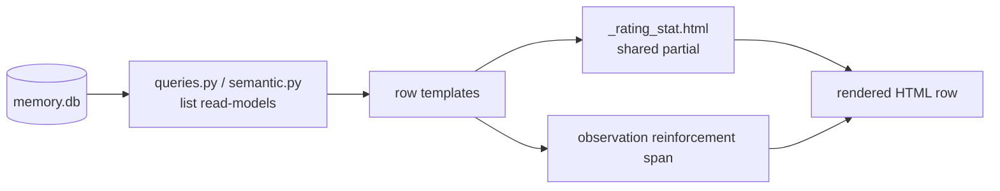

# Inline rating indicators on memory list rows — design

**Date:** 2026-05-15
**Status:** Approved (design)

## Problem

The closed-loop rating system (PR #52) records, per reflection and per
semantic memory, a `useful_count` (incremented on `cited` / `shaped`
classifications) and a `times_misled` count (incremented on `misled`).
Observations carry a separate `reinforcement_score` nudged by
`memory.record_use`.

Today these signals are barely visible in the management UI:

- **Reflection rows** show a `★ useful: N` badge only when
  `useful_count > 0`; `times_misled` is drawer-only.
- **Semantic rows** show the same conditional `★ useful: N` badge;
  `times_misled` is drawer-only.
- **Observation rows** show nothing about value; `reinforcement_score`
  is drawer-only.

To answer "are my memories adding value when generating code?" the user
must open each drawer one at a time. There is no at-a-glance signal on
the list pages, and the negative signal (`times_misled`, negative
reinforcement) is hidden entirely from the row.

## Goal

Surface each memory's value signal **inline on its own row**, on all
three list pages (Observations, Reflections, Semantic). No aggregate
panel or dashboard — the signal belongs next to the memory it describes.

## Non-goals (YAGNI)

- No aggregate / rollup dashboard of corpus-wide rating totals.
- No sorting or filtering of list rows by these values (the existing
  `useful_only` filter on the Reflections tab is untouched).
- No extension of the `cited` / `shaped` / `ignored` / `misled` rating
  model to observations. Observations keep `reinforcement_score` as
  their value signal.
- No schema migration — every column this design reads already exists.

## What shows where

| Page | Inline indicator | Always shown? | Colour |
|---|---|---|---|
| Reflections | `useful N · misled N` pair | Yes, even at `0 · 0` | each badge: ink/amber when `> 0`, grey when `0` |
| Semantic | `useful N · misled N` pair | Yes, even at `0 · 0` | each badge: ink/amber when `> 0`, grey when `0` |
| Observations | `reinforcement_score` (1 dp) | Yes, even at `0.0` | `> 0` ink, `< 0` amber, `== 0` grey |

The UI is a brutalist ink / amber / paper theme — it has no green or red. The
value semantics map onto the existing palette: positive (useful, positive
reinforcement) → **ink**; negative (misled, negative reinforcement) → **amber**;
default/zero → **muted grey**.

"Always shown" was an explicit decision: a fixed mini-stat on every row
lets the user distinguish a never-rated memory (`0 · 0`) from a
rated-clean one, and keeps the negative signal visible.

**Zero renders grey.** A badge at `0` (or a reinforcement score of
`0.0`) takes a muted/grey style rather than its signal colour. Grey
communicates "default value, no signal yet" and stops a wall of
never-rated rows from reading as a wall of ink/amber. The signal colour
(ink useful, amber misled, ink/amber reinforcement) appears only once
the count moves off `0`. This rule is uniform across all three
indicators.

`reinforcement_score` is a SQLite `REAL`. It is rendered rounded to one
decimal place. It may be negative (repeated `failure` reinforcement).

## Architecture

The change spans three layers; only the data layer touches Python
logic, and only for observations.

### 1. Data layer

`better_memory/ui/queries.py`:

- `ReflectionListRow` already carries `useful_count` and `times_misled`,
  and `reflection_list_for_ui` already SELECTs both. **No change.**
- `observation_list_for_ui` / `ObservationRow` do **not** carry
  `reinforcement_score`. Add it:
  - Add `reinforcement_score: float` to the `ObservationRow`
    frozen dataclass.
  - Add `reinforcement_score` to the SELECT column list in
    `observation_list_for_ui`.
  - Pass `r["reinforcement_score"]` into the `ObservationRow`
    constructor.

`better_memory/services/semantic.py`:

- `SemanticMemory` already carries `useful_count` and `times_misled`,
  and `list_for_project` already SELECTs both. **No change.**

This is the only Python change in the feature: three lines in
`queries.py` for the observation row model.

### 2. Shared template partial

New file `better_memory/ui/templates/fragments/_rating_stat.html`.

It renders the `useful · misled` pair from two integer inputs. It is
included by both `reflection_row.html` and `semantic_row.html` so the
two pages render an identical indicator by construction — they cannot
drift apart.

Contract:

- The partial reads two names from context: `rating_useful` (int) and
  `rating_misled` (int). It deliberately does **not** reference `row`,
  so it has no dependency on what the parent template calls its loop
  variable.
- Each including row supplies the two names via a `` block
  wrapping a plain `` (Jinja includes with the current
  context by default, so the `` names are visible to the
  partial):

  ```jinja
  
    
  
  ```

- Output: a `<span class="rating-stat">` containing a `useful N` badge
  and a `misled N` badge, both always present. Each badge's class is
  chosen by its own count: the signal colour (green useful / red
  misled) when `> 0`, the grey/default class when `0`.

Observations do **not** use this partial — their signal is a single
score, not a pair. `observation_row.html` renders its own inline
`<span class="reinforcement-stat ...">` element directly.

### 3. Row + drawer templates

| Template | Change |
|---|---|
| `fragments/reflection_row.html` | Replace the `★ useful` block with a `` wrapper including `_rating_stat.html`. |
| `fragments/semantic_row.html` | Replace the `★ useful` block the same way. |
| `fragments/observation_row.html` | Add a `reinforcement-stat` span (colour class chosen by sign of `row.reinforcement_score`). |
| `fragments/reflection_drawer.html` | The `Misled` row currently renders only when `times_misled > 0`. Make it always render, matching the always-shown rows. |
| `fragments/semantic_drawer.html` | Same: always render the `Misled` line. |
| `fragments/observation_drawer.html` | No change — it already renders `reinforcement`. |

### 4. CSS

The current `★ useful` badge markup uses `badge bg-success` — but those
classes are **not defined** in the brutalist `app.css`, so that badge
renders unstyled today. The new indicators define real classes against
the existing palette tokens (`--brut-ink`, `--brut-amber`, `--brut-muted`,
`--brut-rule`). Add to `app.css`:

- `.rating-stat` — inline-flex container for the badge pair.
- `.rating-badge` — base badge; grey/muted by default (this is the `0`
  state, so `.rating-zero` needs no override).
- `.rating-badge.rating-useful` — ink fill.
- `.rating-badge.rating-misled` — amber fill.
- `.reinforcement-stat` with `.reinf-pos` (ink) / `.reinf-neg` (amber) /
  `.reinf-zero` (muted, the base colour).
- `.text-danger` — referenced by both drawers' Misled line but currently
  undefined; add a one-line amber rule.

No new colour tokens — ink / amber / muted / rule already exist.

## Data flow



No new request path, route, or HTMX trigger. The indicators render as
part of the existing row fragments returned by the existing list panel
endpoints.

## Error handling / edge cases

- **Null counters.** `useful_count` / `times_misled` are
  `NOT NULL DEFAULT 0` (migration 0009) so they are never null for rows
  created after the migration. The read-models already coalesce with
  `or 0` defensively; the partial treats any falsy value as `0`.
- **Negative reinforcement.** `reinforcement_score` may be negative;
  the value drives the colour class (positive / negative / zero).
  Rounding uses one decimal place so a small negative score does not
  display as `-0.0` — values within `(-0.05, 0.05)` render as `0.0` and
  take the grey/zero class.
- **Missing column on legacy rows.** Not possible — `reinforcement_score`
  has existed since migration 0001 / 0002.

## Testing

Extend the UI test suite (`tests/ui/`) with Flask test-client render
tests — the established pattern in `test_observations.py` /
`test_reflections.py` / `test_semantic.py`. They assert the rendered
HTML fragment contains the expected text and class names, which is
exactly what this feature changes; a browser is not needed. New
assertions:

1. **Reflections** — a row with `useful_count = 0, times_misled = 0`
   still renders the `useful 0` and `misled 0` badges (always-shown),
   and both badges carry the grey/default class, not the signal colour.
2. **Reflections** — a row with `useful_count > 0` renders the useful
   badge with the green style; a row with `times_misled > 0` renders
   the misled badge with the red style. A mixed row (e.g.
   `useful > 0, misled = 0`) shows one signal-coloured and one grey
   badge — confirming each badge is classed by its own count.
3. **Semantic** — same assertions as reflections (the shared partial
   means these double as the partial's contract test).
4. **Observations** — a row renders the reinforcement indicator;
   a positive score takes the positive class, a negative score the
   negative class, `0.0` the grey/zero class.
5. **Drawer** — the reflection and semantic drawers render the `Misled`
   line even when the count is `0`.

Assertions match on DOM text / classes. Per a known gotcha, Playwright
locators match DOM `textContent`, not CSS-rendered text — assert on the
source values (`0`, `1`, `-0.5`), not on any text-transformed display.

## Files touched

- `better_memory/ui/queries.py` — add `reinforcement_score` to
  `ObservationRow` (dataclass field, SELECT, constructor).
- `better_memory/ui/templates/fragments/_rating_stat.html` — new.
- `better_memory/ui/templates/fragments/reflection_row.html` — use partial.
- `better_memory/ui/templates/fragments/semantic_row.html` — use partial.
- `better_memory/ui/templates/fragments/observation_row.html` — add
  reinforcement span.
- `better_memory/ui/templates/fragments/reflection_drawer.html` — always
  render Misled.
- `better_memory/ui/templates/fragments/semantic_drawer.html` — always
  render Misled.
- UI stylesheet — misled badge + reinforcement colour classes.
- `tests/ui/` — new assertions per the Testing section.
