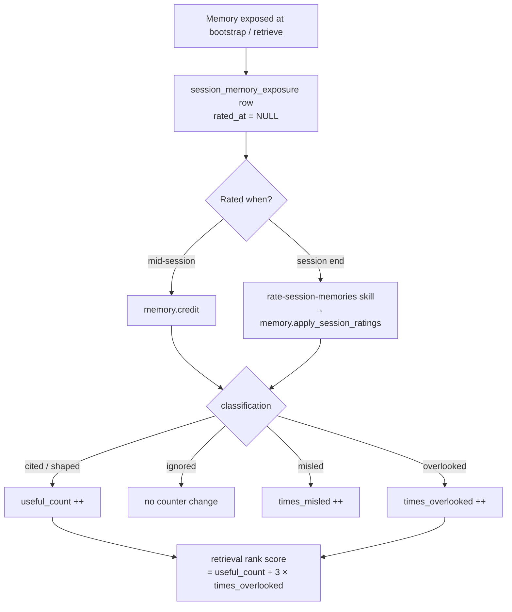

# A 5th memory-rating class: `overlooked` — design

**Date:** 2026-05-17
**Status:** Approved (design)
**Issue:** [#60](https://github.com/emp3thy/better-memory/issues/60)

## Problem

The closed-loop rating system (migration 0009) classifies every reflection
and semantic memory exposed in a session into one of four classes:

- `cited` — quoted or directly referenced (used well → `useful_count++`)
- `shaped` — guided a decision (used well → `useful_count++`)
- `ignored` — seen but irrelevant (neutral; moves no counter)
- `misled` — caused a wrong direction (used badly → `times_misled++`)

There is no class for a memory that was **relevant and should have been
applied, but wasn't — until the user explicitly demanded it**. Today that
case is filed under `ignored`, which treats the memory as neutral noise and
moves no counter. The single strongest "this memory matters" signal — a
human explicitly vouching for it — is discarded.

## Goal

Add a 5th classification, `overlooked`: *relevant, not applied, user had to
intervene*. Two effects:

1. **Importance boost.** An `overlooked` rating ranks the memory *up* in
   retrieval — weighted harder than a `cited`, because a human explicitly
   vouched for its relevance.
2. **Agent-failure signal.** A per-memory `times_overlooked` counter (and a
   `/diagnostics` aggregate) measures how often the agent drops memories it
   was handed.

Unlike the other classes, `overlooked` has a concrete observable anchor:
*did the user explicitly point the agent back to a memory it already had?*
That is an event, not a judgement call — which is what makes a self-reported
failure trustworthy enough to act on.

## Decisions

These were settled during brainstorming and are not open questions:

| Decision | Choice | Rationale |
|---|---|---|
| Class name | `overlooked` | The issue proposed `missed`; it is one letter from the existing `misled` and would produce the column pairs `times_missed`/`times_misled`. `overlooked` removes the collision. |
| Counter semantics | `overlooked` bumps `times_overlooked` **only** — never `useful_count` | Keeps three orthogonal counters. If `overlooked` also bumped `useful_count`, retrieval ranking (which reads `useful_count`) would double-count the same event. |
| Ranking | `ORDER BY (useful_count + W × times_overlooked) DESC`, `W = 3` | Weighted sum: one `overlooked` ≈ three cites — "harder than cited" without dominating. Signals compose; a heavily-cited memory still outranks a once-overlooked one. |
| `memory.credit` | Accepts `overlooked` | The `overlooked` event has a concrete mid-session anchor, so it is creditable the moment it happens. `ignored` stays credit-rejected (it is a session-end sweep default, not an event). |
| UI | In scope | Extends the inline rating indicators (PR #61). Leaving the row showing two of three counters is incoherent. |

## Non-goals (YAGNI)

- **No `importance_score` column.** Ranking stays a computed `ORDER BY`
  expression, not a stored, separately-maintained score.
- **No new MCP tool**, and no change to the `memory.retrieve` *payload* —
  `times_overlooked` is not surfaced in retrieve output, consistent with
  `times_misled` (already not surfaced there). The ranking change alone
  raises overlooked memories.
- **No `times_misled` in ranking.** Retrieval ranking today uses only
  `useful_count`; this design adds `times_overlooked` and nothing else.
  Demoting `misled` memories is out of scope.
- **No retroactive reclassification** of historic `ignored` rows.
- **No sorting/filtering UI controls** for the new counter.

## Rating flow



## Architecture

The change spans schema, the rating service, two MCP tool schemas, two
retrieval queries, the session-close hook, the rating skill, and the UI.

### 1. Migration `0010_overlooked_rating.sql`

New file in `better_memory/db/migrations/`, picked up automatically by
`apply_migrations` (schema.py) in lexical order after `0009`.

**1a. Widen the `classification` CHECK constraint.** SQLite cannot `ALTER`
a `CHECK` constraint, so `session_memory_exposure` is recreated. No table
holds a foreign key into `session_memory_exposure` (verified by grep), so no
`PRAGMA foreign_keys` toggling is required.

```sql
CREATE TABLE session_memory_exposure_new (
    session_id     TEXT NOT NULL,
    memory_kind    TEXT NOT NULL CHECK(memory_kind IN ('reflection', 'semantic')),
    memory_id      TEXT NOT NULL,
    exposed_at     TEXT NOT NULL,
    source         TEXT NOT NULL CHECK(source IN ('bootstrap', 'retrieve')),
    rated_at       TEXT,
    classification TEXT CHECK(classification IN
                     ('cited', 'shaped', 'ignored', 'misled', 'overlooked')),
    PRIMARY KEY (session_id, memory_kind, memory_id, exposed_at)
);

INSERT INTO session_memory_exposure_new
    (session_id, memory_kind, memory_id, exposed_at, source, rated_at, classification)
SELECT
    session_id, memory_kind, memory_id, exposed_at, source, rated_at, classification
FROM session_memory_exposure;

DROP TABLE session_memory_exposure;
ALTER TABLE session_memory_exposure_new RENAME TO session_memory_exposure;

CREATE INDEX idx_sme_session_unrated
    ON session_memory_exposure(session_id) WHERE rated_at IS NULL;
CREATE INDEX idx_sme_memory
    ON session_memory_exposure(memory_kind, memory_id);
```

The column list in the `INSERT ... SELECT` is explicit (not `SELECT *`) so
the migration cannot silently mis-map if the column order ever drifts. Both
indexes are recreated — they are dropped with the old table.

**1b. Add the counter columns**, mirroring the 0009 layout for
`useful_count` / `last_useful_at`:

```sql
ALTER TABLE reflections       ADD COLUMN times_overlooked   INTEGER NOT NULL DEFAULT 0;
ALTER TABLE reflections       ADD COLUMN last_overlooked_at TEXT;
ALTER TABLE semantic_memories ADD COLUMN times_overlooked   INTEGER NOT NULL DEFAULT 0;
ALTER TABLE semantic_memories ADD COLUMN last_overlooked_at TEXT;
```

### 2. Rating service — `services/memory_rating.py`

- Extend the `Classification` Literal to include `"overlooked"`, and the
  `CreditClassification` Literal likewise (it becomes
  `"cited" | "shaped" | "misled" | "overlooked"`).
- Add `"overlooked"` to `_VALID_CLASSES` and to `_CREDIT_CLASSES`.
- Add `overlooked: int` to the `AppliedCounts` TypedDict, and `"overlooked": 0`
  to the `applied` dict initialised in `apply_session_ratings`.
- `_apply_one` step 3 gains one branch, parallel to the `misled` branch:

  ```python
  elif classification == "overlooked":
      self._conn.execute(
          f"UPDATE {table} "
          f"SET times_overlooked = times_overlooked + 1, last_overlooked_at = ? "
          f"WHERE id = ?",
          (now, memory_id),
      )
  ```

- `credit_one` already rejects `classification == "ignored"` with a specific
  error and otherwise validates against `_CREDIT_CLASSES`; adding `overlooked`
  to that set is the only change needed for it to be accepted. Update the
  `credit_one` docstring's "Apply outcomes" list accordingly.
- Add a module-level constant `OVERLOOKED_RANKING_WEIGHT = 3`. It lives here
  because `memory_rating.py` is the canonical owner of the rating model
  (it already defines `_VALID_CLASSES`, the `Classification` Literal, and
  the counter-update logic). `config.py` is unsuitable — it is strictly
  filesystem layout plus env-driven external-service knobs.

### 3. MCP tool schemas — `mcp/server.py`

Three edits, at the line numbers current as of this spec:

- **Line 780** — `memory.credit` `class` enum
  `["cited", "shaped", "misled"]` → add `"overlooked"`.
- **Line 756** — `memory.apply_session_ratings` `ratings[].class` enum
  `["cited", "shaped", "ignored", "misled"]` → add `"overlooked"`.
- **Line 771** — the `memory.credit` description string
  `"class must be 'cited', 'shaped', or 'misled' — NOT 'ignored'."` →
  reword to include `overlooked` and state when to use it (when the user
  pointed the agent back to a memory it already had).

The handlers delegate to `MemoryRatingService` and need no logic change.

### 4. Retrieval ranking — `services/reflection.py`, `services/semantic.py`

Both retrieval queries currently order primarily by `useful_count DESC`.
Each changes that primary key to the weighted sum, binding the weight as a
query parameter from `OVERLOOKED_RANKING_WEIGHT`:

- `reflection.py` → `retrieve_reflections()`:
  `ORDER BY useful_count DESC, confidence DESC, updated_at DESC`
  becomes
  `ORDER BY (useful_count + ? * times_overlooked) DESC, confidence DESC, updated_at DESC`.
- `semantic.py` → `list_for_project()`:
  `ORDER BY useful_count DESC, created_at DESC`
  becomes
  `ORDER BY (useful_count + ? * times_overlooked) DESC, created_at DESC`.

`times_overlooked` exists on both tables after migration 0010, so it can be
referenced in `ORDER BY` whether or not it is in the `SELECT` list. The
weight is bound, not interpolated.

`list_for_project()` backs both the MCP semantic retrieval and the UI
semantic list (per the inline-indicators design), so this `ORDER BY` change
shifts the default order in both — overlooked memories rise. That is
consistent with the feature's intent. It is not a regression of the
inline-indicators non-goal, which ruled out adding *sort/filter controls*,
not a change to the existing default order (already `useful_count DESC`).

### 5. Session-close directive & rating skill

- **`hooks/session_close.py`** — the `RATE_MEMORIES` directive (around line
  128) lists `cited / shaped / ignored / misled (default: ignored)`. Add
  `overlooked` to that line.
- **`.claude/skills/rate-session-memories/SKILL.md`** — add `overlooked` as
  a fifth class in STEP 2, with a **tight anchor rule**:

  > **overlooked** — the memory was relevant and you should have applied it,
  > but you did not, until the user explicitly pointed you back to it.

  The skill's rules section gains: `overlooked` is **never a fallback**. Test
  for it first and separately from the cited/shaped/ignored axis — the
  decisive question is the observable anchor (*did the user explicitly point
  you back to a memory you already had?*), not a judgement of relevance. If
  that event did not happen, the memory is not `overlooked`.

- The `memory.credit` tool description (section 3, line 771) carries the
  same one-line definition so mid-session crediting is discoverable.

### 6. UI — inline indicator, drawer, diagnostics

Builds directly on the inline rating indicators design
(`2026-05-15-inline-memory-rating-indicators-design.md`, shipped in PR #61).

**6a. Data layer.** The list-row and drawer read-models for reflections and
semantic memories must carry the new columns:

- `ui/queries.py` — add `times_overlooked` (and `last_overlooked_at` for the
  drawer) to the reflection list-row and reflection detail read-models:
  dataclass field, `SELECT` column, constructor argument. New dataclass
  fields are declared with a default (`times_overlooked: int = 0`,
  `last_overlooked_at: str | None = None`) so existing call sites are
  unaffected, and `last_overlooked_at` is typed `str | None` to match the
  nullable column.
- `services/semantic.py` — add the same two fields to the `SemanticMemory`
  dataclass and to the `list_for_project()` `SELECT`.
- Observations are untouched — they are not part of the class-based rating
  model (they use `reinforcement_score`).

**6b. Shared partial — `_rating_stat.html`.** Today it renders a
`useful · misled` pair from `rating_useful` / `rating_misled`. Add a third
badge between them, reading `rating_overlooked`:

```jinja
<span class="rating-badge rating-{{ 'overlooked' if rating_overlooked else 'zero' }}">overlooked {{ rating_overlooked or 0 }}</span>
```

`reflection_row.html` and `semantic_row.html` each extend their ``
block to also bind `rating_overlooked = row.times_overlooked`.

**6c. Drawers.** `reflection_drawer.html` and `semantic_drawer.html` gain an
always-rendered `Overlooked` line between the `Useful` and `Misled` lines:

```jinja
<dt>Overlooked</dt>
<dd>{{ detail.reflection.times_overlooked }} (last: {{ detail.reflection.last_overlooked_at }})</dd>
```

(The semantic drawer uses its own detail object name.) "Always rendered"
matches the inline-indicators decision that the `Misled` line always renders.

**6d. `/diagnostics`.** The route in `ui/app.py` (around lines 567–593)
gains one aggregate query —
`SELECT COALESCE(SUM(times_overlooked), 0) FROM reflections` plus the same
for `semantic_memories`, summed — passed to the template as
`overlooked_total`. `diagnostics.html` renders it in the existing
"Rating diagnostics" `<dl>`:

```jinja
<dt>overlooked (total)</dt>
<dd>{{ overlooked_total }} (memories the agent dropped until the user intervened)</dd>
```

The "Recent ratings" table needs no change — it renders
`r.classification` through a generic `.badge`, so `overlooked` rows appear
automatically once the migration allows the value.

**6e. CSS.** Add a `.rating-badge.rating-overlooked` rule to the UI
stylesheet (`app.css`). Styling: an **amber outline** (transparent fill,
amber border and text) — in the warning family with `misled` (amber fill)
but visually distinct from it. The `0` state keeps the existing grey
`rating-zero` class. Use the existing brutalist palette tokens
(`--brut-amber`, `--brut-muted`, `--brut-rule`); no new colour token, and no
Bootstrap utility classes (they are not defined in `app.css`).

## Error handling / edge cases

- **CHECK constraint on legacy rows.** Every existing `classification` value
  is one of the original four, all still permitted by the widened CHECK, so
  the `INSERT ... SELECT` in migration 0010 cannot violate it.
- **Null counters.** `times_overlooked` is `NOT NULL DEFAULT 0`, so rows
  created before 0010 read `0`, never null. The `_rating_stat.html` partial
  treats any falsy value as `0` (`rating_overlooked or 0`).
- **Multiple exposure rows.** A memory exposed at both bootstrap and a
  mid-session retrieve has two `session_memory_exposure` rows.
  `_apply_one` already bumps the memory counter once and stamps *all*
  unrated exposure rows — the `overlooked` branch inherits this unchanged.
- **`memory.credit` re-credit.** A memory already credited (mid-session or
  earlier) returns the `already_rated` skip outcome — unchanged; the
  `overlooked` branch is only reached for a still-unrated exposure.

## Testing

- **Migration.** A test applies migrations up to 0009, asserts inserting a
  `session_memory_exposure` row with `classification='overlooked'` *fails*
  the CHECK (the baseline), then applies 0010 and asserts the same insert
  *succeeds*. Assert `times_overlooked` / `last_overlooked_at` exist on both
  memory tables and default to `0` / `NULL`.
- **`test_memory_rating.py`.** `credit_one(classification='overlooked')`
  bumps `times_overlooked` to 1, sets `last_overlooked_at`, and stamps the
  exposure row's `classification`. `apply_session_ratings` with an
  `overlooked` entry counts it under `applied["overlooked"]`. `credit_one`
  still raises for `ignored`.
- **Ranking.** Seed values that cross the `W = 3` boundary, not values that
  pass regardless: a memory with `useful_count=2, times_overlooked=0`
  (score 2) ranks *below* one with `useful_count=0, times_overlooked=1`
  (score 3); a memory with `useful_count=4` (score 4) ranks *above* it.
  Cover both `retrieve_reflections()` and `list_for_project()`.
- **`test_session_close_rating_directive.py`.** The directive text lists
  `overlooked`.
- **MCP tools.** `memory.credit` and `memory.apply_session_ratings` accept
  `class='overlooked'` end-to-end.
- **UI render tests** (`tests/ui/`, Flask test-client). A row with
  `times_overlooked=0` still renders the `overlooked 0` badge with the grey
  `rating-zero` class; `times_overlooked>0` renders it with the
  `rating-overlooked` class; badge independence holds (a row useful>0,
  overlooked=0, misled>0 shows the correct class on each). The drawer
  renders the `Overlooked` line at `0`. `/diagnostics` shows the
  `overlooked (total)` line and an `overlooked` row in Recent ratings.
  Assertions match DOM `textContent` / class names (Playwright locators do
  not see CSS-transformed text).

## Docs

Per the project's docs-sync convention:

- `website/mcp-tools.md` — the `class` enums for `memory.credit` and
  `memory.apply_session_ratings`.
- `website/architecture.md` — the rating model, now five classes.
- `README.md` and `docs/hooks-setup.md` — update wherever the rating
  classes are enumerated.
- `docs/superpowers/specs/2026-05-10-memory-rating-design.md` — add a brief
  note that the model was extended to five classes by this design (issue
  #60), so the older spec is not read as current.
- No MCP tool is added or removed, so tool-count tables (`README.md`,
  `website/index.md`, `website/mcp-tools.md`) are unaffected.

## Files touched

| File | Change |
|---|---|
| `better_memory/db/migrations/0010_overlooked_rating.sql` | **New.** Recreate exposure table with widened CHECK; add four columns. |
| `better_memory/services/memory_rating.py` | Class lists, Literals, `AppliedCounts`, `_apply_one` branch, `OVERLOOKED_RANKING_WEIGHT`. |
| `better_memory/services/reflection.py` | `retrieve_reflections()` `ORDER BY`. |
| `better_memory/services/semantic.py` | `list_for_project()` `ORDER BY`; `SemanticMemory` columns. |
| `better_memory/mcp/server.py` | Two `class` enums + one description string. |
| `better_memory/ui/queries.py` | Reflection read-model columns. |
| `better_memory/ui/app.py` | `/diagnostics` aggregate query. |
| `better_memory/hooks/session_close.py` | `RATE_MEMORIES` directive class list. |
| `better_memory/ui/templates/fragments/_rating_stat.html` | Third badge. |
| `better_memory/ui/templates/fragments/reflection_row.html` | Bind `rating_overlooked`. |
| `better_memory/ui/templates/fragments/semantic_row.html` | Bind `rating_overlooked`. |
| `better_memory/ui/templates/fragments/reflection_drawer.html` | `Overlooked` line. |
| `better_memory/ui/templates/fragments/semantic_drawer.html` | `Overlooked` line. |
| `better_memory/ui/templates/diagnostics.html` | `overlooked (total)` line. |
| UI stylesheet (`app.css`) | `.rating-badge.rating-overlooked` rule. |
| `.claude/skills/rate-session-memories/SKILL.md` | Fifth class + anchor rule. |
| `website/mcp-tools.md`, `website/architecture.md`, `README.md`, `docs/hooks-setup.md`, `docs/superpowers/specs/2026-05-10-memory-rating-design.md` | Rating-model sync. |
| `tests/services/test_memory_rating.py`, `tests/hooks/test_session_close_rating_directive.py`, `tests/ui/`, migration test | New assertions per Testing. |
