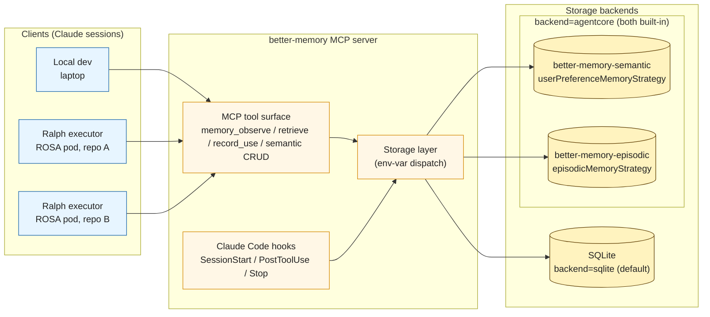

# AgentCore Storage Backend — Design

**Status:** Draft (design phase, post-spike)
**Date:** 2026-05-24
**Author:** gethin (with Claude)
**Drivers:** [2026-05-23-ralph-umbrella-design.md](../../../../ralph/docs/superpowers/specs/2026-05-23-ralph-umbrella-design.md), [2026-05-23-ralph-v1-per-repo-loop-design.md](../../../../ralph/docs/superpowers/specs/2026-05-23-ralph-v1-per-repo-loop-design.md)

## Goal

Add an opt-in storage backend that delegates to AWS Bedrock AgentCore Memory, so a fleet of Ralph executors (on ROSA pods) and human developers (on laptops) can share memory across machines/agents through a managed service. The existing MCP tool surface and the three Claude Code hooks stay unchanged — Ralph and any other MCP consumer integrate the same way against either backend.

A single configuration switch:

```
BETTER_MEMORY_STORAGE_BACKEND=sqlite     # default - current behaviour
BETTER_MEMORY_STORAGE_BACKEND=agentcore  # delegate storage to AgentCore Memory
```

## Non-Goals

- **Replacing SQLite for existing users.** Opt-in only; default unchanged.
- **Bulk migration of existing SQLite data into AgentCore.** Clean-start in agentcore mode. A future spec can cover migration if there's demand.
- **Knowledge base port.** The local markdown corpus + BM25 index stays SQLite-backed regardless of `BETTER_MEMORY_STORAGE_BACKEND`. It's not Claude-derived; it doesn't need server-side extraction.
- **Embeddings backend in agentcore mode.** AgentCore's `retrieve-memory-records` is the search path; the existing Ollama / TF-IDF backends are no-ops in agentcore mode.
- **Multi-region / DR.** Single AgentCore region per deployment. Cross-region replication is out of scope.
- **A web UI for AgentCore-specific admin tasks.** The existing better-memory management UI works read-only against either backend; agentcore-specific admin lives in CLI commands.

## Constraints

- **Backend dispatch is one env var.** No mixed-mode or per-tool override.
- **MCP surface unchanged.** All existing tools and hooks present the same shape; behavioural differences are documented per-tool.
- **Project scoping unchanged.** `git rev-parse --git-common-dir` is still the source of truth for project identity.
- **Synthesis is AgentCore-driven in agentcore mode.** Built-in strategies handle extraction; the Claude-driven `memory_synthesize_next_*` loop is unavailable when storage is AgentCore.
- **Region:** default `eu-west-2`. Configurable via `AWS_REGION` / `BETTER_MEMORY_AGENTCORE_REGION`.
- **Auth:** standard AWS credential chain — environment, profile, IRSA on ROSA. The MCP server doesn't manage credentials.
- **No `memoryExecutionRoleArn` required.** Built-in strategies run extraction in AgentCore's account; no Bedrock model access opt-in on the operator side.
- **Single user is no longer a safe assumption** in agentcore mode. The fleet writes concurrently against shared resources.

## Architecture



### Storage layer abstraction

Services depend on a `StorageBackend` protocol (Python `typing.Protocol`). Two concrete implementations:

- `better_memory.storage.sqlite.SqliteBackend` — wraps the existing services / SQL. Behaviour-preserving.
- `better_memory.storage.agentcore.AgentCoreBackend` — `boto3` client over `bedrock-agentcore` (data plane) and `bedrock-agentcore-control` (control plane).

The protocol is the contract. Backend-only methods (e.g., synthesize_next is sqlite-only) raise `NotImplementedError` and are flagged via a capability bit so the MCP server can branch on registration.

### Two AgentCore memory resources, both built-in

| Memory name | Strategy | Latency | Purpose |
|---|---|---|---|
| `better-memory-semantic` | built-in `userPreferenceMemoryStrategy` (and optionally `semanticMemoryStrategy`) | ~3 min from event to record (measured) | Long-term user preferences and facts. Next session must see them. |
| `better-memory-episodic` | built-in `episodicMemoryStrategy` with `reflectionConfiguration` | ~15-30 min from session end to reflection (measured) | Episodic events distilled into reflections. Eventual surfacing is fine — matches today's manual-synthesis cadence. |

Both built-in. Both use AWS-managed extraction models in AgentCore's account; no `memoryExecutionRoleArn` needed, no Bedrock model access opt-in for the operator, no Bedrock invocation costs in the operator's account.

Why two memory resources rather than one with both strategies:

- **Independent retention.** `eventExpiryDuration` is per-memory. Episodic events can churn (30-90 days); preference events keep longer (365 days).
- **Independent latency expectations.** Preferences need to be ~immediate; reflections can take 30 minutes. Documenting each separately keeps operator expectations clear.
- **Independent evolution.** Schema changes (especially metadata schema on the episodic side) iterate without touching the preferences memory.

A single memory resource with mixed strategies is valid in AgentCore and remains an option if operational cost dominates — flagged as a deferred decision.

### actorId encodes project

Across both memories:

- `actorId` = the project name resolved from `git rev-parse --git-common-dir` (e.g. `nuke`, `better-memory`)
- `actorId = general` is a reserved value for the cross-project bucket
- Strategy `namespaceTemplates` use `{actorId}` for project-scoped extraction landing zones
- `sessionId` = the Claude session identifier (`CLAUDE_SESSION_ID` env var if present, else a generated UUID)

`actorId` is opaque to AWS; AgentCore doesn't validate it against IAM identities. It exists purely for namespace substitution and as an IAM context key (`bedrock-agentcore:actorId`) if we add per-project IAM scoping later.

### Namespace shape

Constraint discovered in the spike: a strategy's `reflectionConfiguration.namespaceTemplates` must be the same as or a prefix of the strategy's `namespaceTemplates`. We satisfy this by nesting episodes under reflections in the path:

```
projects/{actorId}/reflections/             ← extracted reflections land here
projects/{actorId}/reflections/episodes/    ← episode records land here (under reflections)
projects/{actorId}/semantic/                ← user-preference records
projects/{actorId}/retired/                 ← retire = move record here
general/reflections/                        ← cross-project (post-promotion)
general/reflections/episodes/
general/semantic/
general/retired/
```

Polarity (do / dont / neutral) is **not** in the namespace — it's a record metadata field declared on the episodic strategy's reflection schema. Strategies are bound to exactly one namespace template each (spike Finding 4), so polarity-as-namespace would require three strategies. Metadata-on-flat-namespace is the cleaner fit.

### Memory record metadata schema (episodic memory)

Declared in `episodicMemoryStrategy.reflectionConfiguration.memoryRecordSchema.metadataSchema`. **Every key the backend will write must be declared here — undeclared keys are silently dropped at create/update (spike Finding 5).**

| Key | Type (declared) | Runtime value type | LLM extraction | Notes |
|---|---|---|---|---|
| `polarity` | `STRING` allowedValues `do` / `dont` / `neutral` | `stringValue` | Per-field instruction telling the LLM to classify do/dont/neutral | Verified working in spike (3/3 reflections correctly classified) |
| `useful_count` | `NUMBER` | `numberValue` | — | App-managed. ++ on `cited` / `shaped` rating, and on positive `record_use` |
| `missed_count` | `NUMBER` | `numberValue` | — | App-managed. ++ on negative `record_use` (reverse-credit) |
| `ignored_count` | `NUMBER` | `numberValue` | — | App-managed. ++ on `ignored` rating from session-end classification |
| `times_misled` | `NUMBER` | `numberValue` | — | App-managed. ++ on `misled` rating |
| `overlooked_count` | `NUMBER` | `numberValue` | — | App-managed. ++ on `overlooked` rating (matches the 5-class sqlite system: cited / shaped / ignored / misled / overlooked) |
| `last_credited_at` | `STRING` | `dateTimeValue` | — | App-managed. Recency for client-side decay. Declared as `STRING` because `MetadataSchemaEntry.type` enum is only `STRING / STRINGLIST / NUMBER`; the runtime value uses `dateTimeValue` (boto3 accepts a `datetime` object) |
| `status` | `STRING` allowedValues `active` / `retired` / `promoted` | `stringValue` | — | App-managed. Lifecycle state. |

System metadata (`x-amz-agentcore-memory-recordType`, `createdAt`, `updatedAt`) is always present without declaration.

`indexedKeys` on the episodic memory: `polarity`, `status`, `last_credited_at`, `overlooked_count` — so metadata-filtered retrieval skips full scans (including the "most overlooked" management-UI view).

### Memory record metadata schema (semantic memory)

Declared in `userPreferenceMemoryStrategy.memoryRecordSchema.metadataSchema`. Mirror of the episodic schema MINUS `polarity` (semantic preferences are not classified do/dont/neutral). Same app-managed counters so the same rating UX works against semantic records.

| Key | Type (declared) | Runtime value type | LLM extraction | Notes |
|---|---|---|---|---|
| `useful_count` | `NUMBER` | `numberValue` | — | App-managed. Same semantics as episodic |
| `missed_count` | `NUMBER` | `numberValue` | — | App-managed |
| `ignored_count` | `NUMBER` | `numberValue` | — | App-managed |
| `times_misled` | `NUMBER` | `numberValue` | — | App-managed |
| `overlooked_count` | `NUMBER` | `numberValue` | — | App-managed |
| `last_credited_at` | `STRING` | `dateTimeValue` | — | App-managed |
| `status` | `STRING` allowedValues `active` / `retired` / `promoted` | `stringValue` | — | App-managed |

`indexedKeys` on the semantic memory: `status`, `last_credited_at`, `overlooked_count`.

### Rating model (cross-backend parity)

Session-end classification produces 5 classes, identical to sqlite mode. The classes map onto metadata counters as follows; the per-record update is one `BatchUpdateMemoryRecords` call with the full metadata snapshot (read current → bump counter → write back).

| Rating class | Counter incremented | Also updates |
|---|---|---|
| `cited` | `useful_count` | `last_credited_at` |
| `shaped` | `useful_count` | `last_credited_at` |
| `ignored` | `ignored_count` | `last_credited_at` |
| `misled` | `times_misled` | `last_credited_at` |
| `overlooked` | `overlooked_count` | `last_credited_at` |

Rating works against both semantic and episodic records using the same metadata schema. In agentcore mode there is **no `session_memory_exposure` table** — the per-session exposure log + end-of-session classification loop is replaced by direct counter mutations issued from the rating UI / `record_use` MCP tool. The `list_session_exposures` / `apply_session_ratings` / `credit_one` MCP tools therefore behave as follows in agentcore mode:

- `record_use(observation_id, outcome)` → look up the AgentCore record, bump `useful_count` / `missed_count`, write `last_credited_at`. Same wire shape as sqlite mode.
- `list_session_exposures(session_id)` → returns an empty `exposures` list (the session-exposure model doesn't apply; the rating panel hides when empty).
- `apply_session_ratings(session_id, ratings)` → for each rating entry, performs the per-record metadata update above. Behavior preserved; the source of "which records to rate" shifts from the exposure table to the rating UI's current selection.
- `credit_one(session_id, kind, id, classification)` → equivalent to one of the per-record metadata updates above. Selects the counter from the class.

The episode lifecycle methods (`open_background_episode` / `start_foreground_episode` / `close_active_episode` / `close_episode_by_id` / `list_episodes`) are no-ops in agentcore mode: AgentCore manages event grouping via `sessionId` internally and does not expose an episode-as-first-class-record concept that maps onto better-memory's episodes table. The MCP tools / management UI hide the Episodes tab when `backend.supports_episodes` reports False (a second capability flag on the Protocol, alongside `supports_synthesis`).

### Reflection content shape (returned by AgentCore)

Built-in episodic produces reflections as structured JSON in `content.text`:

```json
{
  "title": "Per-Step Confidence Rating Gate for Implementation Plans",
  "use_cases": "Applies when creating or reviewing implementation plans ...",
  "hints": "Assign a confidence percentage to every task ... Treat this as a hard gate, not a suggestion ...",
  "confidence": "0.9"
}
```

The shape lines up with better-memory's existing reflection model (title / use_cases / hints / confidence / polarity). The only structural difference is `hints` returned as one prose string rather than a list. The retrieval layer parses the JSON and maps onto the existing `Reflection` dataclass; the prose `hints` is split into a list on `\n- ` or sentence boundaries (working approach; iterate if quality requires).

### Session lifecycle and the closure event

AgentCore's built-in episodic strategy waits for an episode to look complete before triggering extraction. The strategy detects completion from a combination of conversational closure signals in the payload and a session-idle window. Without an explicit closure cue, the spike measured ~15-20 min idle before trigger.

Better-memory already has the right primitive for this — the `Stop` hook (session_close). In agentcore mode, the Stop hook fires one final `CreateEvent` against the AgentCore session whose payload is a closure marker:

```json
{
  "conversational": {
    "role": "OTHER",
    "content": {"text": "Session complete. All work for this session has been recorded."}
  }
}
```

The role enum is `ASSISTANT | USER | TOOL | OTHER` (boto3 surface verification, 2026-05-25). `OTHER` is the right semantic match for a system-emitted closure marker — it is neither a real user turn nor an assistant reply.

The LLM's completion-detection picks this up. Extraction triggers within the typical 1-3 minute window for a complete episode instead of waiting out the 15-minute idle. The closure event is fire-and-forget — failure to deliver it just falls back to the idle-detection path.

Operator implication: Ralph executor sessions (`session_close` always fires) get fast extraction; human dev sessions that exit abruptly (closed terminal, killed process) fall back to idle-detection.

## Decisions (with rationale)

| Decision | Choice | Why |
|---|---|---|
| Backend selector | Single env var, default `sqlite` | Matches the TF-IDF embeddings backend precedent |
| Synthesis ownership | AgentCore-driven, both strategies built-in | Spike verified extraction quality is good; no need for custom prompts or our own Bedrock invocations |
| Strategy types | `userPreferenceMemoryStrategy` (semantic memory) + `episodicMemoryStrategy` (episodic memory) | Built-in covers both use-cases; matches the AWS quickstart and demos exactly |
| Polarity placement | Metadata, not namespace | Strategy bound to one namespace template (spike Finding 4); polarity-as-metadata verified working in spike |
| Topology | Two memory resources (semantic + episodic) | Independent retention / latency expectations / evolution |
| actorId semantics | Project name | The most natural map of a per-repo concept |
| Namespace tree | Episodes nested under reflections | Satisfies the strategy-namespace-prefix constraint |
| Knowledge base | Stays SQLite-only | Not Claude-derived; no synthesis benefit |
| Embeddings | No-op in agentcore mode | AgentCore retrieval replaces hybrid_search |
| Session closure | Stop hook fires a final closure CreateEvent | Triggers AgentCore's completion detection; bounds latency to ~1-3 min |
| Custom strategies | Not in v1 | Built-in is sufficient and operationally simpler; revisit only if extraction quality forces it |

## Verified API surface (boto3 introspection, 2026-05-25)

Post-spec verification against `boto3 1.43.14` / `botocore 1.43.14` confirmed the overall shape but surfaced a handful of corrections. These supersede any conflicting statement earlier in the spec.

### Operation locations

| Operation | Boto3 method | Service (client) |
|---|---|---|
| `CreateEvent` | `create_event` | `bedrock-agentcore` (data) |
| `RetrieveMemoryRecords` | `retrieve_memory_records` | `bedrock-agentcore` (data) |
| `ListMemoryRecords` | `list_memory_records` | `bedrock-agentcore` (data) |
| `GetMemoryRecord` | `get_memory_record` | `bedrock-agentcore` (data) |
| `BatchCreateMemoryRecords` | `batch_create_memory_records` | `bedrock-agentcore` (data) |
| `BatchUpdateMemoryRecords` | `batch_update_memory_records` | `bedrock-agentcore` (data) |
| `BatchDeleteMemoryRecords` | `batch_delete_memory_records` | `bedrock-agentcore` (data) |
| `ListMemoryExtractionJobs` | `list_memory_extraction_jobs` | **`bedrock-agentcore` (data)** — NOT control plane as stated in the prior draft |
| `CreateMemory` | `create_memory` | `bedrock-agentcore-control` (control) |
| `GetMemory` | `get_memory` | `bedrock-agentcore-control` (control) |
| `DeleteMemory` | `delete_memory` | `bedrock-agentcore-control` (control) |

### Per-call corrections vs prior draft

1. **`BatchCreateMemoryRecords` requires `requestIdentifier` per record** (max 80 chars). Caller-supplied dedupe key — semantic_observe builds one from content hash or a UUID per call.

2. **`Conversational.role` enum is `ASSISTANT | USER | TOOL | OTHER`.** Closure event uses `OTHER`. Spec example above corrected.

3. **`CreateEvent.metadata` is `map<string, {stringValue: max256}>` only.** Memory record metadata is richer (`stringValue | stringListValue | numberValue | dateTimeValue`). For event-level metadata, anything non-string must be serialized to string before sending; richer typing lives on the record layer.

4. **`memoryStrategyId` is OPTIONAL at the boto3 schema level** on `BatchCreateMemoryRecords`, `BatchUpdateMemoryRecords`, `RetrieveMemoryRecords.searchCriteria`, and `ListMemoryRecords`. We **always send it** for deterministic strategy routing, but code must not assume botocore will reject the call when it is omitted.

5. **`BatchUpdateMemoryRecords` has no `clientToken`** (unlike `BatchCreateMemoryRecords`). Idempotency on update comes from natural overwrite of a specific `memoryRecordId`.

6. **`BatchDeleteMemoryRecords` records take only `memoryRecordId`** — no metadata, no namespace.

7. **`GetMemoryRecord` exists on the data plane.** Use it for single-record lookups (e.g. before `BatchUpdateMemoryRecords` on credit / promote / retire). `ListMemoryRecords` with filters is for collection scans. Spike Finding 3's "`get-memory-record` returns 404 for BASE records" warning is preserved — use it for non-BASE records only; for BASE records continue to use `list_memory_records` with `metadataFilters`.

8. **`ListMemoryExtractionJobs.filter.status` only accepts `'FAILED'`** as a status value. There is no way to filter by `SUCCEEDED` or in-progress states. `agentcore status` can call without a filter to get total counts, or with `status=FAILED` for the failure subset.

9. **`namespace` (single string, max 1024) and `namespacePath` are distinct optional kwargs on retrieve / list.** Semantics differ (`namespace` is exact-match; `namespacePath` is prefix-style). Plan 2 task should pin which one matches our intended hierarchy at implementation time — we use single-string namespaces (no per-record list), so `namespace` is the default; `namespacePath` is the escape hatch if AgentCore's prefix matching behaves differently than expected.

### `MemoryRecordOutput` shape (partial-failure handling)

`BatchCreateMemoryRecords` / `BatchUpdateMemoryRecords` / `BatchDeleteMemoryRecords` all return `{successfulRecords: list[MemoryRecordOutput], failedRecords: list[MemoryRecordOutput]}`. Each `MemoryRecordOutput` has `memoryRecordId`, `status` (`SUCCEEDED | FAILED`), optional `requestIdentifier`, `errorCode` (integer), `errorMessage`. Plan 2 must propagate per-record errors, not just check transport-level success.

### Strategy ID discovery

`create_memory` returns `response['memory']['strategies'][i]['strategyId']` synchronously. **No follow-up `get_memory` call is needed for IDs.** However:

- `memory.status` starts at `CREATING` and each `strategies[i].status` likewise. The service rejects records until both transition to `ACTIVE` (spike Finding 5 noted 90-115s).
- There is no `CreateMemoryStrategy` / `ListMemoryStrategies` / `GetMemoryStrategy` op. Strategy mutation only happens inline via `CreateMemory.memoryStrategies` or `UpdateMemory` with `ModifyMemoryStrategies`.
- Recovery path if `agentcore.json` is lost: `ListMemories` (returns only `arn`/`id`/`status`) then `GetMemory` to repopulate `strategies` (match logical role back to entry by stable `name` constant, e.g. `"better-memory-semantic-preferences"`).

### Persistence file shape — `$BETTER_MEMORY_HOME/agentcore.json`

`agentcore init` writes this once. Runtime reads it on every server boot.

```json
{
  "schema_version": 1,
  "region": "eu-west-2",
  "semantic": {
    "memory_id": "better-memory-semantic-abc1234567",
    "memory_arn": "arn:aws:bedrock-agentcore:eu-west-2:<acct>:memory/better-memory-semantic-abc1234567",
    "memory_name": "better-memory-semantic",
    "strategy_id": "userPreference-zXy1234567",
    "strategy_name": "userPreference",
    "event_expiry_duration_days": 365
  },
  "episodic": {
    "memory_id": "better-memory-episodic-def4567890",
    "memory_arn": "arn:aws:bedrock-agentcore:eu-west-2:<acct>:memory/better-memory-episodic-def4567890",
    "memory_name": "better-memory-episodic",
    "strategy_id": "episodicReflections-qPr9876543",
    "strategy_name": "episodicReflections",
    "event_expiry_duration_days": 90
  }
}
```

Naming conventions: strategy names are stable constants in code (e.g. `_SEMANTIC_STRATEGY_NAME = "userPreference"`), so recovery via name-match works.

### AWS credentials

The adapter relies on the **default boto3 credential chain** — env vars (`AWS_ACCESS_KEY_ID` / `AWS_SECRET_ACCESS_KEY` / `AWS_SESSION_TOKEN`), then `~/.aws/credentials`, then instance / SSO profiles. No better-memory-specific credential code. The README documents the IAM permissions needed; the operator wires credentials however they prefer.

### Retry config

Both clients are constructed with:

```python
from botocore.config import Config as BotoConfig

BotoConfig(
    region_name=config.agentcore_region,
    retries={"mode": "standard", "max_attempts": 5},
)
```

Standard mode (not adaptive) — predictable capped exponential backoff; 4 retries past the initial attempt. Exhausted retries surface as `RetryableStorageError` with the underlying botocore exception chained.

## Components

### `better_memory/config.py` — modify

Add to `Config`:

```python
storage_backend: Literal["sqlite", "agentcore"]      # default "sqlite"
agentcore_region: str                                # default "eu-west-2"
agentcore_semantic_memory_id: str | None             # populated by `agentcore init`
agentcore_episodic_memory_id: str | None             # populated by `agentcore init`
```

Read from env: `BETTER_MEMORY_STORAGE_BACKEND`, `BETTER_MEMORY_AGENTCORE_REGION`, `BETTER_MEMORY_AGENTCORE_SEMANTIC_MEMORY_ID`, `BETTER_MEMORY_AGENTCORE_EPISODIC_MEMORY_ID`.

When `storage_backend = agentcore` and the memory IDs are unset, `get_config()` raises with a "run `better-memory agentcore init` first" message.

### `better_memory/storage/protocol.py` — new

The `StorageBackend` protocol. Methods cover the storage operations every service relies on today — observe, retrieve, record_use, semantic CRUD, episode lifecycle, reflection lifecycle (apply / retire / promote / archive). Sqlite-only methods (e.g., synthesize_next) are declared on the protocol with a documented `NotImplementedError` contract so the MCP server can branch on capability at registration time.

### `better_memory/storage/sqlite.py` — new (refactor of existing services)

Wraps the existing services behind the protocol. Mechanical refactor; existing tests pass without modification.

### `better_memory/storage/agentcore.py` — new

The boto3-based implementation. Responsibilities:

- Construct two boto3 clients (data plane `bedrock-agentcore`, control plane `bedrock-agentcore-control`)
- Translate MCP concepts to AgentCore primitives — observation → event, reflection → record, project → actorId, claude session → sessionId
- Implement read/write/credit flows by composing AgentCore API calls
- Use `list-memory-records` (with namespace filter) or `retrieve-memory-records` (with semantic search) for fetches — never `get-memory-record` (spike Finding 3)
- Translate AgentCore errors back into better-memory's error types

The module is the only one that imports boto3. Everything else depends on the protocol.

### `better_memory/storage/session.py` — new

Helpers for resolving identity:

- `resolve_actor_id(project: str | None) -> str` — returns project name or `"general"`
- `resolve_session_id() -> str` — uses `CLAUDE_SESSION_ID` if present, else generates
- `resolve_namespace(actor_id: str, kind: Literal["reflections", "episodes", "semantic", "retired"]) -> str`
- `closure_event_payload() -> list[dict]` — the canonical closure-marker payload fired by the Stop hook

### `better_memory/hooks/session_close.py` — modify

In agentcore mode, after the existing close logic, the Stop hook fires one final `CreateEvent` against the AgentCore session with the closure-marker payload from `closure_event_payload()`. Failure to deliver is logged but non-fatal — the strategy will still trigger eventually via idle-detection.

In sqlite mode, behaviour unchanged.

### `better_memory/mcp/server.py` — modify

At startup, the server builds a `StorageBackend` based on `config.storage_backend` and injects it into the service constructors. Tool registration branches on backend capability — `memory_synthesize_next_*` is registered only when the backend reports synthesis support (sqlite mode).

The session bootstrap hook continues to report `pending_synthesis.pending` in sqlite mode; in agentcore mode the field is omitted (consumers can branch cleanly).

### `better_memory/cli/agentcore.py` — new

CLI commands under a new `better-memory agentcore` subgroup:

| Command | What it does |
|---|---|
| `init` | Creates both memory resources with built-in strategies; declares the indexedKeys + episodic metadataSchema; prints the IDs; writes them to `$BETTER_MEMORY_HOME/agentcore.json`. Idempotent (refuses to re-create if IDs are known). |
| `status` | Shows memory IDs, recent extraction job state, namespace populations, last events ingested. |
| `smoke` | Minimal observe + closure event + (optional wait) + retrieve loop against the configured memory. For ops verification. |
| `migrate-from-sqlite` | Stubbed for v1; raises NotImplementedError with a pointer to a future migration spec. |

Notably absent vs the previous draft: no `prompt-test` (no custom prompt to test), no `extract --now` (no force-trigger API), no IAM-role manipulation (built-in needs no execution role).

## Data flow

### Write — `memory.observe` (agentcore mode)

```
1. Resolve project (git) -> actorId
2. Resolve sessionId (env var or generated)
3. Build event payload from observation content
4. bedrock-agentcore.CreateEvent(
       memoryId=episodic_memory_id,
       actorId=actorId,
       sessionId=sessionId,
       eventTimestamp=now,
       payload=[{conversational: {role, content: {text}}}, ...],
       metadata={...optional event-level metadata...}
   )
5. Return event_id.
   (No synchronous extraction; the strategy decides when to extract based on
    session completion signals + idle window.)
```

### Session close — Stop hook (agentcore mode)

```
1. The hook fires its existing close-logic.
2. If agentcore mode AND a sessionId is known for this session:
     bedrock-agentcore.CreateEvent(
         memoryId=episodic_memory_id,
         actorId=actorId,
         sessionId=sessionId,
         eventTimestamp=now,
         payload=closure_event_payload()
     )
3. Failure logged, non-fatal — idle-detection still triggers eventually.
```

### Read — `memory.retrieve` (agentcore mode)

```
For each polarity in (do, dont, neutral):
  bedrock-agentcore.RetrieveMemoryRecords(
      memoryId=episodic_memory_id,
      namespace=f"projects/{actorId}/reflections/",
      searchCriteria={
          searchQuery: query_text,
          topK: candidate_k,
          metadataFilters: [{
              left:  {metadataKey: "polarity"},
              operator: "EQUALS_TO",
              right: {metadataValue: {stringValue: polarity}}
          }, {
              left:  {metadataKey: "status"},
              operator: "EQUALS_TO",
              right: {metadataValue: {stringValue: "active"}}
          }]
      }
  )

Apply reinforcement multiplier + recency decay client-side using
metadata.useful_count, missed_count, last_credited_at.
Parse content.text JSON into the Reflection dataclass.
Sort by final score, truncate to limit.
Return SearchResult[] grouped by polarity (same shape as today).
```

Knowledge-base BM25 retrieval continues to query the local SQLite knowledge index regardless of storage backend.

### Credit — `memory.record_use`

```
1. Find the record: list-memory-records (with namespace + memoryRecordId
   filter) — get-memory-record doesn't work reliably for BASE records.
2. Compute new_metadata = full_current_metadata with:
     useful_count++ (if outcome=success) OR missed_count++ (if outcome=failure)
     last_credited_at = now()
3. batch-update-memory-records(records=[{
       memoryRecordId, timestamp, content, metadata: new_metadata
   }])
   (Always send full metadata snapshot — merge-vs-replace semantics are
    undetermined; full snapshot is safe under both.)
```

### Promote / retire

```
Promote project -> general:
  batch-update-memory-records(records=[{
      memoryRecordId,
      namespaces: ["general/reflections/"],
      metadata: {...current, status: "promoted"}
  }])

Retire:
  batch-update-memory-records(records=[{
      memoryRecordId,
      namespaces: [f"projects/{actorId}/retired/"],
      metadata: {...current, status: "retired"}
  }])
```

### Semantic memory CRUD (`memory_semantic_observe`)

User-curated semantic memories bypass extraction — they're already distilled. Use `batch-create-memory-records` directly into `projects/{actorId}/semantic/` with `memoryStrategyId` of the semantic memory's strategy so AWS applies schema validation. Update / delete map to `batch-update-memory-records` and `batch-delete-memory-records`.

For preferences that emerge organically from conversation (e.g., user says "I always use uv"), let the built-in `userPreferenceMemoryStrategy` extract them automatically (verified working in the spike at ~3 min latency).

### Session bootstrap (SessionStart hook)

The hook envelope is unchanged. The agentcore implementation issues parallel `RetrieveMemoryRecords` calls — one per polarity bucket against the episodic memory, plus one against the semantic memory — and assembles the same `additionalContext` payload as today.

## Error handling

| Failure mode | Behaviour |
|---|---|
| AWS credentials missing at startup (agentcore mode) | `get_config()` raises with a setup pointer; MCP server refuses to start |
| Memory IDs missing | Raises with "run `better-memory agentcore init` first" |
| Per-call AWS throttling / 5xx | boto3 default retry policy + adapter with capped backoff; surfaced as `RetryableStorageError` if exhausted |
| Closure event fails to deliver at Stop hook | Logged, non-fatal — idle-detection still triggers eventually |
| Built-in strategy extraction failure | Surfaced via `list-memory-extraction-jobs`; `better-memory agentcore status` shows recent failures |
| Calling `memory_synthesize_next_*` in agentcore mode | MCP returns `unknown tool` (not registered) |
| Empty namespace on retrieve | Returns empty list; no exception |
| `record_use` against a record that's been consolidated since fetch | `batch-update-memory-records` returns `failedRecords` for that id; surface as `RecordSupersededError` with retry guidance |
| Cross-backend coexistence | Out of scope; agentcore and sqlite are mutually exclusive per server process |
| Undeclared metadata key in event or record payload | Silently dropped by AgentCore (spike Finding 2). The backend validates payload metadata keys against a known-schema constant before sending, to fail loudly rather than silently. |

## Testing strategy

### Unit
- `tests/storage/test_protocol.py` — both implementations satisfy the protocol via `typing.runtime_checkable`.
- `tests/storage/test_agentcore_unit.py` — mocked boto3; covers payload construction, namespace resolution, metadata schema serialisation, retrieve-filter construction.
- `tests/storage/test_agentcore_metadata.py` — polarity validation, counter increment semantics, status transitions, promote / retire namespace mutations, full-snapshot-on-update discipline.
- `tests/storage/test_agentcore_closure.py` — Stop hook fires a closure event in agentcore mode; failure is non-fatal.

### Integration (opt-in, AWS-credentials-required)
- `tests/integration/test_agentcore_roundtrip.py` — observe (multi-event) → closure event → wait for extraction → retrieve → credit → promote → retire, against a real AgentCore Memory provisioned via fixture.
- Gated by `BETTER_MEMORY_TEST_AGENTCORE=1`; skipped by default.
- Cleanup: fixture creates and deletes a throwaway memory resource per test session.

### CLI tests
- `tests/cli/test_agentcore_init.py` — idempotency, IAM-error messaging, state-file writes.
- `tests/cli/test_agentcore_status.py` — output shape with both populated and empty memories.

### Smoke
- `better-memory agentcore smoke` runs a minimal observe + closure + retrieve loop. Useful for ops verification post-deploy.

### No regression on sqlite path
- Existing test suite runs unchanged. Backend-agnostic tests parameterise on `storage_backend` when sensible.

## Documentation

- `README.md` — storage backend env var in prerequisites table; AWS prerequisites + IAM policy snippet (narrow `bedrock-agentcore` + `bedrock-agentcore-control` actions; no role-management or Bedrock model perms needed in v1).
- `website/architecture.md` — new section on storage backends with the architecture mermaid.
- `website/configuration.md` — env var rows + agentcore-specific fields.
- New `website/agentcore-setup.md` — step-by-step setup (IAM user, init command, memory IDs, troubleshooting).
- New `docs/troubleshooting/agentcore.md` — common errors and fixes (credential issues, region mismatches, missing closure events, etc.).
- `website/mcp-tools.md` — per-tool agentcore-mode notes (synthesize_next unavailable; pending_synthesis omitted from bootstrap).

## Spike findings (2026-05-24)

Three focused spikes were run against `eu-west-2`. The first two reshaped the design; the third validated the final shape end-to-end.

### Finding 1: Built-in `userPreferenceMemoryStrategy` extracts in ~3 minutes

3-event session under a built-in user-preference strategy → all three preferences extracted into structured JSON records (`{context, preference, categories}`) **168 seconds** after the last event. No execution role, no Bedrock model access opt-in, no custom prompts. This validates the "next session knows" expectation for the semantic memory.

### Finding 2: Built-in `episodicMemoryStrategy` extracts in ~15-20 min from last event, ~1-3 min from closure signal

6-event session with backdated timestamps → first extraction trigger at ~17 min idle, producing 1 episode record (rich structured situation/intent/assessment/turns) + 3 reflection records (title / use_cases / hints / confidence) with `polarity` correctly classified by the per-field LLM extraction instruction in `memoryRecordSchema`.

External examples (Strands SDK, Gerardo Arroyo's blog) confirm: **episodic extraction waits for episode completion**. With an explicit closure cue in the payload, extraction triggers within minutes. Without one, idle-detection adds 15+ minutes.

### Finding 3: Reflection content shape lines up with better-memory's existing model

AgentCore-extracted reflections come back as `{title, use_cases, hints, confidence}` in `content.text` — essentially identical to better-memory's `Reflection` dataclass. Only structural delta: `hints` is a single prose string rather than a list. The retrieval layer parses and adapts.

### Finding 4: Custom strategies (`customMemoryStrategy` with `episodicOverride`) are not worth it for v1

A custom-override strategy with our own Bedrock model invocation failed with `CUSTOM_MODEL_BEDROCK_RESOURCE_NOT_FOUND` because the operator's account didn't have Bedrock model access enabled for the chosen Anthropic model. Built-in strategies sidestep this entirely. **Lock-in built-in for v1.** Custom override remains a deferred option if extraction quality requires us to override the prompt.

### Finding 5: API quirks captured as defensive design rules

- **Undeclared metadata is silently dropped** at create/update time. The backend validates payload metadata against the known schema before sending.
- **`get-memory-record` returns 404 for BASE records** that exist. Use `list-memory-records` (with namespace filter) or `retrieve-memory-records` (with search) instead.
- **A strategy is bound to exactly one namespace template.** Reflection namespace must be a prefix of (or equal to) the episodic namespace.
- **Metadata merge-vs-replace semantics are undetermined.** Every update sends the full metadata snapshot — safe under both semantics.
- **Memory creation takes ~90-115 seconds.** `agentcore init` must poll, not appear to hang.

### Verified safe

- AgentCore Memory available in `eu-west-2`
- Built-in `userPreferenceMemoryStrategy` and `episodicMemoryStrategy` both work without `memoryExecutionRoleArn` and without Bedrock model access opt-in
- Records can move between namespaces via `batch-update-memory-records` (promote / retire pattern)
- Metadata schema with `extractionConfig.llmExtractionConfig` on built-in strategies correctly populates classified fields (polarity verified)
- Reflection content shape is compatible with better-memory's existing dataclass

### Minor / accepted

- 20 metadata keys / record cap (we declare 7; comfortable headroom)
- String metadata charset restricted; reflection prose lives in `content.text` (16K, unrestricted)
- One namespace template per strategy (worked around via metadata)

## Open questions (deferred to implementation)

1. **`hints` parsing.** AgentCore returns reflection `hints` as one prose string; better-memory's `Reflection` has `hints: list[str]`. Working approach: split on `\n- ` or sentence boundaries. Refine if quality requires.
2. **Reinforcement-decay computation.** Client-side over retrieved metadata (working assumption, mirrors sqlite-mode) vs derived metadata field maintained on each credit call. Revisit if retrieval workloads show CPU pressure.
3. **Per-project IAM scoping.** Single broad role with `bedrock-agentcore:*` on the two memory resources for v1. Per-project scoping via `actorId` context-key conditions is a future refinement.
4. **Management UI affordances for agentcore-mode admin.** CLI is sufficient for v1; UI panels follow up in a separate spec.
5. **SQLite → AgentCore data migration.** Out of scope for this design; deferred to a separate spec.
6. **Whether the closure event is fired for non-Ralph sessions.** Working assumption: always, when the Stop hook fires. Human dev sessions that exit abruptly (closed terminal) fall back to idle-detection. Revisit if that pattern surfaces real friction.

## Rollout

- Default unchanged — no behaviour change for existing users.
- New env var documented as opt-in alongside AWS prerequisites.
- New CLI commands install with the package.
- Plan task ordering (rough — full plan in the writing-plans pass):
  1. Storage protocol + sqlite wrapper (no behaviour change; tests stay green)
  2. AgentCore client adapter — read path (boto3 wiring; mocked unit tests; retrieve-memory-records with metadata filters)
  3. AgentCore client adapter — write path (CreateEvent; closure event helper)
  4. AgentCore client adapter — record lifecycle (batch-update for credit/promote/retire)
  5. MCP server wiring (conditional tool registration; capability reporting)
  6. Stop hook closure-event integration
  7. CLI `agentcore init` / `status` / `smoke`
  8. Integration test against a real AWS account
  9. Docs (README, configuration, agentcore-setup, troubleshooting, mcp-tools)
