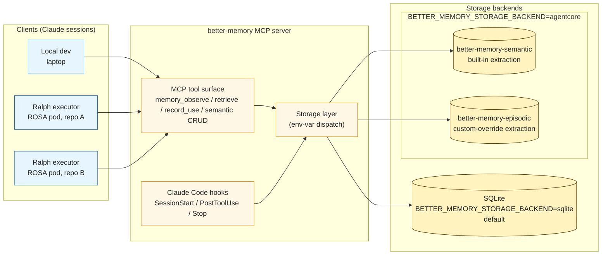

# AgentCore Storage Backend — Design

**Status:** Draft (design phase)
**Date:** 2026-05-24
**Author:** gethin (with Claude)
**Drivers:** [2026-05-23-ralph-umbrella-design.md](../../../../ralph/docs/superpowers/specs/2026-05-23-ralph-umbrella-design.md), [2026-05-23-ralph-v1-per-repo-loop-design.md](../../../../ralph/docs/superpowers/specs/2026-05-23-ralph-v1-per-repo-loop-design.md)

## Goal

Add an opt-in storage backend that delegates to AWS Bedrock AgentCore Memory, so a fleet of Ralph executors (on ROSA pods) and human developers (on laptops) can share memory across machines/agents through a managed service. The existing MCP tool surface and the three Claude Code hooks stay unchanged — Ralph and any other MCP consumer integrate the same way against either backend.

A single configuration switch:

```
BETTER_MEMORY_STORAGE_BACKEND=sqlite   # default — current behaviour
BETTER_MEMORY_STORAGE_BACKEND=agentcore  # delegate storage to AgentCore Memory
```

## Non-Goals

- **Replacing SQLite for existing users.** Opt-in only; default unchanged.
- **Bulk migration of existing SQLite data into AgentCore.** Clean-start in agentcore mode. A future spec can cover migration if there's demand.
- **Knowledge base port.** The local markdown corpus + BM25 index stays SQLite-backed regardless of `BETTER_MEMORY_STORAGE_BACKEND`. It's not Claude-derived; it doesn't need server-side extraction.
- **Embeddings backend in agentcore mode.** AgentCore's `retrieve-memory-records` is the search path; the existing Ollama / TF-IDF backends are no-ops in agentcore mode.
- **Multi-region / DR.** Single AgentCore region per deployment. Cross-region replication is out of scope.
- **A web UI for AgentCore-specific admin tasks.** Existing better-memory management UI works read-only against either backend; agentcore-specific admin lives in CLI commands.

## Constraints

- **Backend dispatch is one env var.** No mixed-mode or per-tool override.
- **MCP surface unchanged.** All existing tools and hooks present the same shape; behavioural differences are documented per-tool.
- **Project scoping unchanged.** `git rev-parse --git-common-dir` is still the source of truth for project identity.
- **Synthesis is server-side in agentcore mode.** Claude-driven `memory_synthesize_next_*` is unavailable when storage is AgentCore.
- **Region:** default `eu-west-2`. Configurable via `AWS_REGION` / `BETTER_MEMORY_AGENTCORE_REGION`.
- **Auth:** standard AWS credential chain — environment, profile, IRSA on ROSA. The MCP server doesn't manage credentials.
- **Single user is no longer a safe assumption** in agentcore mode. The fleet writes concurrently against shared resources.

## Architecture



### Storage layer abstraction

Services depend on a `StorageBackend` protocol (Python `typing.Protocol`). Two concrete implementations:

- `better_memory.storage.sqlite.SqliteBackend` — wraps the existing services / SQL. Behaviour-preserving.
- `better_memory.storage.agentcore.AgentCoreBackend` — `boto3` client over `bedrock-agentcore` (data plane) and `bedrock-agentcore-control` (control plane).

The protocol is the contract. New methods on the protocol must be implementable by both backends or marked `NotImplementedError` with a clear reason (e.g., synthesize_next is sqlite-only).

### Two AgentCore memory resources

`agentcore` mode requires two memory resources, both per-deployment (not per-project):

| Memory name | Strategies | Purpose |
|---|---|---|
| `better-memory-semantic` | built-in `semanticMemoryStrategy` + `userPreferenceMemoryStrategy` | Long-term semantic memories ("preferences"). Stock AgentCore extraction; cheapest path. |
| `better-memory-episodic` | `customMemoryStrategy` with `episodicOverride` | Episodic events → reflection records via our prompt running on Bedrock. Polarity / outcome metadata declared in `memoryRecordSchema`. |

Why two memories and not one with both strategies attached:

- **Independent cost profiles.** Built-in has AgentCore-managed pricing; custom-override runs Bedrock invocations in your account. Splitting makes attribution unambiguous.
- **Independent retention.** `eventExpiryDuration` is per-memory. Episodic events probably want shorter expiry (90d) than semantic events (1y).
- **Independent evolution.** The custom strategy prompt iterates separately from the stock semantic extraction.

A single memory resource with mixed strategies is supported by AgentCore and remains an option if operational cost dominates — flagged as a deferred decision.

### actorId encodes project

Across both memories:

- `actorId` = the project name resolved from `git rev-parse --git-common-dir` (e.g. `nuke`, `better-memory`)
- `actorId = general` is a reserved value for the cross-project bucket
- Strategy `namespaceTemplates` use `{actorId}` for project-scoped extraction landing zones
- `sessionId` = the Claude session identifier (CLAUDE_SESSION_ID env var if present, else a generated UUID)

`actorId` is opaque to AWS; AgentCore does not validate it against IAM identities. It exists purely for namespace substitution and as an IAM context key (`bedrock-agentcore:actorId`) if we add per-project IAM scoping later.

### Namespace shape (flat)

```
projects/{actorId}/reflections/         ← active reflections, this project
projects/{actorId}/semantic/            ← project-scoped semantic memories
projects/{actorId}/retired/             ← retire = move record here
general/reflections/                    ← cross-project (post-promotion)
general/semantic/
general/retired/
```

Polarity (do / dont / neutral) is **not** in the namespace — it's a record metadata field. Namespaces stay flat because a strategy can only declare one namespace template (`min: 1, max: 1`) and the placeholder set doesn't include `{polarity}`. Metadata-filtered retrieval is the path.

### Memory record metadata schema

Declared in `memoryRecordSchema.metadataSchema` on the episodic memory's custom strategy:

| Key | Type | Notes |
|---|---|---|
| `polarity` | `stringValue` with allowed values `do` / `dont` / `neutral` | What category of lesson this is |
| `useful_count` | `numberValue` | ++ on record_use success |
| `missed_count` | `numberValue` | ++ on record_use failure |
| `ignored_count` | `numberValue` | from session exposure rating loop |
| `times_misled` | `numberValue` | from session exposure rating loop (mirrors SQLite column) |
| `last_credited_at` | `dateTimeValue` | recency for decay calc on the client |
| `status` | `stringValue` with allowed values `active` / `retired` / `promoted` | lifecycle state |

`indexedKeys` on the memory resource includes `polarity`, `status`, and `last_credited_at` so metadata-filtered retrieval works without full scans.

## Decisions (with rationale)

| Decision | Choice | Why |
|---|---|---|
| Backend selector | Single env var, default sqlite | Matches the TF-IDF embeddings backend precedent; minimises surprise |
| Synthesis ownership | AgentCore-driven, with our prompt via custom override | Trust the managed pipeline; preserves our reflection schema and polarity discipline |
| Polarity placement | Metadata, not namespace | Strategy is bound to ONE namespace template; placeholder set excludes polarity |
| Topology | Two memory resources (semantic + episodic) | Independent cost / retention / evolution; reversible if cost reasons emerge |
| actorId semantics | Project name | The most natural map of a per-repo concept onto AgentCore's actor abstraction |
| Namespace tree | Flat, project-scoped via actorId | Promote / retire are namespace updates; retrieval is path-prefix |
| Knowledge base | Stays SQLite-only | Not Claude-derived; no synthesis benefit from porting |
| Embeddings | No-op in agentcore mode | AgentCore retrieval replaces hybrid_search; tfidf_search is unreachable in this mode |

## Components

### `better_memory/config.py` — modify

Add new fields to `Config`:

```python
storage_backend: Literal["sqlite", "agentcore"]      # default "sqlite"
agentcore_region: str                                # default "eu-west-2"
agentcore_semantic_memory_id: str | None             # populated by `agentcore init`
agentcore_episodic_memory_id: str | None             # populated by `agentcore init`
```

Read from env: `BETTER_MEMORY_STORAGE_BACKEND`, `BETTER_MEMORY_AGENTCORE_REGION`, `BETTER_MEMORY_AGENTCORE_SEMANTIC_MEMORY_ID`, `BETTER_MEMORY_AGENTCORE_EPISODIC_MEMORY_ID`.

When `storage_backend = agentcore` and the memory IDs are unset, `get_config()` raises with a clear "run `better-memory agentcore init` first" message.

### `better_memory/storage/protocol.py` — new

The `StorageBackend` protocol. Methods cover the storage operations every service relies on today — observe, retrieve, record_use, semantic CRUD, episode lifecycle, reflection lifecycle (apply / retire / promote / archive), and the synthesis tools for backends that support them. The sqlite-only methods are declared on the protocol but with a clear "may raise NotImplementedError" contract so the MCP server can branch on capability at registration time.

### `better_memory/storage/sqlite.py` — new (refactor)

Wraps the existing services. The refactor is mechanical — extract the service call surface behind the protocol methods. Existing tests should continue to pass.

### `better_memory/storage/agentcore.py` — new

The boto3-based implementation. Responsibilities:

- Construct two boto3 clients (data plane `bedrock-agentcore`, control plane `bedrock-agentcore-control`)
- Translate MCP-level concepts to AgentCore primitives — observation → event, reflection → record, project → actorId, claude session → sessionId
- Implement read/write/credit flows by composing AgentCore API calls
- Translate AgentCore-specific errors back into better-memory's error types

The module is the only one that imports boto3. Everything else depends on the protocol.

### `better_memory/storage/session.py` — new

Helpers for resolving identity:

- `resolve_actor_id(project: str | None) -> str` — returns project name or `"general"`
- `resolve_session_id() -> str` — uses `CLAUDE_SESSION_ID` if present, otherwise generates
- `resolve_namespace(actor_id: str, kind: Literal["reflections", "semantic", "retired"]) -> str`

### `better_memory/mcp/server.py` — modify

At startup, the server builds a `StorageBackend` based on `config.storage_backend` and injects it into the service constructors. Tool registration branches on backend capability — `memory_synthesize_next_*` is registered only when the backend reports synthesis support (i.e. sqlite).

### `better_memory/cli/agentcore.py` — new

CLI commands under a new `better-memory agentcore` subgroup:

| Command | What it does |
|---|---|
| `init` | Creates both memory resources with the configured strategies; prints the IDs; writes them to a state file under `$BETTER_MEMORY_HOME/agentcore.json`. Idempotent (refuses to re-create if IDs are already known). |
| `status` | Shows memory IDs, recent extraction job state, namespace populations, last events ingested. |
| `prompt-test` | Dry-runs the custom-strategy prompt against a sample event batch and prints what records would be extracted. For prompt iteration. |
| `extract --now` | Calls `start-memory-extraction-job` to force an immediate extraction pass. For debugging cadence questions. |
| `migrate-from-sqlite` | Stubbed for now; raises NotImplementedError with a pointer to the deferred migration spec. |

### Reflection custom-strategy prompt — new

Translate the existing better-memory synthesis prompt into a `customMemoryStrategy` with `episodicOverride`. The override exposes `extraction` (prompt + Bedrock model) and `consolidation` (merge-into-existing-records prompt + model). Both must produce records whose metadata matches our declared schema.

Bedrock model choice and prompt content are TBD — see Open Questions. Step 0 of the implementation plan is a spike that runs the candidate prompt against representative events on each model and compares output quality + cost.

### Synthesis MCP tools — modify

`memory_synthesize_next_get_context` and `memory_synthesize_next_apply`:

- In sqlite mode: behaviour unchanged
- In agentcore mode: not registered; calls return `unknown tool` from MCP routing (rather than registering a no-op handler that raises — saves a round trip)

The session bootstrap hook continues to report `pending_synthesis.pending` as a count for sqlite mode; in agentcore mode the field is omitted or set to `null` so consumers can branch cleanly.

## Data flow

### Write — `memory.observe` (agentcore mode)

```
1. Resolve project (git) → actorId
2. Resolve sessionId (env var or generated)
3. Build event payload from the observation content, outcome, theme, component, trigger_type
4. bedrock-agentcore.CreateEvent(
       memoryId=episodic_memory_id,
       actorId=actorId,
       sessionId=sessionId,
       eventTimestamp=now,
       payload=[<role:user message with the observation payload as text>],
       metadata={...}
   )
5. AgentCore stores the event in short-term memory.
   The custom-override strategy runs server-side on its own cadence; extracted
   records appear under projects/{actorId}/reflections/ with our metadata schema.
6. Return event_id to caller.
```

### Read — `memory.retrieve` (agentcore mode)

```
For each polarity in (do, dont, neutral):
  1. bedrock-agentcore.RetrieveMemoryRecords(
         memoryId=episodic_memory_id,
         namespace=f"projects/{actorId}/reflections/",
         searchCriteria={
             searchQuery: query_text,
             topK: candidate_k,
             metadataFilter: {polarity: {equals: $polarity}}
         }
     )
  2. Apply reinforcement multiplier + recency decay (client-side) using
     metadata.useful_count, missed_count, last_credited_at
  3. Sort by final score, truncate to limit
Return SearchResult[] grouped by polarity (same shape as today).
```

Knowledge-base BM25 retrieval continues to query the local SQLite knowledge index regardless of storage backend.

### Credit — `memory.record_use`

```
1. get-memory-record(memoryRecordId)
2. new_metadata = current_metadata + {
       useful_count++ (if outcome=success) OR missed_count++ (if outcome=failure),
       last_credited_at: now()
   }
3. batch-update-memory-records(records=[{memoryRecordId, timestamp, content, metadata}])
```

### Promote / retire

```
Promote project → general:
  batch-update-memory-records(records=[{
      memoryRecordId,
      namespaces: ["general/reflections/"],
      metadata: {...current, status: "promoted"}
  }])

Retire:
  batch-update-memory-records(records=[{
      memoryRecordId,
      namespaces: [f"projects/{actorId}/retired/"],
      metadata: {...current, status: "retired"}
  }])
```

### Semantic memory CRUD

`memory_semantic_observe` writes either a tagged event (so the user-preference strategy extracts it) OR directly creates a record via `batch-create-memory-records` (skipping extraction). Working assumption: direct creation, because user-curated semantic memories shouldn't get re-extracted or summarised by AgentCore. Update / delete map to `batch-update-memory-records` and `batch-delete-memory-records`.

### Session bootstrap (SessionStart hook)

The hook envelope and structure are unchanged. The agentcore implementation issues parallel `RetrieveMemoryRecords` calls (one per polarity bucket + semantic) and assembles the same `additionalContext` payload as today.

## Error handling

| Failure mode | Behaviour |
|---|---|
| AWS credentials missing at startup (agentcore mode) | `get_config()` raises with a setup pointer; MCP server refuses to start |
| Memory IDs missing | Raises with "run `better-memory agentcore init` first" |
| Per-call AWS throttling / 5xx | boto3 default retry policy + adapter with capped backoff; surfaced as `RetryableStorageError` if exhausted |
| Custom strategy extraction failure | Event is durably stored; AgentCore retries extraction; no user-visible failure |
| Bedrock model unavailable (custom strategy) | Surfaced via `list-memory-extraction-jobs` status; `better-memory agentcore status` shows the failure for diagnosis |
| Calling `memory_synthesize_next_*` in agentcore mode | MCP returns `unknown tool` (not registered) |
| Empty namespace on retrieve | Returns empty list; no exception |
| `record_use` against an extracted record that strategy later overwrites | Counter increment is best-effort; we don't lock records during extraction. If a strategy consolidation runs in between get and update, the update may target a now-superseded record id. Working assumption: rare; surfacing as `RecordSupersededError` with retry guidance. Tested via integration test. |
| Cross-backend coexistence | Out of scope; agentcore mode and sqlite mode are mutually exclusive per server process |

## Testing strategy

### Unit
- `tests/storage/test_protocol.py` — both implementations satisfy the protocol; runtime check via `typing.runtime_checkable`.
- `tests/storage/test_agentcore_unit.py` — mocked boto3; covers payload construction, namespace resolution, metadata schema serialisation, retrieve-filter construction.
- `tests/storage/test_agentcore_metadata.py` — polarity validation paths (allowed-values), counter increment semantics, status transitions, promote / retire namespace mutations.

### Integration (opt-in, AWS-credentials-required)
- `tests/integration/test_agentcore_roundtrip.py` — observe → wait for extraction → retrieve → credit → promote → retire round-trip against a real AgentCore Memory provisioned via fixture.
- Gated by `BETTER_MEMORY_TEST_AGENTCORE=1`; skipped by default; CI runs in a follow-up workflow with org-scoped credentials.
- Cleanup: fixture creates and deletes a throwaway memory resource per test session.

### CLI tests
- `tests/cli/test_agentcore_init.py` — idempotency, IAM-error messaging, state-file writes.
- `tests/cli/test_agentcore_status.py` — output shape with both populated and empty memories.

### Smoke
- A CLI command `better-memory agentcore smoke` that runs a minimal observe + retrieve loop against a configured memory. Useful for ops verification post-deploy.

### No regression on sqlite path
- Existing test suite runs unchanged under both backends. Backend-agnostic tests parameterise on `storage_backend` if and when it makes sense.

## Documentation

- `README.md` — storage backend env var in prerequisites table; AWS prerequisites + IAM policy snippet.
- `website/architecture.md` — new section on storage backends; AgentCore data model mapping diagram (reuse the mermaid above).
- `website/configuration.md` — env var rows + agentcore-specific fields.
- New `website/agentcore-setup.md` — step-by-step setup (IAM user, init command, memory IDs, troubleshooting).
- New `docs/troubleshooting/agentcore.md` — common errors and fixes (credential issues, region mismatches, extraction job failures, etc.).
- `website/mcp-tools.md` — per-tool agentcore-mode notes (which tools are unavailable, what the behavioural delta is).

## Assumptions

### Real concerns (with mitigation)

1. **Custom strategy prompt quality + Bedrock model cost.** We don't yet know whether the existing better-memory synthesis prompt translates cleanly to a Bedrock model under AgentCore's `episodicOverride` execution path, or what model is the right cost / quality trade.
   - **Mitigation A (recommended):** Step 0 of the implementation plan is a spike — run the candidate prompt against representative event batches on Haiku 4.5 and Sonnet 4.6; compare output quality and per-batch cost. Decide model before any consumer code lands.
   - **Mitigation B:** Start with built-in `semanticMemoryStrategy` only; defer the custom-override episodic path to a Phase 2 spec. (Loses the polarity discipline in Phase 1.)

2. **Extraction cadence / latency.** Docs describe extraction as "automatic" but don't quote a target latency. If extraction runs hourly, Ralph's iteration cadence has to tolerate that; if it runs near-realtime, no concern.
   - **Mitigation A:** Instrument event-to-record latency in the integration test; document the observed range in the README troubleshooting section.
   - **Mitigation B:** If latency is too high for Ralph's cadence, the storage layer can call `start-memory-extraction-job` opportunistically (e.g. on each `memory.retrieve` if the most-recent event is older than 5 minutes since extraction).

3. **Update semantics for `metadata` map.** CLI help for `batch-update-memory-records` doesn't clarify whether passing partial `metadata` replaces the entire map or merges keys. If it replaces, every credit call must include the full metadata snapshot.
   - **Mitigation:** Verify with a small live test before designing the credit flow. Documented as a check in Step 1 of the implementation plan.

### Verified safe

- AgentCore Memory available in `eu-west-2` — verified via `list-memories` returning `[]`.
- Records can move between namespaces via `batch-update-memory-records` — verified via CLI help.
- Custom metadata (typed key-value, up to 20 keys) supported on records — verified via CLI help.
- Five strategy types available, including `customMemoryStrategy` with `episodicOverride` exposing extraction + consolidation prompts — verified via CLI help.
- IAM scoping by namespace and actor supported via context keys — verified in docs.
- `start-memory-extraction-job` exists for manual triggering — verified via data plane help.

### Minor / accepted

- 20 metadata keys per record cap. Our schema needs 7; comfortable headroom.
- String metadata charset restricted to `[a-zA-Z0-9\s._:/=+@-]`. Reflection prose lives in `content.text` (16K chars, unrestricted); only structured metadata is constrained.
- A strategy is bound to exactly one namespace template. Worked around via polarity-as-metadata.
- Custom strategy = Bedrock model invocations in your account. Expected and clearly billed.

## Open questions (deferred to implementation)

1. Bedrock model selection for the custom strategy (Haiku 4.5 vs Sonnet 4.6). Resolved by the Step 0 spike.
2. Whether reinforcement decay is computed client-side over retrieved metadata, or pushed to a derived metadata field maintained on each credit call. Working assumption: client-side, mirroring sqlite-mode logic. Revisit if retrieval-heavy workloads show CPU pressure.
3. Per-project IAM scoping. Working assumption: a single IAM role with broad `bedrock-agentcore:*` permissions on the two memory resources. Per-project scoping via `actorId` context-key conditions is a future refinement.
4. Better-memory management UI affordances for AgentCore-mode admin (trigger extraction now, view recent extraction jobs, see record counts per namespace). Working assumption: out of scope for the first implementation; CLI is sufficient. A follow-up spec adds the UI panels.
5. Migration of existing SQLite data into AgentCore. Out of scope; deferred to a separate spec.

## Rollout

- Default unchanged — no behaviour change for existing users.
- New env var documented as opt-in alongside the AWS prerequisites.
- New CLI commands install with the package; no separate distribution.
- Plan task ordering (rough — full plan in the writing-plans pass):
  1. Step 0 — Bedrock model + prompt spike (gates the rest of the work)
  2. Storage protocol + sqlite wrapper (no behaviour change; tests stay green)
  3. AgentCore client adapter (boto3 wiring; mocked unit tests)
  4. MCP server wiring (conditional tool registration; capability reporting)
  5. CLI `agentcore init` / `status` / `prompt-test` / `extract --now`
  6. Integration test against a real AWS account
  7. Docs (README, configuration, agentcore-setup, troubleshooting, mcp-tools)
  8. Smoke command for ops verification
