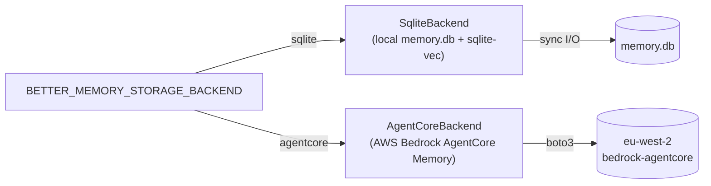

# Architecture

better-memory is a four-layer epistemic hierarchy backed by a single SQLite database, with embeddings supplied by one of two pluggable backends (Ollama, or an in-SQL trigram-FTS5 fusion).

## The four layers

| Layer | Purpose | Lifecycle |
|---|---|---|
| **Observation** | A factual snapshot the AI writes at a decision point. Tagged with an outcome, component, theme, and trigger type. | Created by `memory.observe`. Eventually consumed into a reflection or archived. |
| **Reflection** | A distilled lesson synthesised from one or more observations. Has a polarity (`do` / `dont` / `neutral`), a confidence, and a use-cases description. | Created by the synthesis pipeline (LLM-driven). Reinforced by `memory.record_use`. |
| **Episode** | A bounded session of work — opened on session start, closed when the goal is met or abandoned. Observations and reflections are scoped to an episode. | Background episodes open implicitly on first observe; foreground episodes are explicit (`memory.start_episode`). |
| **Knowledge** | Human-authored markdown — standards, language conventions, per-project docs. Indexed via SQLite FTS5. Read-only for the AI. | Edited by humans. Reindexed on MCP server startup (mtime-only). |

## Storage

- **`memory.db`** — Observations, episodes, reflections, audit_log, retention runs, hook errors. Migrations at `better_memory/db/migrations/NNNN_*.sql` apply lexically at boot and are idempotent.
- **`knowledge.db`** — FTS5 index over the contents of `~/.better-memory/knowledge-base/`. Rebuilt on mtime change.
- **`spool/`** — JSON payloads written by Claude Code hooks, drained lazily by the next `memory.retrieve` call. Bad files quarantine to `spool/.quarantine/` rather than blocking the drain.

## Storage backends

better-memory abstracts persistence behind the `StorageBackend` protocol (`better_memory/storage/protocol.py`). At server startup, the factory (`better_memory/storage/factory.py`) selects an implementation based on `BETTER_MEMORY_STORAGE_BACKEND`:

| Aspect | `sqlite` | `agentcore` |
|---|---|---|
| Data location | Local file (`memory.db`) | AWS-managed (`eu-west-2`) |
| Extraction | Local Claude (synthesize_next_* tools) | Cloud (built-in strategies) |
| Latency | Single-digit ms | 100-500 ms per AWS call |
| Cost | Free | Per-API-call + per-record pricing |
| Multi-machine sync | No | Yes (shared memory resources) |
| Closure events | N/A | `CreateEvent(role=OTHER)` from Stop hook |
| Episode tracking | Local `episodes` table | Internal to AgentCore (sessionId) |
| Exposure log (`record_exposures`) | Writes `session_memory_exposure` rows (sources `bootstrap` / `retrieve` / `contextual`) | No-op — no exposure log; rating flows through `memory.credit` only |

See [Configuration](configuration.md) for env vars and [AgentCore setup](agentcore-setup.md) for the agentcore path.

## Retrieval

`memory.retrieve` returns three buckets — `do`, `dont`, `neutral` — built from a hybrid search:

1. **FTS5 lexical** match against observation content + reflection use-cases.
2. **sqlite-vec** dense vector match against observation embeddings (768-dim from `nomic-embed-text`).
3. **Reciprocal Rank Fusion (RRF)** combines the two ranked lists.
4. Results are filtered by the bucket's polarity and weighted by `reinforcement_score` (each `memory.record_use` shifts a memory's score up on success or down on failure).

## Injection strategies

better-memory gets memory in front of Claude two ways: a slimmed-down dump at session start, and targeted mid-session injection keyed to what Claude is actually doing.

**Bootstrap (SessionStart).** `SessionBootstrapService.bootstrap` (`better_memory/services/session_bootstrap.py`) renders project-scoped semantic memories and reflections in full only up to `BETTER_MEMORY_BOOTSTRAP_TOP_N` per set (default 5; general-scope semantic memories are always shown in full, uncapped). The remainder collapses into a one-line `### Index (not expanded - retrieve on demand)` section plus a footer affordance pointing at `memory.retrieve` / `memory.retrieve_observations`. Semantic memory ids in the rendered output are the full ids (not truncated), each stamped with an age suffix (`(Nd old)`). Setting `BETTER_MEMORY_BOOTSTRAP_TOP_N=0` disables slimming and renders everything in full (legacy behavior).

**Contextual injection (UserPromptSubmit / PreToolUse).** The `contextual_inject` hook (`better_memory/hooks/contextual_inject.py`) scores the same curated memory set against the current prompt (UserPromptSubmit) or tool name + input (PreToolUse, matcher `Skill|Task|Write`) via `retrieve_relevant` (`better_memory/services/relevant.py`):

- Keywords are extracted from the query (lowercased, tokenised, stopwords and <3-char tokens dropped).
- Each candidate's score is `(distinct keyword hits + title hits) × activation`, where activation grows with `useful_count` and confidence and is halved when a memory has misled more often than it has helped.
- Candidates below `BETTER_MEMORY_CONTEXT_MIN_HITS` distinct hits are dropped; survivors are ranked by score and capped to `BETTER_MEMORY_CONTEXT_MAX_ITEMS`.
- A per-session `SeenStore` (`better_memory/services/context_seen.py`, JSON file at `<home>/state/context_seen_<session_id>.json`) deduplicates memories already injected this session. `BETTER_MEMORY_CONTEXT_REINJECT_TURNS=0` (default) means a memory is injected at most once per session; a positive value allows re-injection after that many turns have passed since it was last shown.
- Survivors render as a `<project-memory source="better-memory">` XML block in `additionalContext`, one entry per item with its kind, id, confidence, `useful_count`, and age, a `dont`-polarity item prefixed `Known pitfall -- do this instead:`, and a footer inviting `memory_credit(kind, id, 'cited'|'shaped'|'misled')` when an entry actually helped or misled.
- Survivors are logged to `session_memory_exposure` with `source='contextual'` (best-effort; a write failure never blocks injection) and counted in `rating_diagnostics` (`contextual_fired_userprompt`, `contextual_fired_pretool`, `contextual_injected`, `contextual_suppressed_floor`, `contextual_suppressed_dedup`).

Gated by `BETTER_MEMORY_CONTEXT_INJECT_MODE` (`userprompt` / `pretool` / `both` / `off`). The hook never raises and always exits 0 — failures are swallowed and logged to `hook_errors`, with no `additionalContext` emitted on that turn.

## Embeddings backends

better-memory supports two backends behind the
`BETTER_MEMORY_EMBEDDINGS_BACKEND` env var.

**`ollama` (default).** Observation text is embedded by a local Ollama
server (model: `nomic-embed-text`, 768-dim). Vectors land in the
`observation_embeddings` virtual table; retrieval fuses FTS5 BM25 with
sqlite-vec kNN via Reciprocal Rank Fusion. Same quality as previous
versions; requires Ollama running on `OLLAMA_HOST`.

**`sqlite`.** A second FTS5 virtual table (`observation_trigram_fts`,
tokenizer=`trigram`) is populated by triggers alongside the existing
`observation_fts` (word tokenizer). Retrieval fuses both via RRF — no
external service, no model downloads, no in-memory state. Lower
recall on long paraphrased queries than Ollama embeddings, but
substring and morphology bridging via trigrams works well for
keyword-dense observations.

Both FTS5 tables are populated by triggers regardless of which backend
is active, so backend switches require no data migration at runtime —
the trigram table is always ready to serve `sqlite` queries, and the
word-tokenized table always feeds the lexical half of the `ollama`
path. Only the vec0 (sqlite-vec) half degrades for cross-backend rows
that were written while `sqlite` was active (no embedding was computed
for them); a future `memory.reindex` MCP tool can backfill if that
half-state becomes a problem.

## Reinforcement

Each observation and reflection has a `reinforcement_score` that decays slowly over time and is updated by validated use:

- `memory.record_use(id, outcome="success")` → score goes up.
- `memory.record_use(id, outcome="failure")` → score goes down.

This is the lever that keeps recall faithful: a well-validated `dont` will keep surfacing for the same query class; a once-true-now-misleading observation gets demoted by repeated failure stamps.

## Self-rating loop

`memory.record_use` is the in-band reinforcement primitive. Layered on
top of it is a closed-loop self-rating cycle that runs per session and
captures whether memories actually shaped Claude's work:

1. **Exposure** — every reflection or semantic memory surfaced by
   `memory.retrieve` / `memory.semantic_retrieve` / the SessionStart
   bootstrap / the `contextual_inject` hook is logged to
   `session_memory_exposure` with the active `session_id` and a
   `source` of `retrieve`, `bootstrap`, or `contextual` respectively
   (sqlite mode only — see [Injection strategies](#injection-strategies)
   for what `contextual_inject` scores and dedups before it exposes
   anything).
2. **Mid-session credit** — `memory.credit(kind, id, class)` lets
   Claude credit a memory as `cited`, `shaped`, `misled`, or `overlooked` the moment
   it's used. Survives context compaction.
3. **End-of-session sweep** — the
   [`session_close`](https://github.com/emp3thy/better-memory/blob/main/better_memory/hooks/session_close.py)
   hook checks for unrated exposures. If any exist, it emits a `Stop`
   block directive triggering the `rate-session-memories` skill. The
   directive lists each pending exposure with its source tag
   (`[bootstrap]` / `[retrieve]` / `[contextual]`) and a leading
   `sources: bootstrap N, contextual N, retrieve N` counts line, then
   the skill calls `memory.list_session_exposures` and submits
   `memory.apply_session_ratings` with one class per id
   (`cited` / `shaped` / `ignored` / `misled` / `overlooked`). Only on the second Stop
   fire — after ratings land — does the hook drop the `session_end`
   marker into the spool.
4. **Aggregation** — `useful_count` / `times_overlooked` / `times_misled`
   columns on reflections and semantic memories accumulate. Retrieval
   queries `ORDER BY (useful_count + 3 × times_overlooked) DESC` so
   memories that proved themselves — or that the user had to recover —
   surface first.

The management UI's Reflections and Semantic tabs surface useful /
overlooked / misled badges per row, and `/diagnostics` exposes recent
ratings, a total overlooked count, and a `session_id_missing` counter
for instrumentation gaps.

## Synthesis pipeline

Synthesis is **IDE-driven** — Claude itself is the LLM. better-memory ships no chat client; it exposes two MCP tools and a skill that orchestrates them.

The drain loop, per pending episode:

1. **`memory.synthesize_next_get_context`** — server returns one closed-but-not-yet-synthesized episode's full context: episode metadata, all observations on it, and existing reflections filtered by tech.
2. **Claude decides** — the [`better-memory-synthesize`](https://github.com/emp3thy/better-memory/blob/main/.claude/skills/better-memory-synthesize/SKILL.md) skill walks Claude through producing a JSON decision: lists of `new`, `augment`, `merge`, and `ignore` actions per observation.
3. **`memory.synthesize_next_apply`** — server validates the decision JSON and applies it atomically: creates new reflections, augments existing ones, merges near-duplicates (combining their evidence and rating counters onto the survivor), marks observations consumed (or ignored), and stamps the episode synthesized. `audit_log` records each action.

The trigger: when `memory.start_episode` returns `pending_synthesis.pending > 0`, the skill fires and drains the queue one episode at a time. Same skill is invoked manually when the user asks to consolidate or distill pending episodes.

The lifecycle implications for observations are detailed in [Observation lifecycle](observation-lifecycle.md).

## Audit log

Every state change writes a row to `audit_log`. It's append-only — no row is ever updated or deleted — so the full history of what the AI saw, what it wrote, and what it consumed is reconstructable at any time.

## Full design spec

See [`docs/superpowers/specs/2026-04-06-better-memory-design.md`](https://github.com/emp3thy/better-memory/blob/main/docs/superpowers/specs/2026-04-06-better-memory-design.md) on GitHub for the original four-phase design with all the trade-offs, deferred decisions, and migration strategy.
