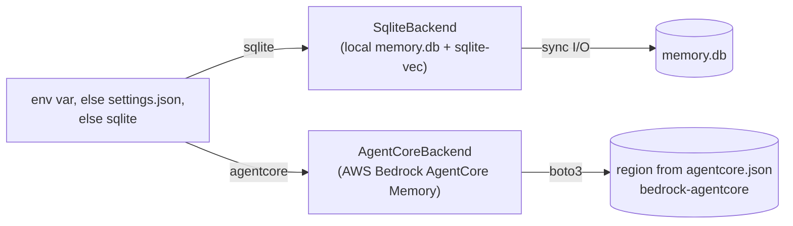

# Architecture

better-memory is a four-layer epistemic hierarchy backed by a pluggable storage backend — a single SQLite database by default — with embeddings supplied by one of two pluggable backends (Ollama, or an in-SQL trigram-FTS5 fusion).

## The four layers

| Layer | Purpose | Lifecycle |
|---|---|---|
| **Observation** | A factual snapshot the AI writes at a decision point. Tagged with an outcome, component, theme, and trigger type. | Created by `memory.observe`. Eventually consumed into a reflection or archived. |
| **Reflection** | A distilled lesson synthesised from one or more observations. Has a polarity (`do` / `dont` / `neutral`), a confidence, and a use-cases description. | Created by the synthesis pipeline (LLM-driven). Reinforced by `memory.record_use`. |
| **Episode** | A bounded session of work — opened on session start, closed when the goal is met or abandoned. Observations and reflections are scoped to an episode. | Background episodes open implicitly on first observe; foreground episodes are explicit (`memory.start_episode`). |
| **Knowledge** | Human-authored markdown — standards, language conventions, per-project docs. Indexed via SQLite FTS5. Read-only for the AI. | Edited by humans. Reindexed on MCP server startup (mtime-only). |

## Storage

- **`memory.db`** — Observations, episodes, reflections, audit_log, retention runs, hook errors. Migrations at `better_memory/db/migrations/NNNN_*.sql` apply lexically at boot and are idempotent.
- **`knowledge.db`** — FTS5 index over the contents of `~/.better-memory/knowledge-base/`. Rebuilt on mtime change.
- **`spool/`** — JSON payloads written by Claude Code hooks, drained lazily by the next `memory.retrieve` call. Bad files quarantine to `spool/.quarantine/` rather than blocking the drain.

## Storage backends

better-memory abstracts persistence behind the `StorageBackend` protocol (`better_memory/storage/protocol.py`). At server startup, the factory (`better_memory/storage/factory.py`) selects an implementation based on the resolved backend — `BETTER_MEMORY_STORAGE_BACKEND` env var if set, else the `storage_backend` key in `$BETTER_MEMORY_HOME/settings.json`, else `sqlite`:

| Aspect | `sqlite` | `agentcore` |
|---|---|---|
| Data location | Local file (`memory.db`) | AWS-managed (region from `agentcore.json`) |
| Local files | `memory.db` + `knowledge.db` (all memory content) | `memory.db` + `knowledge.db` still created — hook-error log + knowledge index only (no memory content) |
| Extraction | Local Claude (synthesize_next_* tools) | Cloud (built-in strategies) |
| Latency | Single-digit ms | 100-500 ms per AWS call |
| Cost | Free | Per-API-call + per-record pricing |
| Multi-machine sync | No | Yes (shared memory resources) |
| Closure events | N/A | `CreateEvent(role=OTHER)` from Stop hook |
| Episode tracking | Local `episodes` table | Internal to AgentCore (sessionId) |
| Exposure log (`record_exposures`) | Writes `session_memory_exposure` rows (sources `bootstrap` / `retrieve` / `contextual`) | No-op — no exposure log, so the end-of-session rating sweep has nothing to trigger on; rating flows through `memory.credit` (and direct `memory.apply_session_ratings` calls) |
| Bulk import | N/A (clean start) | `better-memory agentcore migrate` copies existing sqlite reflections + semantic memories into AWS (idempotent, ledgered) |

Migrating with `better-memory agentcore migrate` is distinct from activating: it only writes records to AWS and never flips `storage_backend`. A migrated reflection carries its rating counters, `status`, and `source_row_id` in the record's JSON **content body** — the built-in episodic strategy owns the metadata schema — whereas cloud-extracted records (and migrated semantic records) keep that state in record **metadata**. See [AgentCore setup > Migrate](agentcore-setup.md#migrate-existing-memory-optional).

See [Configuration](configuration.md) for env vars and [AgentCore setup](agentcore-setup.md) for the agentcore path.

## Retrieval

`memory.retrieve` returns three buckets — `do`, `dont`, `neutral` — built from a hybrid search:

1. **FTS5 lexical** match against observation content + reflection use-cases.
2. **sqlite-vec** dense vector match against observation embeddings (768-dim from `nomic-embed-text`).
3. **Reciprocal Rank Fusion (RRF)** combines the two ranked lists.
4. Results are filtered by the bucket's polarity and weighted by `reinforcement_score` (each `memory.record_use` shifts a memory's score up on success or down on failure).

## Injection strategies

better-memory gets memory in front of Claude two ways: a dump at session start, and targeted mid-session injection keyed to what Claude is actually doing.

**Bootstrap (SessionStart).** Governed by `BETTER_MEMORY_INJECT_MODE` (`legacy` | `deferred`; default `legacy`):

- **`legacy`** (default, byte-identical to pre-deferred-injection behavior). `SessionBootstrapService.bootstrap` (`better_memory/services/session_bootstrap.py`) renders project-scoped semantic memories and reflections in full only up to `BETTER_MEMORY_BOOTSTRAP_TOP_N` per set (default 5; general-scope semantic memories are always shown in full, uncapped). The remainder collapses into a one-line `### Index (not expanded - retrieve on demand)` section plus a footer affordance pointing at `memory.retrieve` / `memory.retrieve_observations`. Semantic memory ids in the rendered output are the full ids (not truncated), each stamped with an age suffix (`(Nd old)`). Setting `BETTER_MEMORY_BOOTSTRAP_TOP_N=0` disables slimming and renders everything in full.
- **`deferred`**. SessionStart renders only general-scope semantic memories in full, plus a single index line ("better-memory knows N reflections + M semantic memories for this project; relevant ones will surface as you work - or ask via memory_retrieve with a task query"). Project-scoped semantic memories and all reflections are not dumped at session start; they surface exclusively through the contextual channel below, or on demand via `memory.retrieve` / `memory.retrieve_observations`.

**CLAUDE.md drift sentinel (SessionStart only).** After bootstrap renders, `hooks/session_bootstrap.py` best-effort-scans the user's `~/.claude/CLAUDE.md` for parameter tokens documented next to a better-memory tool name and flags any the live MCP tool schema does not recognize (`better_memory/hooks/_claude_md_sentinel.py`; schema built from `mcp/tools.py`, so it tracks future tool changes automatically). The accepted-token set per tool is schema-derived, not just its property names: enum *values* (e.g. `memory_retrieve`'s `polarity` values `do` / `dont` / `neutral`) count as valid tokens too, since real CLAUDE.md prose legitimately backtick-quotes them next to the tool name -- this avoids false-positiving on documented return shapes. At most one warning line is appended to bootstrap's `additionalContext` per session; the check is silent when clean, and any exception is swallowed, so the sentinel can never block or degrade injection. It runs only on the SessionStart bootstrap path, not on the contextual channel. Alongside the sentinel, `better_memory/skills/CLAUDE.snippet.md` was rewritten to behavioural instructions only ("pass a task-describing query when you begin a task", "credit with evidence") and never enumerates parameter names or types, so the canonical snippet itself can no longer drift into the failure mode the sentinel exists to catch.

**Contextual injection (UserPromptSubmit / PreToolUse).** The `contextual_inject` hook (`better_memory/hooks/contextual_inject.py`) scores the curated memory set (semantic + reflections) against the current prompt (UserPromptSubmit, fires on every prompt) or tool name + input (PreToolUse, matcher now unscoped -- every tool call, not a fixed allowlist) via `retrieve_relevant` (`better_memory/services/relevant.py`), a three-leg evidence-gated scorer:

- A memory injects only when it clears an evidence gate: a BM25 match against `reflection_fts` (title / use_cases / hints), or a vector cosine similarity >= `BETTER_MEMORY_CONTEXT_VEC_FLOOR` (default `0.55`) against its embedding. No evidence, no injection -- a memory with neither leg present is silently dropped, however popular it is.
- The Wilson lower-bound prior on rated exposures (see [Self-rating loop](#self-rating-loop)) never qualifies a memory by itself; among qualifiers it only ranks, via reciprocal rank fusion together with whichever of the BM25/vector ranks are present. Popularity forcing irrelevant injections into context was the old failure mode the gate exists to close.
- A keyword-hit fallback (>= 2 distinct hits) applies only where the BM25/vector legs are structurally unavailable: for reflections, when there is no raw sqlite `conn` (agentcore mode); for semantic memories -- which have no FTS substrate at all -- whenever no query vector could be produced (no embedder configured, or the Ollama embed call is in cooldown). `BETTER_MEMORY_CONTEXT_MIN_HITS` is **deprecated**: `contextual_inject` no longer reads it, superseded by the evidence gate above.
- Because PreToolUse now matches every tool, a per-session latch (`SeenStore.pretool_fired` / `mark_pretool_fired`, `better_memory/services/context_seen.py`) runs the full retrieval path at most once per session for PreToolUse; every later PreToolUse event in the session short-circuits on the latch state before touching the DB or the embedder. UserPromptSubmit is unaffected by the latch and fires on every prompt.
- Survivors are capped to `BETTER_MEMORY_CONTEXT_MAX_ITEMS`, then filtered through a per-session `SeenStore` (`better_memory/services/context_seen.py`, JSON file at `<home>/state/context_seen_<session_id>.json`) that deduplicates memories already injected this session. `BETTER_MEMORY_CONTEXT_REINJECT_TURNS=0` (default) means a memory is injected at most once per session; a positive value allows re-injection after that many turns have passed since it was last shown. A "turn" here is one firing of the `contextual_inject` hook, not one user prompt-response cycle: each user prompt is a turn, and each PreToolUse latch-firing is a turn too (subsequent latched-out PreToolUse events do not bump the turn counter).
- Survivors render as a `<project-memory source="better-memory">` XML block in `additionalContext`, one entry per item with its kind, id, confidence, `useful_count`, and age, a `dont`-polarity item prefixed `Known pitfall -- do this instead:`, and a footer inviting `memory_credit(kind, id, 'cited'|'shaped'|'misled')` when an entry actually helped or misled.
- Survivors are logged to `session_memory_exposure` with `source='contextual'` (best-effort; a write failure never blocks injection) and counted in `rating_diagnostics` (`contextual_fired_userprompt`, `contextual_fired_pretool`, `contextual_injected`, `contextual_suppressed_floor`, `contextual_suppressed_dedup`). These counters are per-firing, not per-item: a firing that injects one or several memories still increments `contextual_injected` by exactly 1. `contextual_suppressed_floor` now means "no candidate cleared the evidence gate", not "below the old keyword-hits floor".

Gated by `BETTER_MEMORY_CONTEXT_INJECT_MODE` (`userprompt` / `pretool` / `both` / `off`). The hook never raises and always exits 0 — failures are swallowed and logged to `hook_errors`, with no `additionalContext` emitted on that turn.

## Embeddings backends

better-memory supports two backends behind the
`BETTER_MEMORY_EMBEDDINGS_BACKEND` env var.

**`ollama` (default).** Observation text is embedded by a local Ollama
server (model: `nomic-embed-text`, 768-dim). Vectors land in the
`observation_embeddings` virtual table; retrieval fuses FTS5 BM25 with
sqlite-vec kNN via Reciprocal Rank Fusion. Same quality as previous
versions; requires Ollama running on `OLLAMA_HOST`.

**`sqlite`.** A second FTS5 virtual table (`observation_trigram_fts`,
tokenizer=`trigram`) is populated by triggers alongside the existing
`observation_fts` (word tokenizer). Retrieval fuses both via RRF — no
external service, no model downloads, no in-memory state. Lower
recall on long paraphrased queries than Ollama embeddings, but
substring and morphology bridging via trigrams works well for
keyword-dense observations.

Both FTS5 tables are populated by triggers regardless of which backend
is active, so backend switches require no data migration at runtime —
the trigram table is always ready to serve `sqlite` queries, and the
word-tokenized table always feeds the lexical half of the `ollama`
path. Only the vec0 (sqlite-vec) half degrades for cross-backend rows
that were written while `sqlite` was active (no embedding was computed
for them); a future `memory.reindex` MCP tool can backfill if that
half-state becomes a problem.

### Reflection and semantic-memory embeddings

Reflections and semantic memories get their own vectors, written at
write time rather than lazily at query time: `ReflectionSynthesisService`
embeds a reflection when synthesis creates or augments it, `ReflectionService`
re-embeds on `update_text`, and the semantic-memory service does the
same on `memory.semantic_observe` and its update path. All of these go
through `SyncEmbedder` (`better_memory/embeddings/sync_embed.py`), a
synchronous facade over the Ollama embedder that is best-effort by
design: any failure opens a 60-second circuit breaker (`_DEFAULT_COOLDOWN`)
during which every embed call returns `None` immediately instead of
retrying against a dead Ollama. In `contextual_inject`, that cooldown is
additionally persisted to a state file (`<home>/state/embed_down_until`)
so an Ollama outage is paid for once, not once per hook process -- every
`contextual_inject` invocation started while the file's deadline is still
in the future skips the embed call outright instead of re-discovering the
outage itself. A missing vector is never treated as an
error - callers just drop the vector leg from ranking and fall back to
the Wilson + BM25 order above.

Two mechanisms cover rows left without a vector - historical rows
predating this feature, or rows written during a breaker outage:

- **Lazy self-heal on retrieve.** Each `memory.retrieve` call embeds up
  to 20 reflections missing a vector before ranking (`SELF_HEAL_BATCH_CAP`
  in `better_memory/services/reflection.py`) - capped so a cold corpus
  can't turn one retrieve call into an unbounded batch of Ollama calls.
- **`python -m better_memory.cli.backfill_embeddings`.** A one-shot,
  idempotent CLI that embeds every reflection and semantic memory still
  missing a vector, in batches of 50. Intended to run once after
  deploying the migration that adds the embedding tables, so the
  historical corpus is searchable immediately instead of waiting for
  retrieval traffic to heal it row by row.

## Reinforcement

Each observation and reflection has a `reinforcement_score` that decays slowly over time and is updated by validated use:

- `memory.record_use(id, outcome="success")` → score goes up.
- `memory.record_use(id, outcome="failure")` → score goes down.

This is the lever that keeps recall faithful: a well-validated `dont` will keep surfacing for the same query class; a once-true-now-misleading observation gets demoted by repeated failure stamps.

## Self-rating loop

`memory.record_use` is the in-band reinforcement primitive. Layered on
top of it is a closed-loop self-rating cycle that runs per session and
captures whether memories actually shaped Claude's work:

1. **Exposure** — every reflection or semantic memory surfaced by
   `memory.retrieve` / `memory.semantic_retrieve` / the SessionStart
   bootstrap / the `contextual_inject` hook is logged to
   `session_memory_exposure` with the active `session_id` and a
   `source` of `retrieve`, `bootstrap`, or `contextual` respectively
   (sqlite mode only — see [Injection strategies](#injection-strategies)
   for what `contextual_inject` scores and dedups before it exposes
   anything).
2. **Mid-session credit** — `memory.credit(kind, id, class)` lets
   Claude credit a memory as `cited`, `shaped`, `misled`, or `overlooked` the moment
   it's used. Survives context compaction.
3. **End-of-session sweep** — the
   [`session_close`](https://github.com/emp3thy/better-memory/blob/main/better_memory/hooks/session_close.py)
   hook checks for unrated exposures. If any exist, it emits a `Stop`
   block directive triggering the `rate-session-memories` skill. The
   directive lists each pending exposure with its source tag
   (`[bootstrap]` / `[retrieve]` / `[contextual]`) and a leading
   `sources: bootstrap N, contextual N, retrieve N` counts line, then
   the skill calls `memory.list_session_exposures` and submits
   `memory.apply_session_ratings` with one class per id
   (`cited` / `shaped` / `ignored` / `misled` / `overlooked`). Only on the second Stop
   fire — after ratings land — does the hook drop the `session_end`
   marker into the spool.
4. **Ranking** - `useful_count` / `times_overlooked` / `times_misled` /
   `times_ignored` columns on reflections and semantic memories
   accumulate, and retrieval ranks each bucket by a Wilson score lower
   bound (95% CI) on the proportion of rated exposures that were
   positive: `(useful_count + times_overlooked) / (useful_count +
   times_overlooked + times_ignored)`, computed in
   `better_memory/services/scoring.py`. Ties break on confidence, then
   recency. A memory with fewer than 3 rated exposures has a
   statistically meaningless score (pinned to 0), so instead of losing
   outright to proven rows it competes for a reserved exploration
   slot: the last slot of each polarity bucket (when the bucket cap
   allows at least 2 entries) is set aside for the highest-ranked
   under-rated memory, if one exists. That serve is tagged
   `via_exploration=1` on its `session_memory_exposure` row (migration
   `0015_via_exploration.sql`) -- it's an investment the ranker makes to
   earn the memory a rating, not a relevance claim, so it is excluded
   from the headline usefulness metric while still being rated normally
   through the same self-rating loop. When `memory.retrieve` is called
   with a `query`, this Wilson-ranked list is re-fused with a BM25
   relevance ranking (title / use_cases / hints) and a vector-kNN
   ranking via the same Reciprocal Rank Fusion used for observations --
   a three-leg RRF of Wilson rank, BM25 rank, and vector rank -- so a
   query that matches nothing on either extra leg degrades exactly to
   the Wilson-only order.

The management UI's Reflections and Semantic tabs surface useful /
overlooked / misled badges per row, and `/diagnostics` exposes recent
ratings, a total overlooked count, and a `session_id_missing` counter
for instrumentation gaps.

## Synthesis pipeline

Synthesis is **IDE-driven** — Claude itself is the LLM. better-memory ships no chat client; it exposes two MCP tools and a skill that orchestrates them.

The drain loop, per pending episode:

1. **`memory.synthesize_next_get_context`** — server returns one closed-but-not-yet-synthesized episode's full context: episode metadata, all observations on it, and existing reflections filtered by tech.
2. **Claude decides** — the [`better-memory-synthesize`](https://github.com/emp3thy/better-memory/blob/main/.claude/skills/better-memory-synthesize/SKILL.md) skill walks Claude through producing a JSON decision: lists of `new`, `augment`, `merge`, and `ignore` actions per observation.
3. **`memory.synthesize_next_apply`** — server validates the decision JSON and applies it atomically: creates new reflections, augments existing ones, merges near-duplicates (combining their evidence and rating counters onto the survivor), marks observations consumed (or ignored), and stamps the episode synthesized. `audit_log` records each action.

The trigger: when `memory.start_episode` returns `pending_synthesis.pending > 0`, the skill fires and drains the queue one episode at a time. Same skill is invoked manually when the user asks to consolidate or distill pending episodes.

The lifecycle implications for observations are detailed in [Observation lifecycle](observation-lifecycle.md).

## Audit log

Every state change writes a row to `audit_log`. It's append-only — no row is ever updated or deleted — so the full history of what the AI saw, what it wrote, and what it consumed is reconstructable at any time.

## Full design spec

See [`docs/superpowers/specs/2026-04-06-better-memory-design.md`](https://github.com/emp3thy/better-memory/blob/main/docs/superpowers/specs/2026-04-06-better-memory-design.md) on GitHub for the original four-phase design with all the trade-offs, deferred decisions, and migration strategy.
