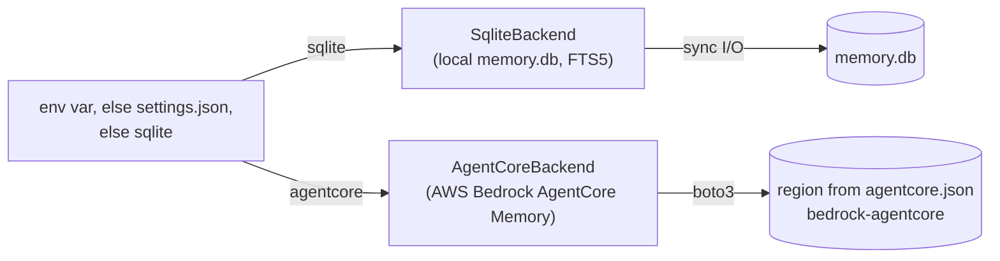

# Architecture

better-memory is a four-layer epistemic hierarchy backed by a pluggable storage backend — a single SQLite database by default, with all local retrieval running as pure in-SQL FTS5 (word + trigram) — no embedding model, no external service.

## The four layers

| Layer | Purpose | Lifecycle |
|---|---|---|
| **Observation** | A factual snapshot the AI writes at a decision point. Tagged with an outcome, component, theme, and trigger type. | Created by `memory.observe`. Eventually consumed into a reflection or archived. |
| **Reflection** | A distilled lesson synthesised from one or more observations. Has a polarity (`do` / `dont` / `neutral`), a confidence, and a use-cases description. | Created by the synthesis pipeline (LLM-driven). Rated via `memory.credit`, ranked by the Wilson-score hit-rate prior described in [Self-rating loop](#self-rating-loop). |
| **Episode** | A bounded session of work — opened on session start, closed when the goal is met or abandoned. Observations and reflections are scoped to an episode. | Background episodes open implicitly on first observe; foreground episodes are explicit (`memory.start_episode`). |
| **Knowledge** | Human-authored markdown — standards, language conventions, per-project docs. Indexed via SQLite FTS5. Read-only for the AI. | Edited by humans. Reindexed on MCP server startup (mtime-only). |

## Storage

- **`memory.db`** — Observations, episodes, reflections, audit_log, retention runs, hook errors. Migrations at `better_memory/db/migrations/NNNN_*.sql` apply lexically at boot and are idempotent.
- **`knowledge.db`** — FTS5 index over the contents of `~/.better-memory/knowledge-base/`. Rebuilt on mtime change.
- **`spool/`** — JSON payloads written by Claude Code hooks, drained lazily by the next `memory.retrieve` call. Bad files quarantine to `spool/.quarantine/` rather than blocking the drain.

## Storage backends

better-memory abstracts persistence behind the `StorageBackend` protocol (`better_memory/storage/protocol.py`). At server startup, the factory (`better_memory/storage/factory.py`) selects an implementation based on the resolved backend — `BETTER_MEMORY_STORAGE_BACKEND` env var if set, else the `storage_backend` key in `$BETTER_MEMORY_HOME/settings.json`, else `sqlite`:

The `sqlite-vec` extension is still loaded by every `memory.db` connection (`better_memory/db/connection.py`) — not for search (no code path performs a vector query any more), but because dropping the vec0 virtual tables in migration `0018_drop_vec_tables.sql` requires the module registered first. Removing the dependency outright is an announced follow-up.

| Aspect | `sqlite` | `agentcore` |
|---|---|---|
| Data location | Local file (`memory.db`) | AWS-managed (region from `agentcore.json`) |
| Local files | `memory.db` + `knowledge.db` (all memory content) | `memory.db` + `knowledge.db` still created — knowledge index, hook-error log, and session-operational state (exposure ledger, migration ledger); no memory content |
| Extraction | Local Claude (synthesize_next_* tools) | Cloud (built-in strategies) |
| Latency | Single-digit ms | 100-500 ms per AWS call |
| Cost | Free | Per-API-call + per-record pricing |
| Multi-machine sync | No | Yes — memory content and rating counters are shared; the exposure ledger and its evidence stay local/session-scoped on every machine |
| Closure events | N/A | `CreateEvent(role=OTHER)` from Stop hook; end-of-session rating sweeps additionally emit one best-effort `CreateEvent` (`extractionMode: SKIP`) as a durable, team-visible receipt of what was rated |
| Episode tracking | Local `episodes` table | Internal to AgentCore (sessionId) |
| Self-rating loop (exposure ledger, `memory.credit`, sweep, Wilson ranking, exploration slot) | Local, entirely in `memory.db` | Same loop — backend-agnostic. Exposure ledger writes to the SAME local `session_memory_exposure` table (session-operational state, never memory content); rating counters (`useful_count`, `ignored_count`, etc.) live on the AWS record and are genuinely shared across teammates. `query`-conditioned retrieval and the contextual-injection evidence gate use server-side semantic search (`RetrieveMemoryRecords`) in place of sqlite's BM25 leg, degrading to Wilson-only / keyword fallback only on an AWS error. |
| Bulk import | N/A (clean start) | `better-memory agentcore migrate` copies existing sqlite reflections + semantic memories into AWS (idempotent, ledgered) |

Migrating with `better-memory agentcore migrate` is distinct from activating: it only writes records to AWS and never flips `storage_backend`. A migrated reflection carries its rating counters, `status`, and `source_row_id` in the record's JSON **content body** — the built-in episodic strategy owns the metadata schema — whereas cloud-extracted records (and migrated semantic records) keep that state in record **metadata**. See [AgentCore setup > Migrate](agentcore-setup.md#migrate-existing-memory-optional).

The management UI's `create_app` (`better_memory/ui/app.py`) builds a `StorageBackend` via `factory.build_backend`, sharing the same sqlite connection the UI already opens, and stores it at `app.extensions["backend"]`. The Reflections surfaces (list, detail, promote, retire) and the Semantic surfaces (full CRUD — create, list, get, update text, set scope, delete) reach memory CONTENT exclusively through `app.extensions["backend"]`, never raw SQL in `better_memory/ui/queries.py` or a service constructed directly on the raw connection. `app.extensions["db_connection"]` is retained for OPERATIONAL state — hook errors, rating evidence/counters, retention runs, the audit log — on both backends. A `caps` context processor reads six capability flags off `app.extensions["backend"]` (`supports_episodes`, `supports_observations`, `supports_provenance`, `supports_retention_runs`, `supports_reflection_review`, `supports_reflection_text_edit`) and exposes them to every template as `caps`, rebuilt on every render so swapping the extension flips every gate. All six flags are consumed: each pairs a nav-link/template-block gate (``, wrapping existing markup, no new classes) with a matching `abort(404)` guard on the route(s) it protects, so an agentcore session can neither see nor navigate directly to a hidden surface.

- `supports_episodes` — hides the Episodes nav link and 404s every `/episodes*` route (episode grouping is internal to AgentCore's `sessionId`, no local table).
- `supports_observations` — hides the Observations nav link and 404s every `/observations*` route (no local observation table in agentcore mode).
- `supports_provenance` — hides the reflection drawer's "Source observations" section and the observation drawer's "Linked reflections" section, and skips the `queries.reflection_provenance` fetch entirely rather than fetching-then-hiding.
- `supports_retention_runs` — hides the Diagnostics retention-runs panel and 404s `/diagnostics/panel/retention-runs` (AgentCore's own event expiry has no local `retention_runs` table).
- `supports_reflection_review` — hides the reflection drawer's Confirm button and 404s `/reflections/<id>/confirm` (agentcore has no `pending_review` status to confirm out of).
- `supports_reflection_text_edit` — hides the reflection drawer's inline Edit button and 404s both `/reflections/<id>/edit` routes (GET form, POST save) — agentcore reflection content is not locally editable.

The Diagnostics hook-errors panel, recent-ratings table, and rating-diagnostics counters are ungated on both backends — they read session-operational state from the local `memory.db`, which exists identically in agentcore mode. The Reflections project dropdown is sourced from `StorageBackend.distinct_projects()` rather than a raw query: sqlite runs `SELECT DISTINCT project FROM reflections`; agentcore does a best-effort sorted-casefold union of `list_actors()` (wraps `ListActors` against the episodic memory, `[]` on any error) and the local `agentcore_migration` ledger's namespace-parsed project set (`projects/{p}/... -> p`, `general/... -> general`) — both legs degrade to empty rather than raising, so a dropdown that would otherwise 500 in agentcore mode just renders fewer options.

See [Configuration](configuration.md) for env vars and [AgentCore setup](agentcore-setup.md) for the agentcore path.

## Self-managing wiring

better-memory owns its own Claude Code wiring rather than relying on a one-time install script. Three pieces, all under `better_memory/setup/`:

- **`manifest.py`** — the single source of truth: a declarative table of every managed hook (`MANAGED_HOOKS`, 8 entries across 7 modules — `contextual_inject` registers on two events), the managed env key (`MANAGED_ENV`), the managed skills (`managed_skills()` — enumerated live from the repo checkout's `.claude/skills/`, so a skill added to or removed from the repo is picked up without a code change), and the managed CLAUDE.md block text (`CLAUDE_MD_BLOCK`), spliced between `<!-- BEGIN better-memory (managed) -->` / `<!-- END -->` markers.
- **`engine.py`** — pure `render()` / `diff()` functions plus the I/O half, `apply()`: smart-merges the managed subset of `~/.claude/settings.json` (hooks + env), `~/.claude.json` (MCP server entry), and `~/.claude/CLAUDE.md` (managed block — absorbing any pre-marker legacy unmarked section so the protocol text is never duplicated) without touching the user's other entries. Backs up every file it overwrites to `~/.better-memory/install-backups/` first, retries once if `~/.claude.json` is rewritten concurrently by Claude Code itself, and serializes concurrent `apply()` calls via `~/.better-memory/state/setup-apply.lock` (60s stale timeout). Skill links use real symlinks, falling back to Windows directory junctions when symlink privilege is unavailable; links whose repo skill no longer exists are pruned (foreign entries in `~/.claude/skills/` are never touched).
- **`autocheck.py`** — a near-zero-cost per-session check wired into the `session_bootstrap` hook: it compares a fingerprint of the desired state (plus target-file mtimes, cached in `~/.better-memory/state/wiring_fingerprint.json`) against what's on disk, and only runs the full `diff()`/`apply()` when something changed. It also installs the per-repo `post-commit` hook the first time it sees a git repo without one (see [docs/hooks-setup.md](https://github.com/emp3thy/better-memory/blob/main/docs/hooks-setup.md#post-commit-hook-opt-in-episode-close) for the install rules: honors a custom `core.hooksPath`, chains only after a plain-`sh` script, warns and never overwrites anything else). Disable with `BETTER_MEMORY_WIRING_AUTOCHECK=off`.

The CLI wraps the same engine: `better-memory setup` always applies; `better-memory doctor` reports drift read-only (exit 1 if any drift, 0 if clean); `better-memory doctor --fix` applies (always exits 0). `python -m better_memory.cli.install_hooks` is a deprecated shim that now just delegates to `setup`.

This retired the old CLAUDE.md drift sentinel — see [Injection strategies](#injection-strategies) below for what replaced it.

## Retrieval

Two distinct retrieve tools, two distinct ranking mechanisms:

- **`memory.retrieve`** returns three reflection buckets — `do`, `dont`,
  `neutral` — ranked by the Wilson-score hit-rate prior on rated
  exposures (see [Self-rating loop](#self-rating-loop) for the formula
  and the query-driven BM25 re-fusion).
- **`memory.retrieve_observations`** returns raw observations via a
  hybrid search over two BM25 legs -- word-level FTS5 (`observation_fts`)
  and trigram-level FTS5 (`observation_trigram_fts`, which catches
  substring matches the word tokenizer misses) -- fused by Reciprocal
  Rank Fusion (RRF). There is no vector/embedding leg (removed; see
  `better_memory/search/hybrid.py`). Results are filtered by outcome
  bucket and weighted by `reinforcement_score` (each `memory.record_use`
  shifts a memory's score up on success or down on failure — see
  [Reinforcement](#reinforcement)).

## Injection strategies

better-memory gets memory in front of Claude two ways: a dump at session start, and targeted mid-session injection keyed to what Claude is actually doing.

**Bootstrap (SessionStart).** Governed by `BETTER_MEMORY_INJECT_MODE` (`legacy` | `deferred`; default `legacy`):

- **`legacy`** (default, byte-identical to pre-deferred-injection behavior). `SessionBootstrapService.bootstrap` (`better_memory/services/session_bootstrap.py`) renders project-scoped semantic memories and reflections in full only up to `BETTER_MEMORY_BOOTSTRAP_TOP_N` per set (default 5; general-scope semantic memories are always shown in full, uncapped). The remainder collapses into a one-line `### Index (not expanded - retrieve on demand)` section plus a footer affordance pointing at `memory.retrieve` / `memory.retrieve_observations`. Semantic memory ids in the rendered output are the full ids (not truncated), each stamped with an age suffix (`(Nd old)`). Setting `BETTER_MEMORY_BOOTSTRAP_TOP_N=0` disables slimming and renders everything in full.
- **`deferred`**. SessionStart renders only general-scope semantic memories in full, plus a single index line ("better-memory knows N reflections + M semantic memories for this project; relevant ones will surface as you work - or ask via memory_retrieve with a task query"). Project-scoped semantic memories and all reflections are not dumped at session start; they surface exclusively through the contextual channel below, or on demand via `memory.retrieve` / `memory.retrieve_observations`.

**CLAUDE.md drift sentinel — retired.** SessionStart no longer runs a standalone sentinel that scanned `~/.claude/CLAUDE.md` for stale tool-parameter references (`better_memory/hooks/_claude_md_sentinel.py`, deleted). See [Self-managing wiring](#self-managing-wiring) above: the retrieve/reinforce/synthesize/record protocol text is now a managed block (`manifest.CLAUDE_MD_BLOCK`) that `better-memory setup` / `doctor --fix` / the session-start autocheck (`better_memory.setup.autocheck.maybe_repair`, wired into `hooks/session_bootstrap.py`) keep byte-identical to the canonical text, so drift is repaired outright rather than merely flagged. `better_memory/skills/CLAUDE.snippet.md` (used for non-Claude-Code MCP integrations) remains behavioural instructions only ("pass a task-describing query when you begin a task", "credit with evidence") and never enumerates parameter names or types, so it can't drift the way the retired sentinel used to detect.

**Contextual injection (UserPromptSubmit / PreToolUse).** The `contextual_inject` hook (`better_memory/hooks/contextual_inject.py`) scores the curated memory set (semantic + reflections) against the current prompt (UserPromptSubmit, fires on every prompt) or tool name + input (PreToolUse, matcher now unscoped -- every tool call, not a fixed allowlist) via `retrieve_relevant` (`better_memory/services/relevant.py`), an evidence-gated scorer:

- A memory injects only when it clears an evidence gate. For reflections: a BM25 match against `reflection_fts` (title / use_cases / hints) -- or, only when that leg is structurally unavailable (no sqlite `conn` passed in), a keyword-hit fallback (>= 2 distinct hits). For semantic memories, which have no FTS substrate of their own: the keyword-hit fallback (>= 2 distinct hits) is the only evidence leg, and it is unconditionally active. No evidence, no injection -- a memory with neither leg present is silently dropped, however popular it is. In agentcore mode, both kinds are instead gated by the backend's own `relevance_ranks` (`StorageBackend.relevance_ranks`, backed by server-side `RetrieveMemoryRecords` semantic search): a memory qualifies iff it appears in that search's result set, falling back to the keyword-hit floor only when the lookup itself fails (an AWS error, signalled by `None` -- a genuinely empty `{}` result is a legitimate negative, not a fallback trigger).
- The Wilson lower-bound prior on rated exposures (see [Self-rating loop](#self-rating-loop)) never qualifies a memory by itself; among qualifiers it only ranks, via reciprocal rank fusion together with the BM25 rank (or, on agentcore, the `relevance_ranks` rank) when present. Popularity forcing irrelevant injections into context was the old failure mode the gate exists to close.
- The keyword-hit fallback described above applies only where the primary evidence leg is structurally unavailable or has failed: for sqlite-backed reflections, when there is no raw sqlite `conn`; for agentcore-backed reflections and semantic memories, only when `relevance_ranks` itself fails (an AWS error on every namespace, signalled by `None` -- a genuinely empty `{}` result is a legitimate negative and is NOT a fallback trigger); for sqlite-backed semantic memories it is unconditional, since they have no other evidence leg at all. `BETTER_MEMORY_CONTEXT_MIN_HITS` is **deprecated**: `contextual_inject` no longer reads it, superseded by the evidence gate above.
- Because PreToolUse now matches every tool, a per-session latch (`SeenStore.pretool_fired` / `mark_pretool_fired`, `better_memory/services/context_seen.py`) runs the full retrieval path at most once per session for PreToolUse; every later PreToolUse event in the session short-circuits on the latch state before touching the DB. UserPromptSubmit is unaffected by the latch and fires on every prompt.
- Survivors are capped to `BETTER_MEMORY_CONTEXT_MAX_ITEMS`, then filtered through a per-session `SeenStore` (`better_memory/services/context_seen.py`, JSON file at `<home>/state/context_seen_<session_id>.json`) that deduplicates memories already injected this session. `BETTER_MEMORY_CONTEXT_REINJECT_TURNS=0` (default) means a memory is injected at most once per session; a positive value allows re-injection after that many turns have passed since it was last shown. A "turn" here is one firing of the `contextual_inject` hook, not one user prompt-response cycle: each user prompt is a turn, and each PreToolUse latch-firing is a turn too (subsequent latched-out PreToolUse events do not bump the turn counter).
- Survivors render as a `<project-memory source="better-memory">` XML block in `additionalContext`, one entry per item with its kind, id, confidence, `useful_count`, and age, a `dont`-polarity item prefixed `Known pitfall -- do this instead:`, and a footer inviting `memory_credit(kind, id, class, evidence)` — with a one-line evidence statement — when an entry actually helped or misled.
- Survivors are logged to `session_memory_exposure` with `source='contextual'` (best-effort; a write failure never blocks injection) and counted in `rating_diagnostics` (`contextual_fired_userprompt`, `contextual_fired_pretool`, `contextual_injected`, `contextual_suppressed_floor`, `contextual_suppressed_dedup`). These counters are per-firing, not per-item: a firing that injects one or several memories still increments `contextual_injected` by exactly 1. `contextual_suppressed_floor` now means "no candidate cleared the evidence gate", not "below the old keyword-hits floor".

Gated by `BETTER_MEMORY_CONTEXT_INJECT_MODE` (`userprompt` / `pretool` / `both` / `off`). The hook never raises and always exits 0 — failures are swallowed and logged to `hook_errors`, with no `additionalContext` emitted on that turn.

## Local search (sqlite)

All local retrieval is pure in-SQL FTS5 — no embedding model, no
external service, no in-memory state. Two FTS5 virtual tables are
populated by triggers on write: `observation_fts` (word tokenizer) and
`observation_trigram_fts` (tokenizer=`trigram`, which catches substring
matches the word tokenizer misses). `better_memory/search/hybrid.py`
fuses both via Reciprocal Rank Fusion into one ranked list for
`memory.retrieve_observations`. Reflections have their own word-level
FTS5 table (`reflection_fts`, title / use_cases / hints) used by the
evidence gate in [Injection strategies](#injection-strategies) and the
query re-fusion in [Self-rating loop](#self-rating-loop). Semantic
memories have no FTS substrate of their own and rely on the keyword-hit
fallback described in those sections. There used to be a second,
Ollama-backed embeddings path (vector search over `nomic-embed-text`
embeddings, selected via a now-removed `BETTER_MEMORY_EMBEDDINGS_BACKEND`
env var); it was deleted, along with the `observation_embeddings` /
`reflection_embeddings` / `semantic_embeddings` vec0 tables (migration
`0018_drop_vec_tables.sql`). The `sqlite-vec` extension is still loaded
by every connection only because dropping those vec0 tables requires
the module registered — see the note under [Storage
backends](#storage-backends).

## Reinforcement

Each **observation** (not reflections or semantic memories — see below)
has a `reinforcement_score` that decays slowly over time and is updated
by validated use:

- `memory.record_use(id, outcome="success")` → score goes up.
- `memory.record_use(id, outcome="failure")` → score goes down.

This is the lever that keeps observation recall faithful: a
well-validated failed approach will keep surfacing for the same query
class; a once-true-now-misleading observation gets demoted by repeated
failure stamps.

## Self-rating loop

Reflections and semantic memories have no `reinforcement_score` column
and are never touched by `memory.record_use` — calling it with a
reflection/semantic id is a silent no-op. Instead, a closed-loop
self-rating cycle runs per session and captures whether memories
actually shaped Claude's work, feeding the Wilson-score hit-rate prior
described below:

1. **Exposure** — every reflection or semantic memory surfaced by
   `memory.retrieve` / `memory.semantic_retrieve` / the SessionStart
   bootstrap / the `contextual_inject` hook is logged to
   `session_memory_exposure` with the active `session_id` and a
   `source` of `retrieve`, `bootstrap`, or `contextual` respectively —
   the same local `memory.db` table on both storage backends, since it is
   session-operational state rather than memory content (see
   [Injection strategies](#injection-strategies) for what
   `contextual_inject` scores and dedups before it exposes anything).
2. **Mid-session credit** — `memory.credit(kind, id, class, evidence)` lets
   Claude credit a memory as `cited`, `shaped`, `misled`, or `overlooked` the moment
   it's used. `evidence` — a one-line statement of what the memory changed,
   or a quote — is required in the tool schema for every `memory.credit`
   call (all four credit classes are non-ignored). Survives context
   compaction.
3. **End-of-session sweep** — the
   [`session_close`](https://github.com/emp3thy/better-memory/blob/main/better_memory/hooks/session_close.py)
   hook checks for unrated exposures. If any exist, it emits a `Stop`
   block directive triggering the `rate-session-memories` skill. The
   directive opens with a `RATE_MEMORIES: {n} unrated. Invoke skill
   rate-session-memories.` header line, followed by a `Session: {session_id}` line, then an `Evidence line
   first; none possible = ignored.` rule line, then pending exposures
   grouped by kind (`Reflections (N):` / `Semantic (N):`), one line per
   exposure — `- {id} [{source}] {display}`, `display` truncated to 80
   chars and read via `COALESCE(e.display, r.title, s.content)` off the
   `session_memory_exposure` row (falling back to the live title/content
   only when no display snapshot was captured at exposure time). The
   skill then calls `memory.list_session_exposures` (passing the directive's session id as the explicit `session_id` argument) and
   submits `memory.apply_session_ratings` with one `{class, evidence}` per
   id (`cited` / `shaped` / `ignored` / `misled` / `overlooked`; `ignored`
   is the only class evidence is optional for). `MemoryRatingService`
   enforces this server-side: the whole batch is validated before any row
   is written, so one non-ignored rating missing its evidence line fails
   the entire `memory.apply_session_ratings` call loudly, with none of the
   batch applied. Only on the second Stop fire — after ratings land — does
   the hook drop the `session_end` marker into the spool.
4. **Ranking** - `useful_count` / `times_overlooked` / `times_misled` /
   `times_ignored` columns on reflections and semantic memories
   accumulate, and retrieval ranks each bucket by a Wilson score lower
   bound (95% CI) on the proportion of rated exposures that were
   positive: `(useful_count + times_overlooked) / (useful_count +
   times_overlooked + times_ignored)`, computed in
   `better_memory/services/scoring.py`. Ties break on confidence, then
   recency. A memory with fewer than 3 rated exposures has a
   statistically meaningless score (pinned to 0), so instead of losing
   outright to proven rows it competes for a reserved exploration
   slot: the last slot of each polarity bucket (when the bucket cap
   allows at least 2 entries) is set aside for the highest-ranked
   under-rated memory, if one exists. That serve is tagged
   `via_exploration=1` on its `session_memory_exposure` row (migration
   `0015_via_exploration.sql`) -- it's an investment the ranker makes to
   earn the memory a rating, not a relevance claim, so it is excluded
   from the headline usefulness metric while still being rated normally
   through the same self-rating loop. When `memory.retrieve` is called
   with a `query`, this Wilson-ranked list is re-fused with a BM25
   relevance ranking (title / use_cases / hints) via the same
   Reciprocal Rank Fusion used for observations -- a two-leg RRF of
   Wilson rank and BM25 rank -- so a query that matches nothing on the
   BM25 leg degrades exactly to the Wilson-only order.

Every non-ignored rating's evidence line is stored on the
`session_memory_exposure` row (`evidence` column, migration
`0016_rating_evidence.sql`; nullable, so historical rows predating the
migration stay `NULL`). It is audit-only — no ranking or scoring reads it,
and it is unrelated to `reflections.evidence_count` / `evidence_count` on
semantic memories, which count synthesis source observations, not rating
evidence.

The management UI's Reflections and Semantic tabs surface useful /
overlooked / misled badges per row plus a "Rating evidence" history (the
last 10 evidenced ratings for that memory, newest first) in the reflection
and semantic drawers, and `/diagnostics` exposes recent ratings — including
an evidence column — a total overlooked count, and a `session_id_missing`
counter for instrumentation gaps.

## Synthesis pipeline

Synthesis is **IDE-driven** — Claude itself is the LLM. better-memory ships no chat client; it exposes two MCP tools and a skill that orchestrates them.

The drain loop, per pending episode:

1. **`memory.synthesize_next_get_context`** — server returns one closed-but-not-yet-synthesized episode's full context: episode metadata, all observations on it, and existing reflections filtered by tech.
2. **Claude decides** — the [`better-memory-synthesize`](https://github.com/emp3thy/better-memory/blob/main/.claude/skills/better-memory-synthesize/SKILL.md) skill walks Claude through producing a JSON decision: lists of `new`, `augment`, `merge`, and `ignore` actions per observation.
3. **`memory.synthesize_next_apply`** — server validates the decision JSON and applies it atomically: creates new reflections, augments existing ones, merges near-duplicates (combining their evidence and rating counters onto the survivor), marks observations consumed (or ignored), and stamps the episode synthesized. `audit_log` records each action.

The trigger: when `memory.start_episode` returns `pending_synthesis.pending > 0`, the skill fires and drains the queue one episode at a time. Same skill is invoked manually when the user asks to consolidate or distill pending episodes.

The lifecycle implications for observations are detailed in [Observation lifecycle](observation-lifecycle.md).

## Audit log

Every state change writes a row to `audit_log`. It's append-only — no row is ever updated or deleted — so the full history of what the AI saw, what it wrote, and what it consumed is reconstructable at any time.

## Full design spec

See [`docs/superpowers/specs/2026-04-06-better-memory-design.md`](https://github.com/emp3thy/better-memory/blob/main/docs/superpowers/specs/2026-04-06-better-memory-design.md) on GitHub for the original four-phase design with all the trade-offs, deferred decisions, and migration strategy.
