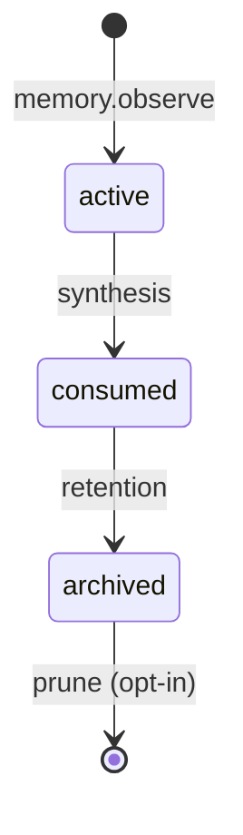

<nav class="brut-nav">
  <div class="brut-nav-brand">
    <span class="brut-bracket">[</span> better-memory <span class="brut-bracket">]</span>
  </div>
  <div class="brut-nav-links">
    <a href="#install">install</a>
    <a href="configuration/">docs</a>
    <a href="https://github.com/emp3thy/better-memory">github</a>
  </div>
</nav>

<section class="brut-section brut-hero-section">
  <div class="brut-container brut-wide">
    <div class="brut-eyebrow">// LOCAL-FIRST · MCP · CLAUDE-CODE</div>
    <h1 class="brut-display">memory that<br><span class="brut-hl">sticks</span> between sessions.</h1>
    <p class="brut-lede">A semantic + episodic memory manager for Claude Code. SQLite, local Ollama, no cloud.</p>
    <div class="brut-ctas">
      <a class="brut-cta brut-cta-primary" href="#install">install →</a>
      <a class="brut-cta brut-cta-secondary" href="architecture/">read the spec →</a>
    </div>
  </div>
</section>

<section class="brut-section brut-shade">
  <div class="brut-container">
    <div class="brut-num">02 — SPECIMEN</div>
    <h2 class="brut-section-h">what an observation looks like</h2>
    <p class="brut-lede brut-muted">A real <code>memory.observe()</code> call, and what comes back from <code>memory.retrieve()</code> next session.</p>

```python
memory.observe(
    content="Growatt Timespan.day inflated; switched to Timespan.hour",
    component="growatt_client",
    outcome="failure",
    trigger_type="debugging",
)
# → returns {"id": "6aa6bf51..."}

# next session, retrieved as:
memory.retrieve(query="growatt") → do bucket
  ↳ "switched to Timespan.hour" — confidence 1.0
```

  </div>
</section>

<section class="brut-section">
  <div class="brut-container">
    <div class="brut-num">03 — RETRIEVAL</div>
    <h2 class="brut-section-h">retrieval, sorted by outcome</h2>
    <p class="brut-lede brut-muted">Three buckets, surfaced separately. The AI sees what worked, what to avoid, and what's just context.</p>
    <div class="brut-buckets">
      <div class="brut-bucket brut-bucket-do">
        <div class="brut-bucket-name">do</div>
        <div class="brut-bucket-role">prior wins</div>
        <div class="brut-bucket-ex">"Calculator uses _estimate_generation_hourly + morning_floor; charge = max(gap_pct, morning_floor_pct)."</div>
      </div>
      <div class="brut-bucket">
        <div class="brut-bucket-name">dont</div>
        <div class="brut-bucket-role">approaches to avoid</div>
        <div class="brut-bucket-ex">"Growatt Timespan.day returned inflated consumption — use Timespan.hour."</div>
      </div>
      <div class="brut-bucket">
        <div class="brut-bucket-name">neutral</div>
        <div class="brut-bucket-role">context</div>
        <div class="brut-bucket-ex">"Python ZoneInfo unavailable on Windows without tzdata package."</div>
      </div>
    </div>
    <p class="brut-bucket-sub">reinforcement-weighted — memory.record_use promotes signal, demotes noise.</p>
  </div>
</section>

<section class="brut-section brut-shade">
  <div class="brut-container">
    <div class="brut-num">04 — LIFECYCLE</div>
    <h2 class="brut-section-h">observations have a lifecycle</h2>
    <p class="brut-lede brut-muted">Synthesis consolidates. Retention archives. Prune is opt-in.</p>



  </div>
</section>

<section class="brut-section" id="install">
  <div class="brut-container">
    <div class="brut-num">05 — INSTALL</div>
    <h2 class="brut-section-h">three commands, one paste</h2>
    <p class="brut-lede brut-muted">Clone, run setup, paste the printed JSON snippets into your Claude Code config.</p>

```bash
git clone https://github.com/emp3thy/better-memory
cd better-memory
./scripts/setup.sh
```

    <div class="brut-tabs" data-brut-tabs>
      <button class="brut-tab brut-tab-active" data-os="macos">macos</button>
      <button class="brut-tab" data-os="linux">linux</button>
      <button class="brut-tab" data-os="windows">windows</button>
    </div>

    <div class="brut-tab-pane brut-tab-pane-active" data-os-pane="macos">

```json
{
  "mcpServers": {
    "better-memory": {
      "type": "stdio",
      "command": "/absolute/path/to/.venv/bin/python",
      "args": ["-m", "better_memory.mcp"]
    }
  }
}
```

    </div>

    <div class="brut-tab-pane" data-os-pane="linux">

```json
{
  "mcpServers": {
    "better-memory": {
      "type": "stdio",
      "command": "/absolute/path/to/.venv/bin/python",
      "args": ["-m", "better_memory.mcp"]
    }
  }
}
```

    </div>

    <div class="brut-tab-pane" data-os-pane="windows">

```json
{
  "mcpServers": {
    "better-memory": {
      "type": "stdio",
      "command": "C:/absolute/path/to/.venv/Scripts/pythonw.exe",
      "args": ["-m", "better_memory.mcp"]
    }
  }
}
```

    </div>

    <p style="margin-top:18px"><a href="configuration/">full setup guide →</a></p>
  </div>
</section>

<section class="brut-section brut-shade">
  <div class="brut-container">
    <div class="brut-num">06 — TOOLS</div>
    <h2 class="brut-section-h">the surface area</h2>

    <table class="brut-tools">
      <thead>
        <tr><th>tool</th><th>purpose</th></tr>
      </thead>
      <tbody>
        <tr><td><a href="mcp-tools/#memoryobserve">memory.observe</a></td><td>Create a new observation. Returns {"id": ...}.</td></tr>
        <tr><td><a href="mcp-tools/#memoryretrieve">memory.retrieve</a></td><td>Three outcome buckets + insights + knowledge. Drains spool first.</td></tr>
        <tr><td><a href="mcp-tools/#memoryrecord_use">memory.record_use</a></td><td>Stamp reinforcement outcome on a memory after validation.</td></tr>
        <tr><td><a href="mcp-tools/#knowledgesearch">knowledge.search</a></td><td>BM25 search against the knowledge base.</td></tr>
        <tr><td><a href="mcp-tools/#knowledgelist">knowledge.list</a></td><td>List indexed knowledge docs.</td></tr>
        <tr><td><a href="mcp-tools/#memorystart_ui">memory.start_ui</a></td><td>Spawn or reuse the management UI; returns {url, reused}.</td></tr>
      </tbody>
    </table>
  </div>
</section>

<section class="brut-section">
  <div class="brut-container">
    <div class="brut-num">07 — GO DEEPER</div>
    <h2 class="brut-section-h">documentation</h2>
    <div class="brut-docs-grid">
      <a href="architecture/" class="brut-doc-card">
        <div class="brut-doc-title">architecture</div>
        <div class="brut-doc-desc">Four-layer epistemic hierarchy, hybrid search, reinforcement-weighted ranking.</div>
        <div class="brut-doc-arrow">→</div>
      </a>
      <a href="configuration/" class="brut-doc-card">
        <div class="brut-doc-title">configuration</div>
        <div class="brut-doc-desc">Env vars, project-name overrides, MCP wiring.</div>
        <div class="brut-doc-arrow">→</div>
      </a>
      <a href="observation-lifecycle/" class="brut-doc-card">
        <div class="brut-doc-title">observation lifecycle</div>
        <div class="brut-doc-desc">Active → consumed → archived. Synthesis, retention, prune.</div>
        <div class="brut-doc-arrow">→</div>
      </a>
      <a href="contributing/" class="brut-doc-card">
        <div class="brut-doc-title">contributing</div>
        <div class="brut-doc-desc">Setup, testing, conventions.</div>
        <div class="brut-doc-arrow">→</div>
      </a>
    </div>
  </div>
</section>

<footer class="brut-footer">
  <div class="brut-footer-left">better-memory · v0.1.0 · MIT</div>
  <div class="brut-footer-right">
    <a href="https://github.com/emp3thy/better-memory">github</a>
    <span class="brut-footer-sep">·</span>
    <span>built with <a href="https://docs.astral.sh/uv/">uv</a> · <a href="https://www.sqlite.org/">sqlite</a> · <a href="https://ollama.com/">ollama</a></span>
  </div>
</footer>
