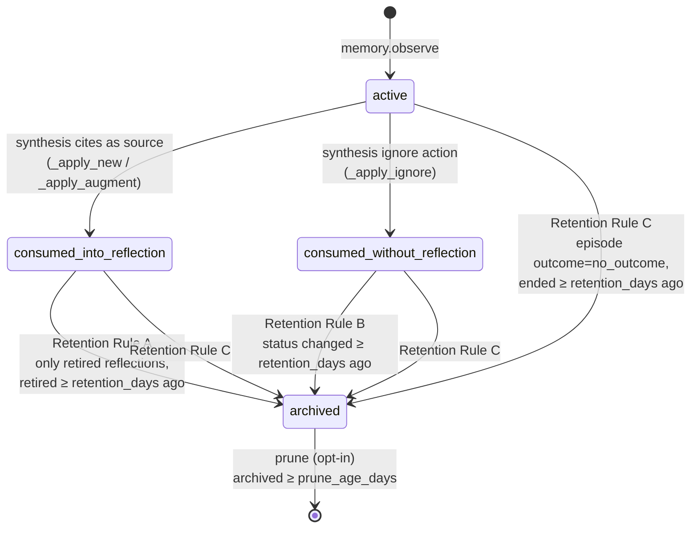

# Observation lifecycle

Observations don't live forever. They flow through four states (`active` → `consumed_*` → `archived` → deleted) driven by two pipelines: **synthesis** (LLM-driven, runs from the management UI button or automatically by `memory.start_episode`) and **retention** (auto-fires once per 24h on `memory.retrieve`, plus manually via the MCP tool).

## State machine

## Synthesis transitions

No deletion, just status flips. Atomic per run.

| Outcome | New status | Notes |
|---|---|---|
| Cited as a source for a NEW reflection | `consumed_into_reflection` | Linked into `reflection_sources`. |
| Cited as a NEW source for an EXISTING reflection (`augment`) | `consumed_into_reflection` | Linked into `reflection_sources`. |
| LLM marks as not reflection-worthy (`ignore`) | `consumed_without_reflection` | No link, just marked done. |
| Untouched by this run | (unchanged — usually `active`) | Picked up by the next synthesis run. |

`merge` is link-only: the source reflection's `reflection_sources` rows move to the target; observation status doesn't change.

## Retention rules

Implemented by `better_memory.services.retention.RetentionService.run`, default `retention_days=90`.

| Rule | Archives observations where … |
|---|---|
| **A** | linked only to *retired* reflections, oldest retirement ≥ retention_days old |
| **B** | `status='consumed_without_reflection'` and the status change was ≥ retention_days ago |
| **C** | belongs to an episode whose `outcome='no_outcome'` and ended ≥ retention_days ago |

## Prune (opt-in)

`RetentionService.run(..., prune=True, prune_age_days=N)` hard-deletes `archived` rows older than `prune_age_days`. `dry_run=True` previews the count without deleting.

!!! warning "Prune is irreversible"
    Set `BETTER_MEMORY_AUTO_PRUNE=1` only if you actively want disk space reclaimed. Default is archive-only — a status flip you can recover from.

Reflections are **never** auto-deleted.

## When retention runs

- **Auto:** `memory.retrieve` triggers `RetentionScheduler.maybe_run()`, which checks the `retention_runs` table and skips if a run happened within the last 24 hours. This catches the steady-state case without a separate scheduler.
- **Manual:** the `memory.run_retention` MCP tool, a CI step, or a direct call to `RetentionService.run`.

The 24h guard means retention is at-most-daily under steady traffic — fine for a memory store this small. If you want stricter cadence, call the MCP tool directly.
